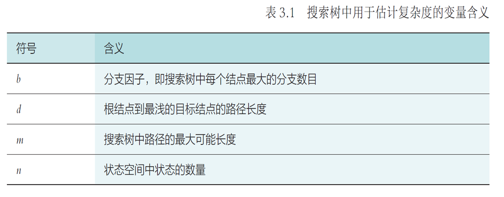
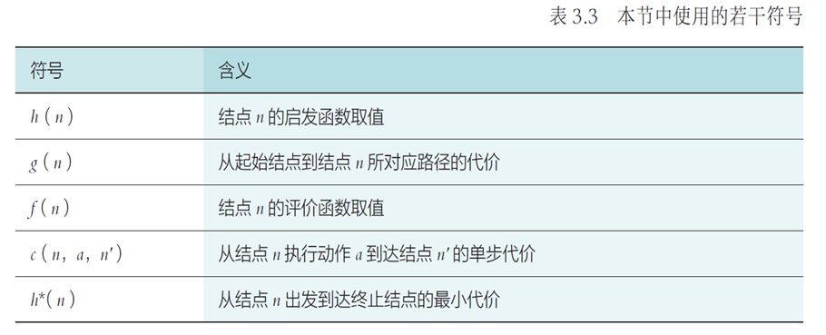
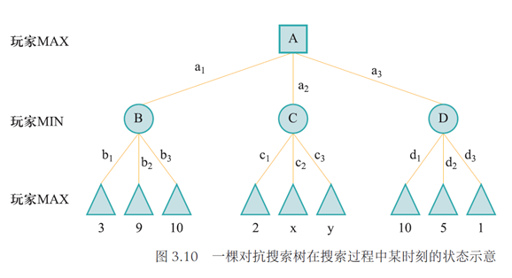
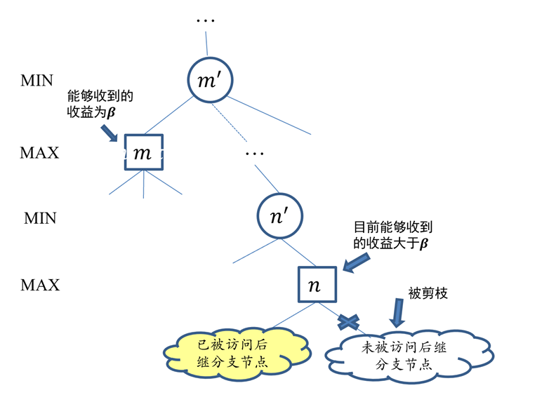
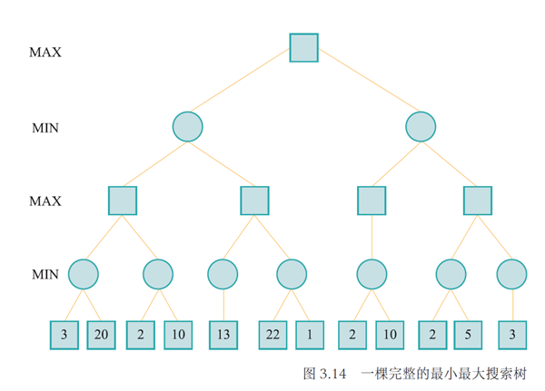

# 搜索探寻与问题求解

## 搜索基本概念

### 搜索的形式化描述

!!! note "状态（state）"
    广义来说**状态**是对搜索算法和搜索环境**当前所处情形的描述信息**。搜索算法**刚开始**所在状态被称为**初始状态**，**完成任务**时所在状态被称为**终止状态**。

!!! note "动作（ action）"
    为了完成最短路径的探索，算法需要不断从一个状态转移到下一个状态。算法**从一个状态转移到另外一个状态所采取的行为**被称为**动作**。

!!! note "状态转移（state transition）"
    算法选择了一个动作之后，其所处**状态**也会**发生相应变化**，这个过程被称为**状态转移**。

!!! note "路径（path）和代价（cost）"
    以任何一个状态为起点，搜索算法通过执行一系列动作后，将会在**不同状态之间不断转移**。将这个过程中**经历的状态记录下来**，可以得到一个**状态序列**，这个状态序列被称为一条**路径**。每条路径对应一个**代价**。如果一条路径对应的状态序列长度为2，那么这条路径的代价也被称为单步代价。一般假定单步代价取值为非负。

!!! note "目标测试（goal test）"
    目标测试函数 goal_test(s) 用于**判断状态 s 是否为目标状态**。目标测试通过意味着搜索算法完成，但是搜索算法完成并不意味着算法已经找到了最短路径。在最短路径搜索中，搜索算法会不断从当前结点的邻接节点中选择下一个结点，如此循环，直到找到一条从初始状态到终止状态的路径为止。当然，寻找所得的路径（从初始状态到终止状态）是否满足“路径最短”这一约束条件，还需要另行判断。

!!! note "搜索过程可视为搜索树的构建"

    可以用一棵**树**来**记录算法所探索的路径**，这样一棵树被称为**搜索树**，树中每个**结点**用一个**状态**标记。搜索树记录了从根结点出发目前所有探索过的路径。搜索算法可以被看成是一个构建搜索树的过程，从根结点（初始状态）开始，不断展开每个结点的后继结点，直到某个结点通过了目标测试。

### 搜索算法的评测标准

- 评价指标
    - 完备性：能否找到解（不一定最优）
    - 最优性：能否保证找到的第一个解是最优解
    - 时间复杂度（通过扩展的结点数量衡量）
    - 空间复杂度（通过同时记录的结点数量衡量）

!!! note ""
     

### 搜索框架

```vb
F <- {根节点}
while F != ∅ do
    n <- pick_from(F)
    F <- F - {n}
    if goal_test(n) then
        return n.path
    end
    F <- F ∪ successor_nodes(n)
end
```

- `pick_from` 决定扩展结点的顺序，`successor_nodes` 决定哪些节点可被放入边缘集合（fringe set，也叫开表，open list）以在后面扩展（expand）
- 每次从边缘集合中取出最上层（最浅）的结点时是**广度优先搜索**（breadth first search，BFS）
- 每次从边缘集合中取出最下层（最深）的结点时是**深度优先搜索**（depth first search，DFS）
- 放弃扩展部分结点的做法称为**剪枝**（pruning）


### 启发函数和评价函数

- 利用一些能够辅助算法做出决策的额外信息的搜索算法称为**启发式搜索**（heuristic search），或**有信息搜索**（informed search）
- 提供的这些辅助信息称为**启发信息**

- 启发信息通常形式化为一个关于结点的函数 $h(n)$，其用于估计结点 $n$ 距离**达到目标**还需付出多少代价，这个函数称为**启发函数**（heuristic function）
    - 启发函数通常是非负的
    - 常见用法是用来更改前面的 pick_from 函数来规定挑选结点的顺序
- 对于任意结点 $n$，决定了搜索算法扩展结点 $n$ 的优先度的函数 $f(n)$ 称为**评价函数**（evaluation function）
    - 评价函数值越小，被挑选的优先级越高
    - 深度优先搜索中 $f(n)$ 可被定义为该结点深度的倒数
    - 广度优先搜索中 $f(n)$ 可被定义为该结点深度

## 贪婪最佳优先搜索

- 贪婪最佳优先搜索
    - 即 greedy best-first search，GBFS
    - 优先扩展距离目标近的结点，即令 $f(n) = h(n)$
    - 不排除环路的贪婪最佳优先搜索算法是不完备的
    - 排除环路的贪婪最佳优先搜索是完备的，但不一定最优
    - 最坏情况下的时间复杂度和空间复杂度均为 $O(b^m)$
        - $b$ 为分支因子（每个结点最大的分支数目）
        - $m$ 为最大深度，也就是搜索树中路径的最大可能长度

```mermaid
graph LR
    A((A)) <--5--> B((B))
    A <--3--> D((D))
    A <--6--> E((E))
    B <--5--> C((C))
    D <--4--> F((F))
    E <--3--> G((G))
    E <--4--> H((H))
    E <--7--> I((I))
    F <--4--> G((G))
    G <--3--> H((H))
    G <--5--> K((K))
    I <--5--> J((J))
    H <--7--> J((J))
    K <--6--> L((L))
    J <--3--> K((K))
```


!!! note "A->K"

    ```mermaid
    graph TB
        A(((A))) ---> B((B = 10 ))
        A ---> D((D = 12 ))
        A ---> E(((E = 7 )))
        E ---> G((G =  5))
        E ---> H(((H =  3)))
        E ---> I((I =  6))
        H ---> J(((J =  3)))
        H ---> L((G =  5))
        J ---> K(((K =  0)))
    ```
    A->K 的路径为 A->E->H->J->K，总代价为 6 + 4 + 7 + 3 = 20

## A*搜索

!!! note ""

    评价函数和启发函数各司其职，在评价函数中考虑从起始结点到当前结点的路径代价

A*搜索的评价函数为$f(n) = g(n) + h(n)$，其中：

- $g(n)$ 为从初始结点到结点 $n$ 的实际代价，即当前最小代价
- $h(n)$ 为从结点 $n$ 到目标结点的估计代价，即启发函数

```mermaid
graph LR
    A((A)) <--5--> B((B))
    A <--3--> D((D))
    A <--6--> E((E))
    B <--5--> C((C))
    D <--4--> F((F))
    E <--3--> G((G))
    E <--4--> H((H))
    E <--7--> I((I))
    F <--4--> G((G))
    G <--3--> H((H))
    G <--5--> K((K))
    I <--5--> J((J))
    H <--7--> J((J))
    K <--6--> L((L))
    J <--3--> K((K))
```


!!! note "A->K"

    ```mermaid
    graph TB
        A(((1. A))) --5--> B((B = 5 + 10 = 15))
        A --3--> D((D = 3 + 12 = 15))
        A --6--> E(((2. E = 6 + 7 = 13)))
        E --3--> G(((4. G = '6 + 3' + 5 = 14)))
        E --4--> H(((3. H = '6 + 4' + 3 = 13)))
        E --7--> I((I = '6 + 7' + 6 = 19))
        H --7--> J((J = '6 + 4 + 7' + 3 = 20))
        H --3--> L((G = '6 + 4 + 3' + 5 = 18))
        G --4--> F(( F = '6 + 3 + 4' + 8 = 21))
        G --5--> K(((5. K = '6 + 3 + 5' + 0 = 14)))
        G --3--> M((H = '6 + 3 + 3' + 3 = 15))
    ```
    A->K 的路径为 A->E->G->K，总代价为 6 + 3 + 5 = 14

    ```c
    * 初始化open_set和close_set；
    * 将起点加入open_set中，并设置优先级为0（优先级最高）；
    * 如果open_set不为空，则从open_set中选取优先级最高的节点n：
        * 如果节点n为终点，则：
            * 从终点开始逐步追踪parent节点，一直达到起点；
            * 返回找到的结果路径，算法结束；
        * 如果节点n不是终点，则：
            * 将节点n从open_set中删除，并加入close_set中；
            * 遍历节点n所有的邻近节点：
                * 如果邻近节点m在close_set中，则：
                    * 跳过，选取下一个邻近节点
                * 如果邻近节点m也不在open_set中，则：
                    * 设置节点m的parent为节点n
                    * 计算节点m的优先级
                    * 将节点m加入open_set中
    ```

### A*搜索的性质

A*算法具有可容性（admissible）和一致性（consistency）



!!! note "可容性"

    对于任意结点𝑛，有$ℎ(𝑛)≤ℎ^∗ (𝑛)$，如果$𝑛$是目标结点，则有$ℎ(𝑛)=0$。$ℎ^∗ (𝑛)$是从结点𝑛出发到达终止结点所付出的最小代价。可以这样理解满足可容性的启发函数，启发函数不会过高估计（over-estimate）从结点𝑛到终止结点所应该付出的代价（即估计代价小于等于实际代价）。在上述问题中，对每个结点而言，其状态（城市）到目标状态（城市）K之间的行驶距离不会小于两城之间的直接距离，因此列车以最大行驶速度通过直线距离花费的时间必然不会超过实际代价，将该时间作为启发函数值，是满足可容性条件的。

!!! note "一致性"

    启发函数的一致性指满足条件 $ℎ(𝑛)≤𝑐(𝑛,𝑎,𝑛^′ )+ℎ(𝑛^′)$，这里$𝑐(𝑛,𝑎,𝑛^′ )$表示结点$𝑛$通过动作$𝑎$到达其相应的后继结点$𝑛^′$的代价。在图中，假设结点$𝑛$和$𝑛^′$对应的状态（城市）为$𝑠$和$𝑠^′$，如果将单步代价$𝑐(𝑛,𝑎,𝑛^′)$重新定义为$𝑠$和$𝑠^′$在二维平面上的欧氏距离，则根据欧氏距离三角不等式原则，城市$𝑠$到目标城市K之间直线距离一定小于等于从城市$𝑠$到其相邻城市$s^′$的直线距离与城市$𝑠^′$到目标城市K之间直线距离之和，此时，将当前状态（城市）与目标状态（城市）𝐾之间直线距离作为启发函数值，则启发函数满足一致性条件。

!!! note "一致性$\Rightarrow$可容性"

    一致性是一个比可容性更严格的性质，即一个启发函数如果满足一致性条件，那么该启发函数必然满足可容性条件。

    

### A*搜索的完备性

如果所求解问题和启发函数满足以下条件，则A*算法是完备的：

- 搜索树中分支数量是有限的，即每个结点的后继结点数量是有限的
- 单步代价的下界是一个正数
- 启发函数有下界

### A*搜索的最优性

!!! note ""
    如果启发函数是可容的，那么A*算法满足最优性
    
假设$A^*$算法找到的第一个终止结点为$𝑛$。对于此时边缘集合中任意结点$𝑛^′$，根据算法每次扩展时的策略，即选择评价函数取值最小的边缘结点进行扩展，有$𝑓(𝑛)≤𝑓(𝑛^′ )$。由于$A*$算法对评价函数定义为$𝑓(𝑛)=𝑔(𝑛)+ℎ(𝑛)$，且$ℎ(𝑛)=0$，有$𝑓(𝑛)=𝑔(𝑛)+ℎ(𝑛)=𝑔(𝑛)$，$𝑓(𝑛^′ )=𝑔(𝑛^′ )+ℎ(𝑛^′)$，综合可得

$$𝑔(𝑛)≤𝑔(𝑛^′ )+ℎ(𝑛^′ )≤𝑔(𝑛^′ )+ℎ^∗ (𝑛^′)$$

其中$𝑔(𝑛)$为从起始结点到结点 $𝑛$ 所对应路径的代价，$𝑔(𝑛^′ )+ℎ^∗ (𝑛^′)$表示从初始结点出发经过结点 $𝑛′$ 到达终止结点的最小代价。也就是说此时扩展其他任何一个边缘结点都不可能找到比结点 $𝑛$ 所对应路径代价更小的路径，因此结点 $𝑛$ 对应的是一条最短路径，即算法满足最优性。

### 最大最小搜索

!!! note ""

    - 智能体不唯一，解决信息确定、全局可观察、轮流行动、输赢收益零和的博弈问题，求解这样问题的算法称为对抗搜索（adversarial search）或博弈搜索（game search）
    - 智能体会选择最大化自身利益、最小化对手利益的策略
    - 形式化描述：
        - 状态：状态 $s$ 包括当前游戏局面和当前行动的智能体，初始状态 $s_0$ 为游戏开始时的状态。$\mathrm{player}(s)$ 表示状态 $s$ 下行动的智能体
        - 动作：动作是指 $\mathrm{player}(s)$ 在当前局面下可以采取的操作 $a$，记动作集合为 $\mathrm{actions}(s)$
        - 状态转移：状态转移函数 $s' = \mathrm{result}(s, a)$ 表示在状态 $s$ 下采取动作 $a$ 后的下一个状态
        - 终局状态测试：终局状态测试函数 $\mathrm{terminal\_test}(s)$ 用于测试游戏是否在状态 $s$ 下结束
        - 终局得分：终局得分函数 $\mathrm{utility}(s, p)$ 表示在状态 $s$ 下玩家 $p$ 的得分
            - 对于二人零和博弈，只需要记录其中一人的终局得分即可


- 最大最小搜索（minimax search）是求解对抗搜索问题的基本算法
- 该算法假设两名玩家在决策时总是理性地倾向于最大化自己的得分（最小化对方得分）
- 算法过程
    - 假设以最大化得分为目标的玩家为 MAX，以最小化得分为目标的玩家为 MIN
    - 某一层由 MAX 玩家行动，则其会选择得分最大的子树进行行动
    - 某一层由 MIN 玩家行动，则其会选择得分最小的子树进行行动
    - 递归地进行上述过程，直到达到终局状态
    - （子树的得分由所有它的子树的得分取最大或最小得到）

$$
\mathrm{minimax}(s) = \begin{cases}
\mathrm{utility}(s) & \text{if terminal\_test(}s\text{)} \\
\max_{a \in \mathrm{actions}(s)} \mathrm{minimax}(\mathrm{result}(s, a)) & \text{if player(}s\text{) = MAX} \\
\min_{a \in \mathrm{actions}(s)} \mathrm{minimax}(\mathrm{result}(s, a)) & \text{if player(}s\text{) = MIN}
\end{cases}
$$

- 最大最小搜索的时间复杂度为 $O(b^m)$，空间复杂度为 $O(bm)$

### Alpha-Beta 剪枝

- 如果搜索树极大，则最大最小搜索的开销巨大，无法在合理时间内返回结果
- Alpha-Beta 剪枝算法的思想如下：

    

    $$
    \begin{align*}
    \mathrm{minimax}(s_0) &= \max(\min(3, 9, 10), \min(2, x, y), \min(10, 5, 1))\\
    &= \max(3, \min(2, x, y), 1)
    \end{align*}
    $$

    - 上式中 $\min(2, x, y)$ 肯定小于 2，而外面一层求最大值又有 3 比它大
    - 所以就没有必要去搜索 $x, y$ 对应的子树得到具体的 $x, y$ 值，可以将这两个动作剪枝掉

!!! note "$\alpha$-$\beta$ 剪枝算法"

    !!! note "对min后代剪枝"

        

    !!! note "对max后代剪枝"

        

    - $\alpha$-$\beta$ 剪枝算法是对最大最小搜索的一种优化
    - 该算法通过维护两个值 $\alpha$ 和 $\beta$ 来减少搜索的分支数
    - $\alpha$ 是 MAX 玩家的最佳选择，$\beta$ 是 MIN 玩家的最佳选择
    - 根结点（MAX结点）的𝛼值和𝛽值分别被初始化为−∞和+∞。
    - 随着搜索算法不断被执行，每个结点的𝛼值和𝛽值不断被更新。大体来说，每个结点的[𝛼,𝛽]从其父结点提供的初始值开始，取值按照如下形式变化：𝛼逐渐增加、𝛽逐渐减少。不难验证，如果一个结点的𝛼值和𝛽值满足𝛼>𝛽的条件，则该结点尚未被访问的后续结点就会被剪枝，因而不会被智能体访问。

    
    

## 蒙特卡洛树搜索

- 四个步骤
    - 选择（selection）：算法从搜索树的根节点开始，向下递归选择子节点直到到达叶子结点或者到达还具有未被扩展的子节点的节点 L，向下递归选择的过程可由 UCB1 算法来实现，在递归选择过程中记录下每个节点被选择的次数和每个节点得到的奖励均值
    - 扩展（expansion）：如果节点 L 还不是一个终止节点，则随机扩展它的一个未被扩展过的后继边缘节点 M
    - 模拟（simulation）：从节点 M 出发，模拟扩展搜索树，直到找到一个终止节点
    - 反向传播（back propagation）：用模拟所得结果回溯更新模拟路径中 M 及以上节点的奖励均值和被访问次数

!!! note "代码"
    ```python
    class AIPlayer:
        def **init**(self, color, C=1.2, iterations=100):
            self.player = color
            self.C = C
            self.iterations = iterations

        def game_over(self, board):
            # 根据当前棋盘，判断棋局是否终止
            # 如果当前选手没有合法下棋的位子，则切换选手；如果另外一个选手也没有合法的下棋位置，则比赛停止。
            b_list = list(board.get_legal_actions('X'))
            w_list = list(board.get_legal_actions('O'))
            is_over = len(b_list) == 0 and len(w_list) == 0  # 返回值 True/False
            return is_over

        def uct_search(self, root, iterations):
            for i in range(iterations):
                node = self.select(root)
                reward = self.simulate(node)
                self.backpropagate(node, reward)
            return self.ucb(root, 0).action

        def select(self, node):
            while not self.game_over(node.board):
                if len(node.children) == 0 or not node.finished():
                    return self.expand(node)
                else:
                    node = self.ucb(node, self.C)
            return node
        
        def expand(self, node):
            actions = list(node.board.get_legal_actions(node.player))
            if len(actions) == 0:
                return node.parent
            visited = [child.action for child in node.children]
            actions = [action for action in actions if action not in visited]
            action = random.choice(actions)
            new_board = deepcopy(node.board)
            new_board._move(action, node.player)
            node.expend(new_board, action, 'X' if node.player == 'O' else 'O')
            return node.children[-1]
        
        def ucb(self, node, C):
            max_ucb = -float('inf')
            max_children = []
            for child in node.children:
                ucb = child.reward / child.cnt + C * math.sqrt(2 * math.log(node.cnt) / child.cnt)
                if ucb > max_ucb:
                    max_ucb = ucb
                    max_children = [child]
                elif ucb == max_ucb:
                    max_children.append(child)
            if len(max_children) == 0:
                return node.parent
            return random.choice(max_children)
        
        def simulate(self, node):
            board = deepcopy(node.board)
            player = node.player
            while not self.game_over(board):
                actions = list(board.get_legal_actions(player))
                if not len(actions) == 0:
                    action = random.choice(actions)
                    board._move(action, player)
                player = 'X' if player == 'O' else 'O'
            return self.evaluate(board)

        def evaluate(self, board: Board):
            winner, diff = board.get_winner()
            if winner == 2:
                return 0
            winner = 'X' if winner == 0 else 'O'
            if winner == self.player:
                return 10 + diff
            else:
                return -10 - diff

        def backpropagate(self, node: TreeNode, reward):
            while node:
                node.cnt += 1
                if node.player == self.player:
                    node.reward -= reward
                else:
                    node.reward += reward
                node = node.parent

        def get_move(self, board):
            if self.player == 'X':
                player_name = '黑棋'
            else:
                player_name = '白棋'
            print("请等一会，对方 {}-{} 正在思考中...".format(player_name, self.player))
            root = TreeNode(deepcopy(board), None, None, self.player)
            action = self.uct_search(root, self.iterations)
            return action
    ```
