# 2 二值图像与形态学

!!! note "本章概述"
    二值图像 | Binary image
    图像二值化 | Image binarization
    形态学操作 | Morphological operation

    - 集合的定义 | Definition of set
    - 腐蚀 | Erosion
    - 膨胀 | Dilation
    - 开运算 | Opening
    - 闭运算 | Closing

    应用 | Application

如何从灰度图转为二值图像？
为什么需要二值图像（实际应用中二值化能把不重要的信息去掉）

## Binary Image

灰度图与二值图像的差别如下图所示：

二值图像（Binary Image）中像素（Pixel）的值只有 {0,1} 或者 {0,255}，编程中我们一般用 {0,255} 来构造二值图像。

二值图像的优缺点：

* 优点：
    * 更小的内存需求
    * 运行速度更快
    * 为二值图像开发的算法往往可以用于灰度级图像

* 缺点：

    * 应用范围有限；
    * 无法推广到三维空间中
    * 表现力欠缺，不能表现物体内部细节
    * 无法控制对比度

## Image binarization

* 设置一个阈值 Threshold，比阈值小的置为 0, 比阈值大的置为 255.
  
$$\left\{\begin{matrix}I(x,y)=0\ if\ I(x,y)\leq Threshold \\ I(x,y)=255\ if\ I(x,y)\geq Threshold \end{matrix} \right.$$

* 如何选取合适的 threshold?  

基本思想：将二值化得到的二值图像视为两部分，一部分对应前景（Foreground），另一部分对应背景（Background）。尝试找到一个合适的threshold使得到的前景和背景的内部方差最小，而它们之间的方差则最大。（下面的推导可看出，这二者是等价的）  

**Otto 大津算法推导**

$$
\begin{aligned}
&\sigma_{within}^{2}(T) =\frac{N_{Fgrd}(T)}N\sigma_{Fgrd}^{2}(T)+\frac{N_{Bgrd}(T)}N\sigma_{Bgrd}^{2}(T)  \\
&\sigma_{between}^{2}(T) =\sigma^2-\sigma_{within}^2(T)  \\
&=\left(\frac{1}{N}\sum_{x,y}(f^2[x,y]-\mu^2)\right)-\frac{N_{Fgrd}}{N}\left(\frac{1}{N_{Fgrd}}\sum_{x,y\in Fgrd}(f^2[x,y]-\mu_{Fgrd}^2)\right) \\
&-\frac{N_{Bgrd}}{N}\left(\frac{1}{N_{Bgrd}}\sum_{x,y\in Bgrd}(f^2[x,y]-\mu_{Bgrd}^2)\right) \\
&=-\mu^{2}+\frac{N_{Fgrd}}{N}\mu_{Fgrd}^{2}+\frac{N_{Bgrd}}{N}\mu_{Bgrd}^{2} \\
&=\frac{N_{Fgrd}}N(\mu_{Fgrd}-\mu)^{2}+\frac{N_{Bgrd}}N(\mu_{Bgrd}-\mu)^{2} \\
&\rightarrow\frac{N_{Fgrd}(T)\cdot N_{Bgrd}(T)}{N^{2}}(\mu_{Fgrd}(T)-\mu_{Bgrd}(T))^{2}
\end{aligned}
$$

($N$ 是像素总个数，$N_{Fgrd}$ 是给定 T 的情况下属于前景的像素个数)

!!! note "简化版推导"  
    $$
    \begin{aligned}
    W_{f}& =\frac{N_{Fgrd}}{N},W_{b}=\frac{N_{Bgrd}}{N},W_{f}+W_{b}=1  \\
    &\mu =W_{f}\times\mu_{Fgrd}+W_{b}\times\mu_{Bgrd}  \\
    \sigma_{between}& =W_{f}(\mu_{Fgrd}-\mu)^{2}+W_{b}(\mu_{Bgrd}-\mu)^{2}  \\
    &\begin{aligned}=W_f(\mu_{Fgrd}-W_f\times\mu_{Fgrd}-W_b\times\mu_{Bgrd})^2+W_b(\mu_{Bgrd}-W_f\times\mu_{Fgrd}-W_b\times\mu_{Bgrd})^2\end{aligned}\\
    &\rightarrow W_{b}W_{f}(\mu_{f}-\mu_{b})^{2}
    \end{aligned}
    $$

* 具体过程  
    * Step 1: 确定原始图像中像素的最大值和最小值；
    * Step 2: 最小值加 1 作为 threshold 对原始图像进行二值化操作；
    * Step 3: 根据对应关系确定前景和背景，分别计算当前 threshold 下的内部协方差和外部协方差；（算一个就可以了）
    * Step 4: 回到 Step 2 直到达到像素最大值；
    * Step 5：比较找到最大外部和最小内部协方差对应的 threshold.

我们可以将前述 thresholding 策略推广到彩色图像，同时考虑 rgb 三个通道，我们就可以针对特定的色彩进行 thresholding 操作，

!!! Example
    
  

大津算法存在问题：全局进行二值化操作不给力，如中间这幅图。

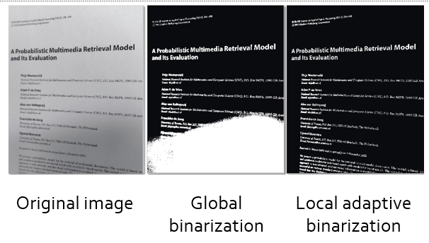

我们可以采用局部自适应操作来优化成为右边的图。具体思想：设定一个局部窗口，在整个图像上滑动该窗口；对于每一窗口位置，确定针对该窗口的threshold。

## Morphology Operation

### Morphology

* 形态学 Morphology  

    1960s 后期提出，研究动植物的结构与形态。形态学一般指生物学中研究动物和植物结构的一个分支

* 数学形态学 Mathematical morphology  

    基础理论：集合论。采用一种简单的非线性代数算子，主要用于二值图像，可扩展到灰度图像。用在噪声过滤、形状简化、细化、分割、物体描述等

用数学形态学（也称图像代数）表示以形态为基础对图像进行分析的数学工具  

* 基本思想是用具有一定形态的**结构元素(structure element)** 去度量和提取图像中的对应形状以达到对图像分析和识别的目的。  
* 形态学图像处理的数学基础和所用语言是**集合论**。  
* 形态学图像处理的应用可以简化图像数据，保持它们基本的形状特性，并除去不相干结构。
* 形态学图像处理的基本运算有4个：**膨胀、腐蚀、开操作和闭操作**  

### Set Theory for Image

  

  

  

### 膨胀 | Dilation

A: 二值图像
B: 二值模板，称为**结构元（structure element）**
$A\oplus B = \{z| (B)_z \cap A \neq \varnothing \}$
上式表示B进行平移与A的交集不为空

膨胀是将与物体“**接触**”的所有背景点合并到该物体中，使边界向外部扩张的过程。可以用来填补物体中的空洞。（其中“接触”的含义由结构元描述）

用行扫描的方式，作为 A 的一部分，希望把前景周围的一圈纳入到前景。

核心判断，交集不为空。 填充 B 的中心

一维情况：

=== "第一步"
    

=== "第二步"
    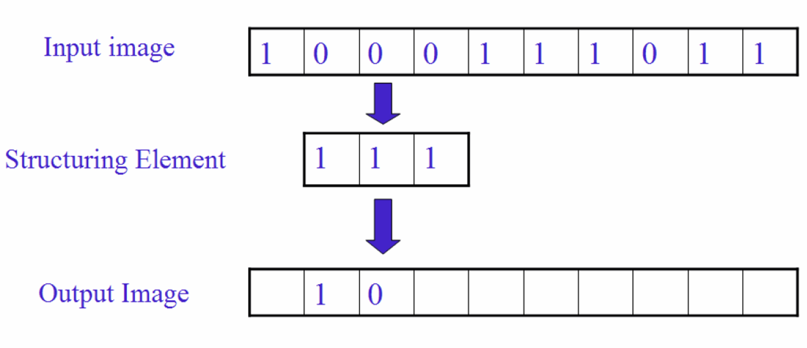

=== "第三步"
    

=== "第四步"
    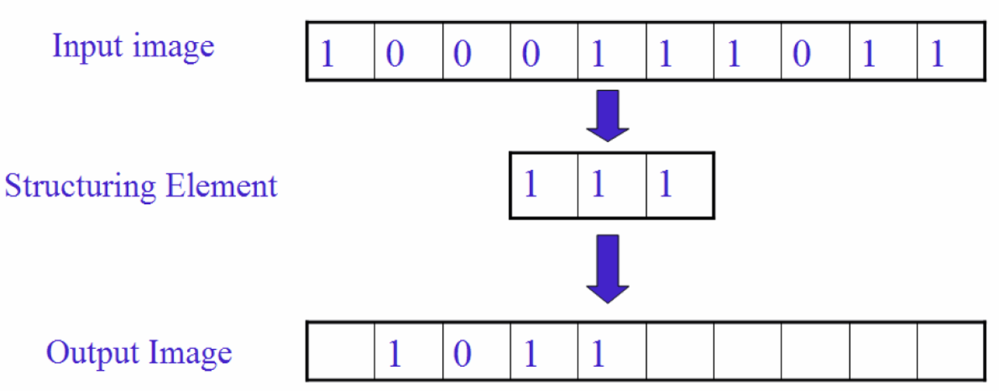

二维情况：

!!! example ""

    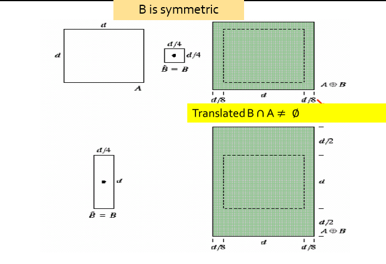

    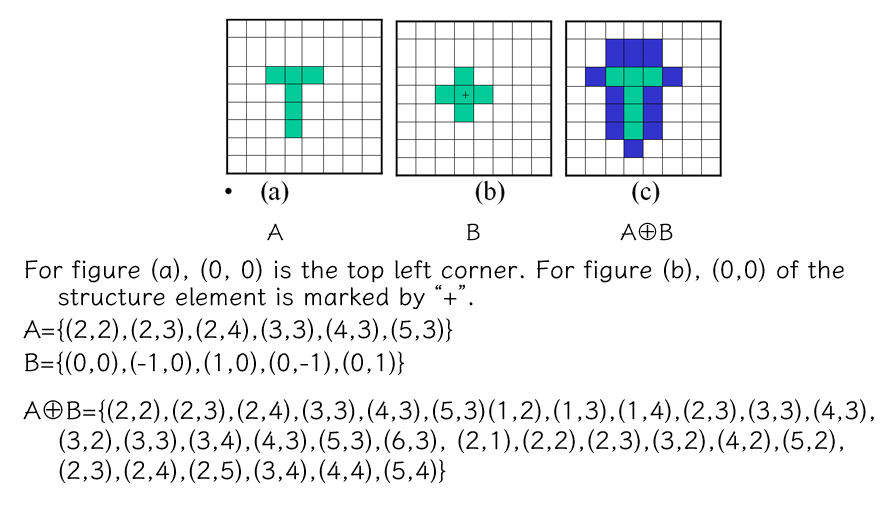

    显然，选择不同形状的结构元，结果也不同。

可以用来填补 gap.

### 腐蚀 | Erosion

腐蚀是一种消除边界点，使边界向内部收缩的过程。可以用来消除小且无意义的物体。

A: Binary image  

B: binary template,  structure element  

$$A\ominus B=\{(x,y)|(B)_{xy}\subseteq A\}$$  

Physical meaning: remove boundary, remove unwanted small objects.

一维情况：
=== "第一步"
    

=== "第二步"
    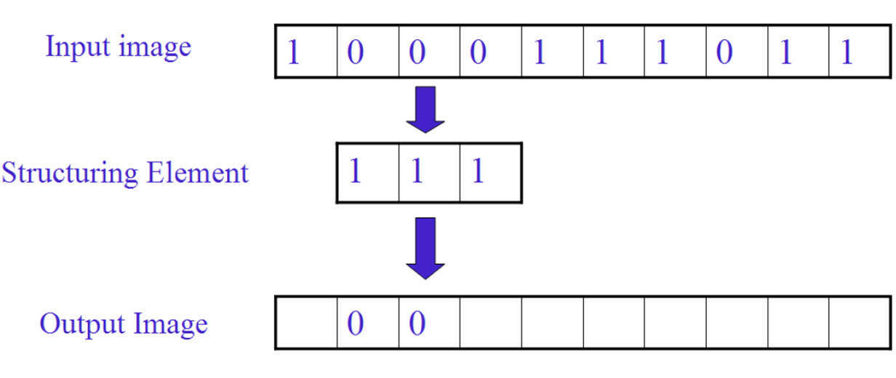

=== "第三步"
    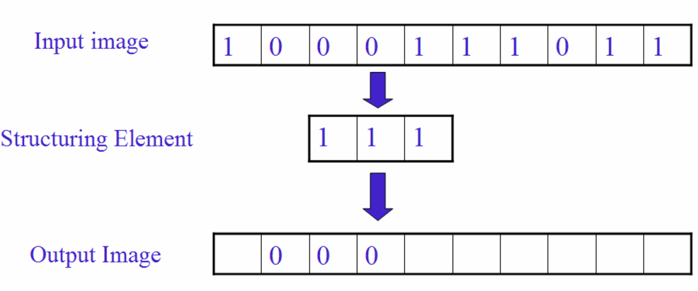

=== "第四步"
    

=== "第五步"
    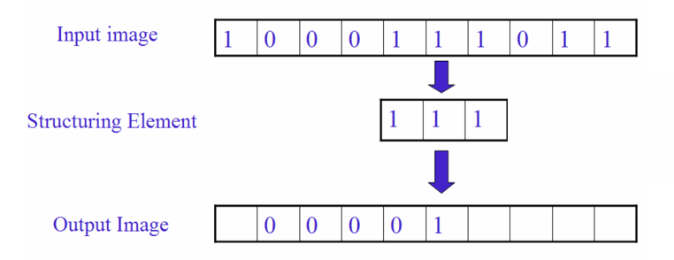

=== "第六步"
    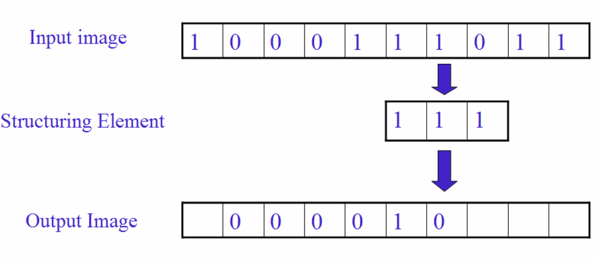

=== "第七步"
    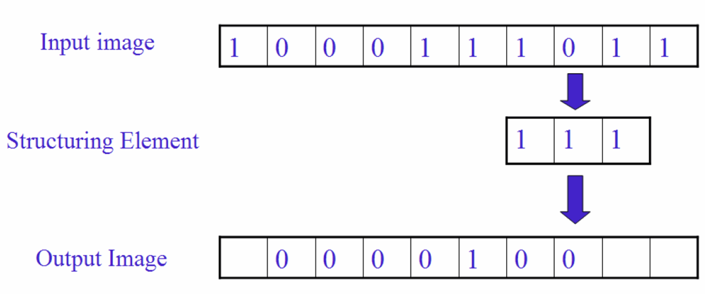

=== "第八步"
    

  

!!! Example
    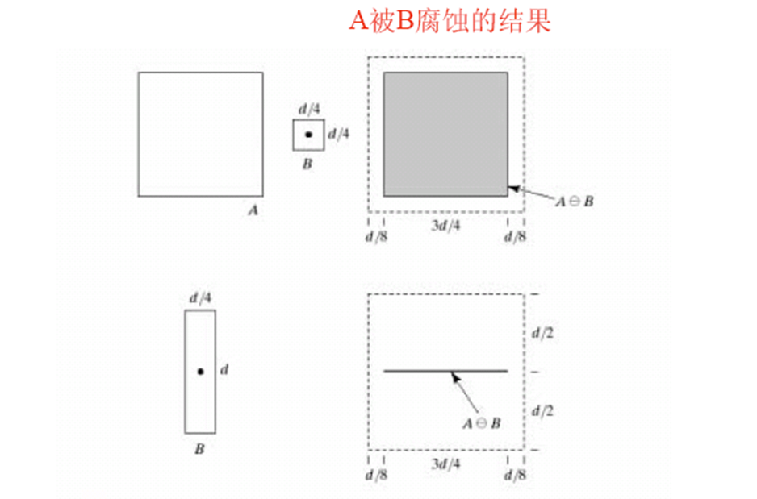

    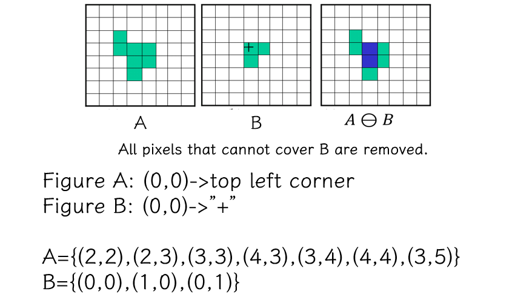 
    
    可以用第二张图验证代码是否正确。再利用算法二值化并操作。

padding 的思想：如果我们想从第一行开始扫描，但是这样有的就超出边界了，我们就把这一行再复制一遍，再从第一行开始扫描。

!!! note "滤波器"

    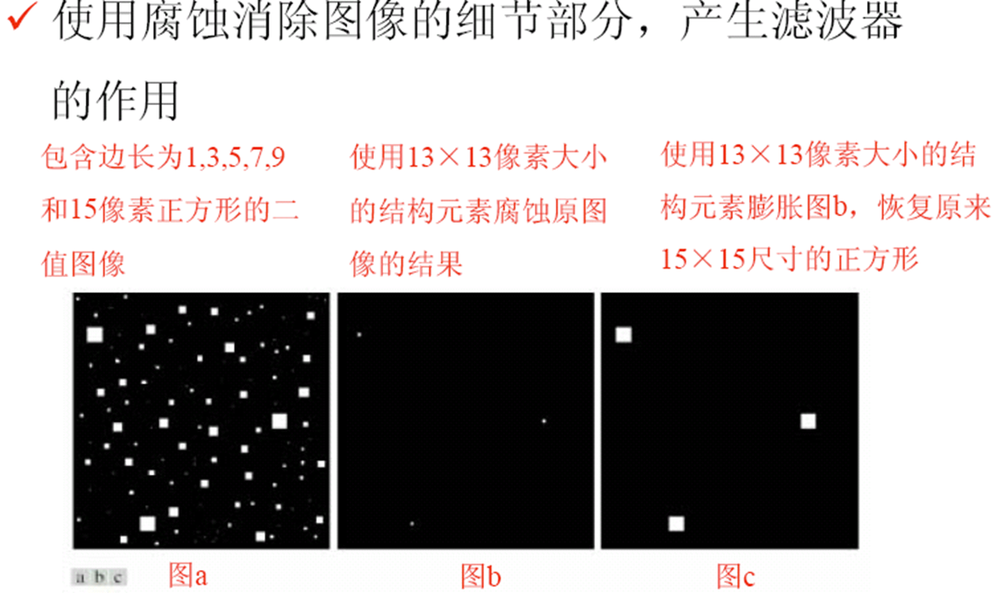

!!! Summary "Dilation and Erosion"

    * 膨胀  
    由B对A膨胀所产生的二值图像D是满足以下条件的点(x,y)的集合：如果B的原点平移到点(x,y)，那么它与A的交集非空。
    * 腐蚀  
    由B对A腐蚀所产生的二值图像E是满足以下条件的点(x,y)的集合：如果B的原点平移到点(x,y)，那么B将完全包含于A中
    * 膨胀与腐蚀是对偶的  
    $(A\ominus B)^c=\{z|(B_z)\sube A\}^c=\{z|(B_z)\cap A=\varnothing\}^c=\{z|(B_z)\cap A^c \neq \varnothing\}=A^c\oplus B$  

!!! Example "Application"

    !!! note "A - erode(A) 得到边界"
        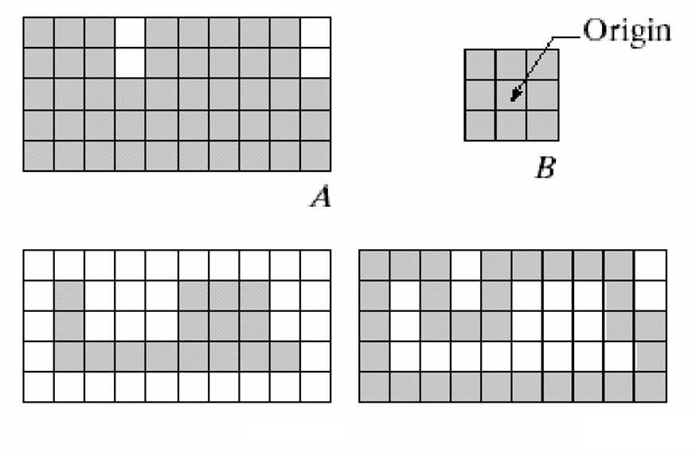

    !!! note 补洞
        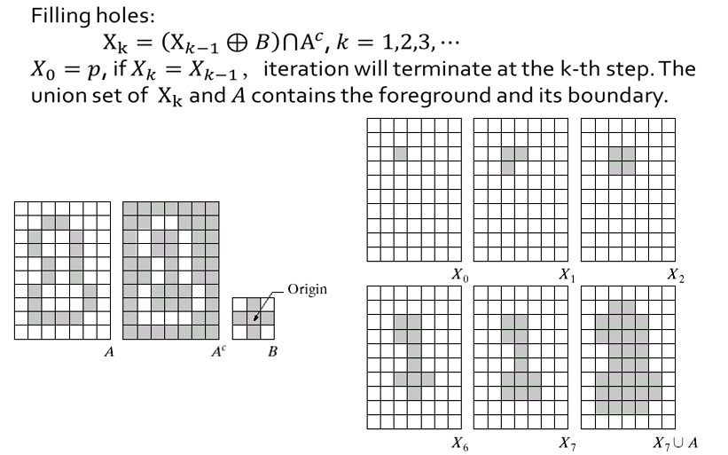

### Open

先腐蚀，后膨胀
$A\circ B=(A\ominus B)\oplus B$

Remove small objects, segment object at thin part, smooth boundary of large object but preserve its original area.

!!! note ""
    

    

### Close

先膨胀，后腐蚀
$A \bullet B =(A\oplus B)\ominus B$  

Fill small holes, connect the neighboring objects, smooth boundary while preserving the area at most.

!!! note ""

    

    

## 总结

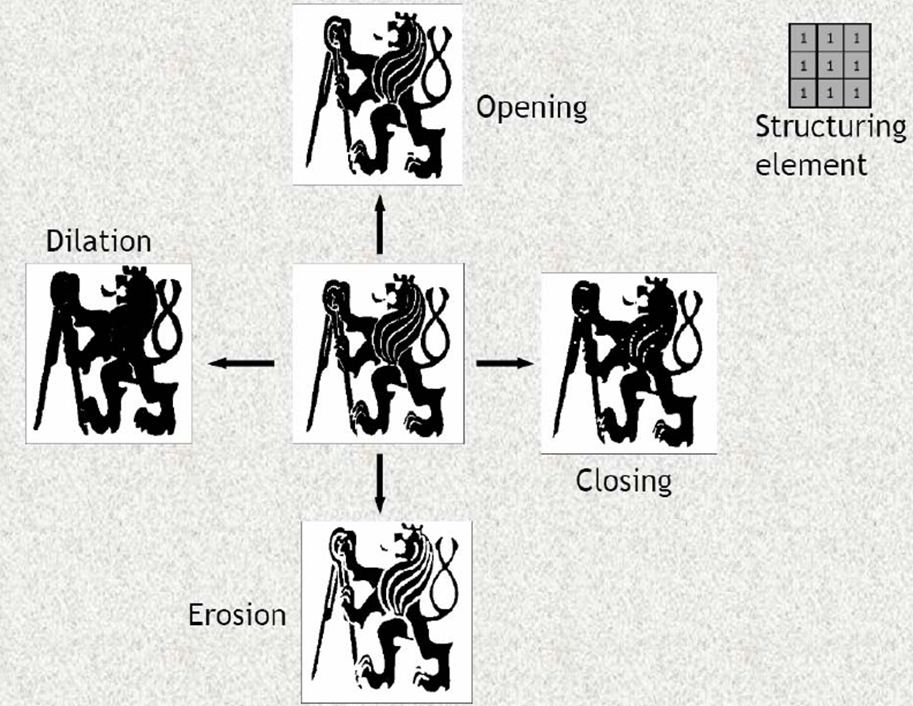
