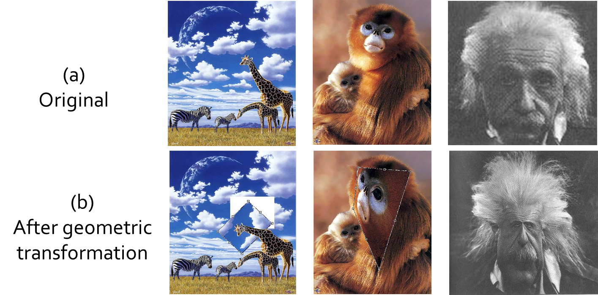
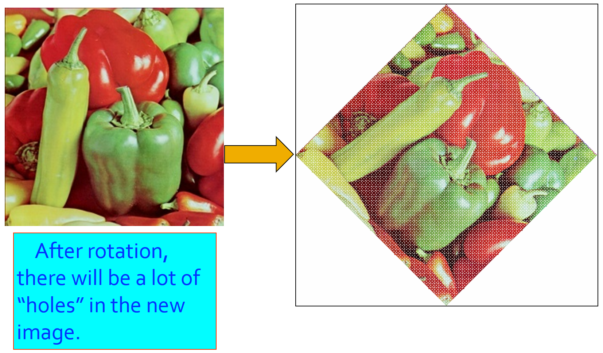
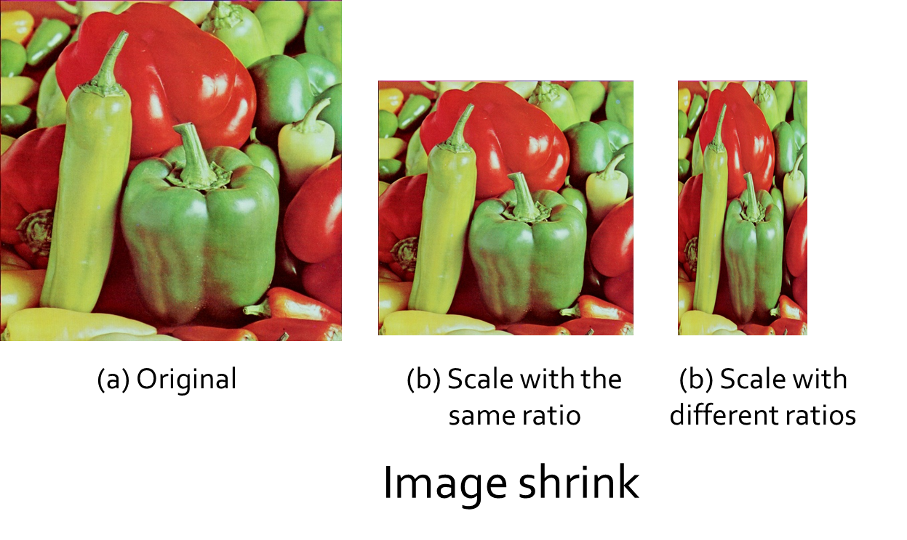
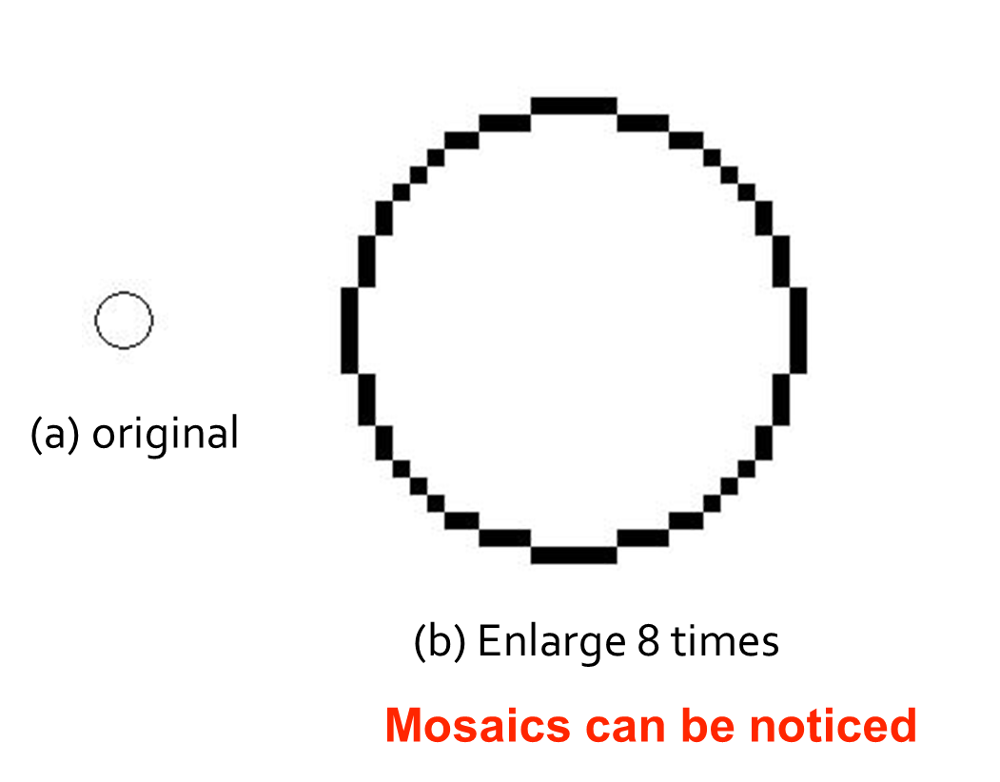
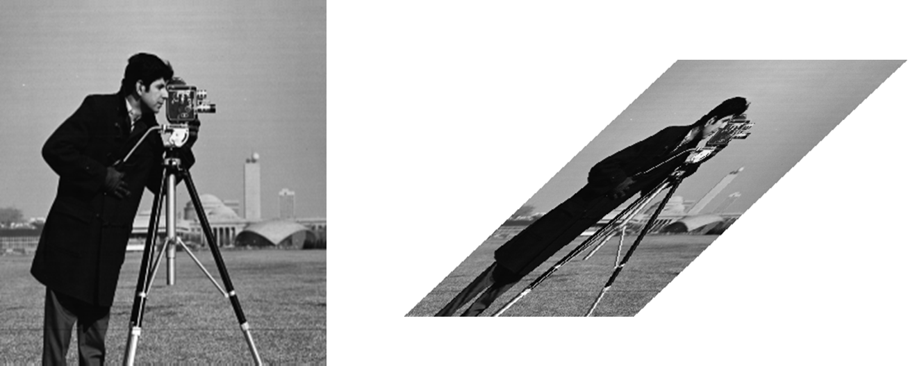
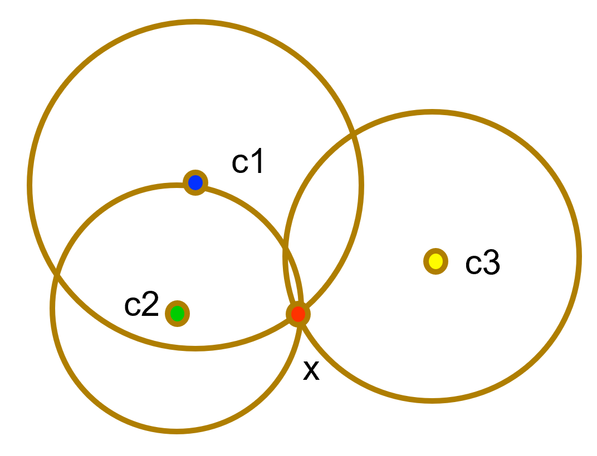
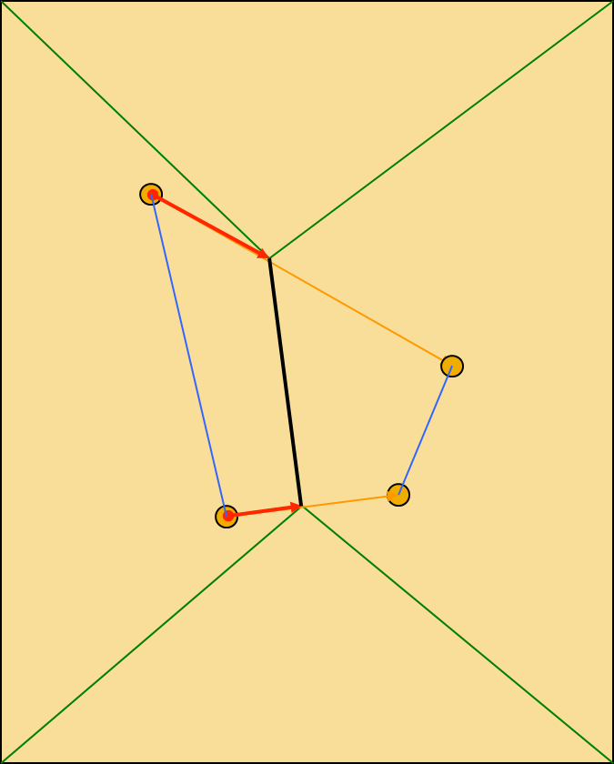
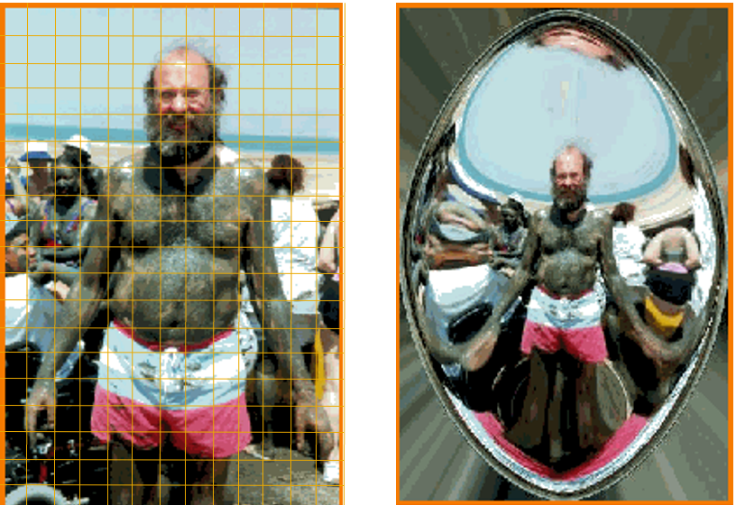

# 4 几何变换 | Geometric transform

!!! Abstract

    * Simple geometric transform  
    * Interpolation  
    * Warp and morph  
    * Application

图像几何变换又称为图像空间变换，它将一副图像中的坐标位置映射到另一幅图像中的新坐标位置。我们学习几何变换就是确定这种空间映射关系，以及映射过程中的变化参数。图像的几何变换改变了像素的空间位置，建立一种原图像像素与变换后图像像素之间的映射关系。我们将一幅图像中的坐标位置映射到另一幅图像中的新坐标位置，关键就是要确定这种空间映射关系，以及映射过程中的变换参数。

几何变换不改变图像的像素值，只是在图像平面上进行像素的重新安排。一个几何变换需要两部分运算：首先是空问变换所需的运算，如平移、旋转和镜像等，需要用它来表示输出图像与输入图像之间的〈像素〉映射关系：此外，还需要使用插值算法，因为按照这种变换关系进行计算，输出图像的像素可能被映射到输入图像的非整数坐标上。

!!! Example
    {}

$f(x,y)$ 表示输入图像， $g(x,y)$ 表示输出图像。函数 $a(x,y)$ 和 $b(x,y)$ 唯一地描述了空间变换：

$$g(x,y)=f(x',y')=f[a(x,y),b(x,y)]$$

几何变换根据难易程度通常可以归结为两类：  

* **简单变换**——变换过程（各个像素变换前后的位置）以及变换参数可知时的变换，如图像的*平移、镜像、转置、旋转、缩放、错切变换*等。
* **一般变换**——变换过程不是一目了然，变换参数难以测量时的变换。通常情况下，对图像畸变进行校正时，需要用到较为复杂的变换公式。  

## 简单变换 | Simple geometric transform

### Translation

将图像沿水平和竖直方向移动，从而产生新图像的过程。

$$
\left\{ \begin{matrix} x^{'}=x+x_0 \\ y^{'}=y+y_0 \end{matrix} \right.
$$

$$
\left[ \begin{matrix} x^{'}\\ y^{'}\\ 1 \end{matrix} \right]=\left[ \begin{matrix} 1 & 0 & x_0 \\ 0 & 1 & y_0 \\ 0 & 0 & 1 \end{matrix} \right] \left[ \begin{matrix} x\\ y\\ 1 \end{matrix} \right]
$$

平移后的景物与原图像相同，但“画布”一定是扩大了，否则就会丢失信息。

### Rotation

绕原点旋转 $\theta$ 角，得到新图像的过程  

$$  
\left\{ \begin{matrix} x^{'}=x\cos\theta - y\sin\theta\\ y^{'}=x\sin\theta + y\cos\theta \end{matrix} \right.
$$

$$
\left[ \begin{matrix} x^{'}\\ y^{'}\\ 1 \end{matrix} \right]=\left[ \begin{matrix} \cos\theta & 0 & x_0 \\ 0 & 1 & y_0 \\ 0 & 0 & 1 \end{matrix} \right] \left[ \begin{matrix} x\\ y\\ 1 \end{matrix} \right]
$$

!!! Example

    {width="50%"}

    需要注意的是，在进行变换的过程中会产生浮点数坐标，但是数字图像是以离散型整数存储数据的。
    
    也就是说，旋转后，新图像中将有许多“孔”。对此，我们将进行“插值”来填充。插值的内容详见[插值 | Interpolation](#interpolation)。

### Scale

图像的缩放指的是将图像的尺寸变小或变大的过程，也就是减少或增加原图像数据的像素个数。简单来说，就是通过增加或删除像素点来改变图像的尺寸。也就是说，将图像与系数相乘以生成新图像。

!!! note ""
    
    

可以表示为：

$$
\left\{ \begin{matrix} x^{'}=cx\\ y^{'}=dy \end{matrix} \right.
$$

或者用矩阵表示为

$$
\left[ \begin{matrix} x^{'}\\ y^{'}\\ 1 \end{matrix} \right]=\left[ \begin{matrix} c &  0 & 0 \\ 0 & d & 0 \\ 0 & 0 & 1 \end{matrix} \right] \left[ \begin{matrix} x\\ y\\ 1 \end{matrix} \right]
$$

!!! note ""

    * 沿 $x$ 轴方向缩放 $c$ 倍（$c>1$时为放大，$0<c<1$时为缩小）；沿 $y$ 轴方向缩放 $d$ 倍（ $d>1$ 时为放大，$0<d<1$ 时为缩小）。
    * 当 $c=d$ 时，图像等比缩放；否则为非等比缩放，导致图像变形。
    * 缩小——按一定间隔选取某些行和列的像素构成缩小后的新图像；
    * 放大——新图像出现空行和空列，可采用插值的方法加以填补，但存在“马赛克”现象。

### Shear

剪切变换是仿射变换的一种原始变换。它指的是类似于四边形不稳定性那种性质，方形变平行四边形，任意一边都可以被拉长的过程。

!!! note ""
    {width="55%"}

假设剪切变换的参数为 $d_x$ 或者 $d_y$，那么可以用数学公式表现为  

* **Shear on x-axis:** $\left\{ \begin{matrix} a(x,y)=x+d_xy\\ b(x,y)=y \end{matrix} \right.$
* **Shear on y-axis:** $\left\{ \begin{matrix} a(x,y)=x\\ b(x,y)=y+d_yx \end{matrix} \right.$

剪切变换可以仅是 x 坐标或仅是 y 坐标坐标受剪切，也可以是两个坐标同时受剪切，其变换矩阵分别为：

$$
\left( \begin{matrix} 1 &  0  \\ d_x & 1 \end{matrix} \right)
\left( \begin{matrix} 1 &  d_y  \\ 0 & 1 \end{matrix} \right)
\left( \begin{matrix} 1 &  d_y  \\ d_x & 1 \end{matrix} \right)  
$$

### Mirror

图像的镜像变换分为两种：水平镜像和垂直镜像。

!!! note ""
    {width="50%"}

绕 $x$ 轴或 $y$ 轴翻转，从而产生与原图像对称的新图像的过程: $\left\{ \begin{matrix} x^{'}=x \\ y^{'}=-y \end{matrix} \right.$

绕 $x$ 轴或 $y$ 轴翻转，从而产生与原图像对称的新图像的过程: $\left\{ \begin{matrix} x^{'}=-x \\ y^{'}=y \end{matrix} \right.$

$$
\left[ \begin{matrix} x^{'}\\ y^{'}\\ 1 \end{matrix} \right]=\left[ \begin{matrix} s_x & 0 & 0 \\ 0 & s_y & 0 \\ 0 & 0 & 1 \end{matrix} \right] \left[ \begin{matrix} x\\ y\\ 1 \end{matrix} \right]
$$

$$
\left[ \begin{matrix} x^{'}\\ y^{'}\\ 1 \end{matrix} \right]=\left[ \begin{matrix} \cos\theta & -\sin\theta & 0 \\ \sin\theta & \cos\theta & 0 \\ 0 & 0 & 1 \end{matrix} \right] \left[ \begin{matrix} x\\ y\\ 1 \end{matrix} \right]
$$

当 $S_x = 1$，且 $S_y = -1$ 时实现绕x轴的镜像变换

当 $S_x = -1$，且 $S_y = 1$ 时实现绕y轴的镜像变换

## 组合变换 | Combination

图像的组合变换是各项简单几何变换的混合操作。

$$
\left[ \begin{matrix} x^{'}\\ y^{'}\\ 1 \end{matrix} \right]=\left[ \begin{matrix} a &  b & c \\ d & e & f \\ g & h & 1 \end{matrix} \right] \left[ \begin{matrix} x\\ y\\ 1 \end{matrix} \right]
$$

变换矩阵是由构成组合变换的各种简单变换的变换矩阵按**从左至右**的顺序逐次相乘以后得到的结果。变换矩阵相乘时的顺序是不可以任意改变的

## 插值 | Interpolation

数学的数值分析领域中，内插或称插值 (Interpolation) 是一种通过已知的、离散的数据点，在范围内推求新数据点的过程或方法。

插值是几何变换最常用的工具，利用已知像素值，采用不同的插值方法，可以模拟出未知像素的像素值。

### 最近邻插值  | Nearest neighbor

**最近邻插值**：输出像素的灰度值等于离它所映射到的位置最近的输入像素的灰度值。

!!! note "计算过程："  
    为了计算几何变换后新图像中某一点P’处的像素值，可以首先计算该几何变换的逆变换，计算出P’所对应的原图像中的位置P。通常情况下，P的位置不可能正好处在原图像的某一个像素位置上（即P点的坐标通常都不会正好是整数）。寻找与P点最接近的像素Q，把Q点的像素值作为新图像中P’点的像素值。

    

最近邻插值法有局限性。当图像中包含明显的几何结构时，结果不能保持一致性和平滑性。例如：

{width="50%"}

### 线性插值 | Linear interpolation

对于一维的线性插值，假设在 $x_1$ 和 $x_2$ 处的灰度值分别为 $g_1$ 和 $g_2$ ，那么 $x_3$ 处的灰度值 $g_3$ 为：  

$$g_3=\dfrac{g_2-g_1}{x_2-x_1}(x_3-x_1)+g_1$$

但我们图像是二维的（行列），因此需要二维插值。  

在二维情况下，称之为 “双线性插值”。

!!! question ""

    已知图像的正方形网格上四个点A、B、C、D的灰度，求P点的灰度。

{width="40%"}

1. 定义双线性方程 $g(x,y)=ax+by+cxy+d$
2. 分别将A、B、C、D四点的位置和灰度代入方程，得到方程组。
3. 解方程组，解出$a$、$b$、$c$、$d$四个系数。
4. 将P点的位置代入方程，得到 P 点的灰度。

在实现时，我们可以同样可以用 1 维的线性插值来实现双线性插值。只要先进行每行的插值，再进行每列的插值，我们就可以对整个图像进行插值运算。这样子也可以并行计算.

例如，对上图中。我们可以通过多次 1 维的线性插值来进行双线性插值：首先将 A、 B 连线进行插值计算求出 R 点灰度值，再将 C、 D 两点连线进行插值计算求出 Q 点灰度值，最后将 Q、 R 连线进行插值计算求出 P 点灰度值。

### RBF interpolation

$G(x)=\sum_{i=1}^n w_iG(c_i)$ where $w_i=\dfrac{\phi(|x-c_i|)}{\sum_{i=1}^n\phi(|x-c_i|}$  

其中 $x$ 可以是一个标量，也可以是一个向量，也就是说既可以是一维插值，也可以是二维、多维插值，取决于 $x$ 的维度。

用鼠标拖，离鼠标越近，受影响越小  

{width="40%"}

常用的核函数：

* Gaussian: $\phi(r)=exp\{-\dfrac{e^2}{2\sigma^2}\}$  
* Multiquadrics: $\phi(r)=\sqrt{1+\dfrac{r^2}{\sigma^2}}$  
* Linear: $\phi(r)=r$  
* Cubic: $\phi(r)=r^3$
* Thinplate: $\phi(r)=r^2\ln(r+1)$

## Warp and Morph

Warp: 只改变像素的位置  

Morph: 不仅改变位置，还要改变颜色  

### Image Morph

这里讨论的 Morph 变形不同于一般的几何变换(Warp)

Morph 变形指景物的形体变化，它是使一幅图像逐步变化到另一幅图像的处理方法。这是一种较复杂的二维图像处理，需要对各像素点的**颜色、位置**作变换。

变形的起始图像和结束图像分别为两幅关键帧（起始帧和结束帧），从起始形状变化到结束形状的关键在于自动地生成中间形状，也即自动生成中间帧。

{width="50%"}

大小相同的两幅图的转换作静态变换。从一幅图a逐渐变化成第二幅图b

* 原理：让图a中每个像素的颜色，逐渐变成图b相同位置像素的颜色。
* 方法：根据变换的快慢，设置相应的步长，将图a每一点的RGB逐渐变成图b相同位置像素的RGB。可以选择等比或等差的方式，或其它方式让：$r^a\rightarrow r^b$
如：$I_i=I_{begin}+i*\dfrac{I_{end}-I_{begin}}{n}$
* 对于彩色图像，RGB三色同时从原图变到目标图像。可以分别变化，也可考虑RGB的相对比例关系同时变化。  
    * $r_{i,j}=r_{begin}+i*\dfrac{r_{end}-r_{begin}}{n}$
    * $g_{i,j}=g_{begin}+i*\dfrac{g_{end}-g_{begin}}{n}$
    * $b_{i,j}=b_{begin}+i*\dfrac{b_{end}-b_{begin}}{n}$

对于灰度图像，可以直接用等比或等差级数定义步长，使颜色从原图变到目标图。

**如何选择关键帧：**  
选择两幅结构相似、大小相同的画面作为起始和结束关键帧，这样才能比较容易地实现自然、连续的中间变形过程。（否则效果很差）

### 模型转换的 Morph | Morph based on segment

以点为中心控制像素的移动。利用 RBF 的思路，移动线段。距离控制点越近，移动幅度越相似。

在起始和结束画面上确定和勾画出各部分（主要轮廓）的结构对应关系，也即从起始画面上的一个点变到结束画面上的另一个对应点的位置，这是变形运算所需要的参数。根据需要，对应点的位置可以任意移动。调整起始帧的对应点位置，可以模拟摄像中的镜头渐变效果。

在各点像素坐标变化的同时，每个像素的颜色RGB也一起从原图像改变为目标图像。

这时可以采用不同的插值策略计算像素中间值（空间，颜色）

!!! note "线段的Morph"

    {width="30%"}

### 视点变换的Morph | Morph based on grid

**视点变换**就是求在视点移动后原始图像变换生成的新视图。

* 在用相机拍摄物体时，保持物体的位置不动，而将相机移离物体，这就相当于**视点变换**；
* 如果我们保持相机固定位置，将物体移离相机，这就相当于**模型转换**。

视点变形要求对物体有三维坐标知识。

!!! note "Fish eye effect"

    {width="40%"}

## 应用 | Application

!!! question "问题背景"

    {width="50%"}

    我们可以应用 $v_{B'}=v_{B}+v_{A'}-v_A$, 但这样得到的表情细节丢失了。  

为此，我们需要引入光照模型(Lambertian model).  

### 光照模型 | Lambertian model

假设空间中 m 为点光源，曲面亮度如下：

$$I=\rho\sum\limits_{1\leq i\leq m} S_iI_in_i\cdot l_i\equiv \rho E(n) $$

$$\text{where}\;\; S_i=\left\{\begin{matrix} 0, \text{cannot be seen} \\ 1, \text{otherwise}\end{matrix}\right.$$

其中 $l_i$ 第 i 个光源照过来的角度，$n$ 表示当前这个曲面的法向量，所以 $n\cdot l_i$ 相当于余弦关系; $I_i$ 表示第 i 个光源的亮度；$S_i$ 表示曲面能不能被第 i 个点光源照到; $\rho$ 表示曲面的材质  

**Expression ratio image(ERI)**: 由于对同一个对象变换前后的材质是一样的，所以$\rho$ 一样，可以得到：

$$\dfrac{I'}{I}=\dfrac{E(n')}{E(n)}$$

ERI 是因为曲面变形所导致的亮度的变化；不依赖于材质的。

假设在对应的点都有相同的法向量，材质不同，相同的形变

| |Before deform | After deform|
|:-|-|-|
|Surface 1|$I_1=\rho_1E(n)$|$I_1^{'}=\rho_1E(n')$|
|Surface 2|$I_2=\rho_2E(n)$|$I_2^{'}=\rho_2E(n')$|

于是刚刚的问题转变为：（假设人脸有近似相同的法向量）

| |Neutral| Expression|
|:-|-|-|
|Person A|$I_a=\rho_aE(n)$|$I_a^{'}=\rho_aE(n')$|
|Person B|$I_b=\rho_bE(n)$|$I_b^{'}=?$|

由刚刚的推导可得

$$I_b^{'}=\dfrac{I_a^{'}}{I_a}I_b$$

**Algorithm:**

* Step 1: Mark feature points
* Step 2: 对每一个特征点 $v_b$ in $B$, warp it: $v_{b'}=v_b+v_{a'}-v_a$, 令 $B_g$ 是 $B$ 变形后的图像  
* Step 3: 用 $B_g$ 对齐 $A$ ，$A'$，直到每个像素都能找到另外两种图像上的对应点
* Step 4: 计算 ratio image $\Re=\dfrac{A'}{A}$
* Step 5: $B' = \Re \cdot B_g$

!!! Info "如何找像素的 correspondence"
    通过图像对齐，手工标记特征点后进行参数化。
