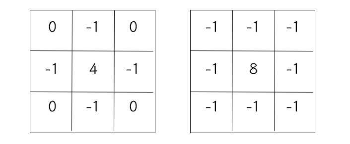
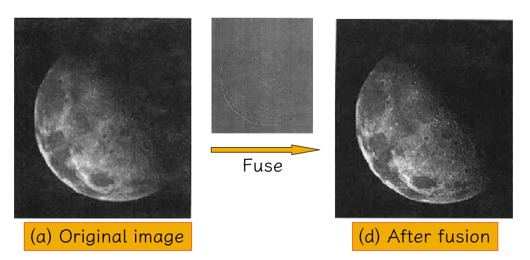
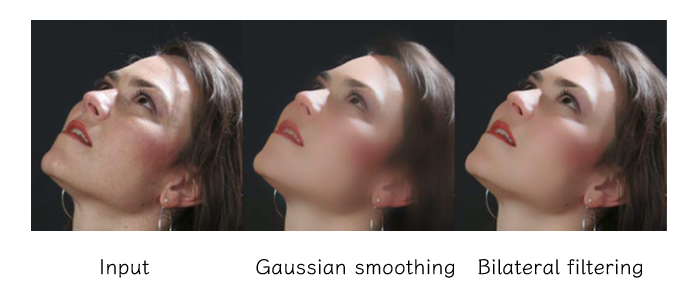

# 5 卷积和滤波 | Convolution and Filtering

!!! abstract "Abstract"

    * Continuous 1D convolution
    * Properties of convolution
    * Discrete 1D convolution 
    * Spatial domain filtering

## 一维卷积 | 1D Convolution

### 连续卷积 | Continuous 1D convolution

两个一维连续函数 $f(x)$ 和 $h(x)$ 的卷积 $g(x)$ 为  

$$g(x)=f(x)*h(x)=\int_{-\infty}^{\infty}f(t)h(x-t)dt$$

它表示两个函数的卷积可以转化成乘积的积分来计算。通常将 $f(x)$ 称为输入函数，将 $h(x)$ 称为卷积函数。  

#### Computing process

已知两个函数，要求计算它们的卷积在任意点x处的值。

* 将卷积函数 $h(t)$ 反折  

{width="50%"}

* 将反折后的卷积函数向右移动距离 $x$

{width="50%"}

* 计算 $f$ 和 $h$ 在任意 $t$ 的乘积，并积分

{width="50%"}

- 对每一个 $x$ 值重复上述计算过程，就得到了输出曲线 $g(x)$
- 当 $x$ 变化时，反折的函数被平移通过静止不动的输入函数, $g(x)$ 值取决于这两个函数的重叠部分的累积。

记卷积的运算符号为 $*$，则卷积的定义为：

$$g(x)=f(x)*h(x)=\int_{-\infty}^{\infty}f(t)h(x-t)dt$$

#### Property

* **Exchangeable**: $f(x)*g(x)=g(x)*f(x)$  
* **Distributive**: $f*(g+h)=f*g+f*h$  
* **Associative**: $f*(g*h)=(f*g)*h$  

### 离散卷积 | Discrete 1D convolution

对于离散序列，其卷积可用与连续函数相类似的方法求得。此时自变量变为下标，面积则由求和代替。
对于两个长度均为 M 的序列 $f(x)$ 和 $h(x)$，其卷积为: 

$$g(x)=f(x)*h(x)=\dfrac{1}{M}=\sum\limits_{t=0}^{M-1}f(t)h(x-t)$$

有效范围：覆盖了所有 $h(t)$ 的点。

***e.g.***  

{width="60%"}

如果要对边界的点进行卷积，可以将序列进行扩展（padding）。

!!! note ""

    **卷积实质上是对图像像素的加权求和**。

## 空间滤波 | Spatial filtering

**图像滤波 (Image Filter)**，即在尽量保留图像细节特征的条件下对目标图像的噪声进行抑制，是图像预处理中不可缺少的操作，其处理效果的好坏将直接影响到后续图像处理和分析的有效性和可靠性。

### 滤波器 | Filter

滤波器是一个大小为 $M\times N$ 的窗口，窗口中的元素与原图像的处于窗口内的像素进行某种运算，结果作为新图像的一个像素。当窗口滑过原图像并完成上述运算之后，就能够得到一幅新图像。（本质就是刚刚提到的卷积）

**滤波器(Filter)** 的别名：掩模(mask)、核(kernel)、模(template)、窗口(window)

滤波器子图像中的值是系数值，而不是像素值，它代表了影响新像素产生的权重。

边界如何处理？可以扩展行列，也可以直接将中心从第二行开始。

### Procedure

在待处理图像中逐点移动掩模，在每一点 $(x,y)$ 处，滤波器在该点的响应通过实现定义的关系来计算。对于线性空间滤波，其响应由滤波器系数与滤波掩模扫过区域的对应像素值的乘积之和给出。

{width="60%"}

### Response

响应值:

$$
\begin{align*}
R=&w(-1,-1)f(x-1,y-1)+w(-1,0)f(x-1, y)\\
&+\ldots+w(0,0)f(x,y)+\ldots\\
&+w(1,0)f(x+1,y)+w(1,1)f(x+1,y)
\end{align*}
$$

这实质上是一种卷积操作，

!!! note "卷积 Recall "

    $$h(x)=f(x)*h(x)=\dfrac{1}{M}=\sum\limits_{t=0}^{M-1}f(t)h(x-t)$$  

通常，掩模的长宽都为奇数。假设分别为 $2a+1$ 和 $2b+1$. 当窗口中心处于像素 $(x,y)$ 处时，新的像素值为：

$$g(x,y)=\sum\limits_{s=-a}^a\sum\limits_{t=-b}^b w(s,t)f(x+s,y+t)$$  

对图像 $f$ 中所有像素都与掩模进行运算之后，最终产生一幅新图像 $g$，即 

$$R=w_1z_1+w_2z_2+\cdots+w_{mn}z_{mn}=\sum\limits_{i=1}^m w_iz_i$$

图像在传输过程中，由于传输信道、采样系统质量较差，或受各种干扰的影响，而造成图像毛糙，此时，就需对图像进行平滑处理。平滑可以抑制高频成分，但也使图像变得模糊。

### 平滑空间滤波器

**平滑空间滤波器**（也叫低通滤波，因为平滑的部分一般是低频的）用于模糊处理和减少噪声。模糊处理经常用于预处理，例如，在提取大的目标之前去除图像中一些琐碎的细节，桥接直线或曲线的缝隙。 可以去掉噪声，但会使图模糊，一般用于预处理。

#### 均值滤波器 | Linear smoothing filter

**平滑线性空间滤波器(Linear smoothing filter)** 的输出是包含在滤波掩模邻域内像素的简单平均值。因此，这些滤波器也称为**均值滤波器**。

均值滤波主要用于细微的细节去除，即去除比遮罩窗口还小的不需要的区域。

* 简单平均，表示窗口中每一个像素对响应的贡献是一样的  

    {width="25%"}

* 加权平均，表示窗口中的像素对相应的贡献有大小之分。  

    两个3×3平滑（均值）滤波器掩模，每个掩模前边的乘数等于它的系数值的和，以计算平均值  

    {width="25%"}

    !!! example ""
        这样中间像素能更多地被保留，类似于一个高斯函数。

##### General equation

$$g(x,y)=\dfrac{\sum\limits_{s=-a}^a\sum\limits_{t=-b}^bw(s,t)f(x+s,y+t)}{\sum\limits_{s=-a}^a\sum\limits_{t=-b}^b w(s,t)}$$ 

其中，滤波器大小为 $(2a+1) \times (2b+1)$，$w$ 为滤波器，$f$ 为输入图像，$g$ 为输出图像。

##### Explanation

滤波掩模的大小与图像的平滑效果有直接的关系。当掩模比较小时，可以观察到在整幅图像中有轻微的模糊，当掩模大小增加，模糊程度也随之增加。 卷积核越大，图越模糊，保留的细节越少（类似照相机的光圈）  

为了得到感兴趣的物体的 brief description，我们常用均值滤波器来模糊它。这样，那些较小物体与背景混合在一起了，较大物体变得像“斑点”而易于检测。因此，我们选取的掩模大小应由那些即将融入背景的物件尺寸来决定。

### 统计滤波器 | Statistical sorting filter

与均值滤波 (空间线性滤波) 相比，**统计滤波**是一种非线性的空间滤波，其效果基于窗口内像素值的排序结果，中心像素的值由统计排序结果决定。(由于每次都要排序，其计算速度比线性滤波慢)

统计滤波器中最常见的例子是**中值滤波器**。

* 用像素邻域内灰度的中值代替该像素的值。
* 提供了优秀的去噪能力，比小尺寸的线性平滑滤波器的模糊程度明显要低。
* 对处理脉冲噪声（pulse noise / pepper noise）非常有效，因为这种噪声是以黑白点叠加在图像上的。

为了对一幅图像上的某个点作中值滤波处理。必须先将掩模内欲求的像素及其邻域的像素值排序，确定出中值，并将中值赋予该像素点。

常用 $n\times n$ 的中值滤波器去除那些相对于其邻域像素更亮或更暗，并且其区域小于 $n^2/2$（滤波器区域的一半）的孤立像素集。

### 锐化滤波器 | Sharpening spatial filter

!!! note ""

    锐化处理的主要目的是突出灰度的过渡部分。补偿轮廓，增强图像的边缘及灰度跳变的部分，使图像变得清晰，增强图像中的细节或锐化模糊部分。

为了突出图像中的细节或者增强被模糊了的细节，我们引入微分算子。

微分算子是实现锐化的工具，其响应程度与图像在该点处的突变程度有关。微分算子增强了边缘和其他突变（如噪声），  削弱了灰度变化缓慢的区域。

* 基于二阶微分的图像增强——**拉普拉斯算子**
* 基于一阶微分的图像增强——**梯度法**

#### 差分算子 | Differential operator

对于一个整数值函数 $f(x)$ 来说，我们使用差分来表示微分算子：

$$\dfrac{\partial f}{\partial x}=f(x+1)-f(x)$$  

类似的，我们可以把二阶微分写成这样：

$$
\begin{align*}
\dfrac{\partial^2 f}{\partial x^2}&=f(x+1)-f(x)-(f(x)-f(x-1))
\\&=f(x+1)-2f(x)+f(x-1)
\end{align*}
$$

#### 梯度算子 | gradient based operator 

对于一个二元函数 $f(x,y)$ 来说，我们首先定义一个二维的向量：

$$
\nabla f=\left[\dfrac{G_x}{G_y}\right]=\left[\dfrac{\dfrac{\partial f}{\partial x}}{\dfrac{\partial f}{\partial y}}\right]
$$

它的 **幅值(Magnitude)** 被表示为：

$$
\nabla f = (G_x^2+G_y^2)^{\frac{1}{2}}=\left[(\dfrac{\partial f}{\partial x})^2 + (\dfrac{\partial f}{\partial y})^2\right]^{\frac{1}{2}}
$$

当对整幅图像计算梯度时，运算量会很大，因此，在实际操作中，常用绝对值代替平方与平方根运算近似求梯度的模值

$$\nabla f\approx |G_x|+|G_y|$$

!!! note ""

    另一种计算方法: **Robert 交叉梯度算子**

    设我们有原始图像如下（$z_i$ is the pixel value）：

    {width="25%"}

    则在 Robert 交叉梯度算子 中，我们记

    $$G_x=z_9-z_5, G_y=z_8-z_6$$

    我们有

    $$
    \begin{align*}
    \nabla f &= (G_x^2+G_y^2)^{\frac{1}{2}}=[(z_9-z_5)^2+(z_8-z_6)^2]^{\frac{1}{2}}
    \\
    &\approx  |G_x|+|G_y|
    = |z_9-z_5|+|z_8-z_6|
    \end{align*}
    $$

#### 拉普拉斯算子 | Laplacian operator

可以证明，最简单的各向同性导数算子是拉普拉斯算子 (Rosenfeld and Kak [1982])。因为任何阶导数都是线性运算，所以拉普拉斯算子是线性算子。

对函数 $f(x, y)$，拉普拉斯算子定义如下(和梯度不同，拉普拉斯算子是一个标量)

$$
\nabla^2 f=\dfrac{\partial^2 f}{\partial x^2}+\dfrac{\partial^2 f}{\partial y^2}
$$

* 两个变量的离散拉普拉斯函数是:  

    $$
    \nabla^2 f(x,y)=f(x+1,y)+f(x-1,y)+f(x,y+1)+f(x,y-1)-4f(x,y)
    $$

    {width="25%"}

    相当于用卷积核对图像做卷积（这个卷积核是各向同性，旋转不变的(*rotation-invariant*)）

* 对角线上的元素也可以考虑进来设计掩膜：  

    $$
    \begin{align*}
    \nabla^2 f(x,y)  =&f(x-1,y-1)+f(x,y-1)+f(x+1,y-1)+\\&f(x-1,y)-8f(x,y)+
    f(x+1,y)+\\&f(x-1,y+1)+f(x,y+1)+f(x+1,y+1) \\
    =& \sum\limits_{i=-1}^1\sum\limits_{j=-1}^1 f(x+i,y+j)-9f(x,y)
    \end{align*}
    $$

    {width="25%"}

* 当拉普拉斯滤波后的图像与其它图像合并时（相加或相减），则必须考虑符号上的差别。

    {width="70%"}

#### 应用

用拉普拉斯算子对图像进行增强：

$$
g(x,y)=\left\{\begin{matrix}f(x,y)-\nabla^2f(x,y), If\ the\ center\ of\ the\ mask\ is\ negative \\
 f(x,y)+\nabla^2f(x,y), If\ the\ center\ of\ the\ mask\ is\ positive \end{matrix} \right.
$$

由于拉普拉斯算子是一种导数算子，它的使用会突出显示图像中的强度不连续性，而不强调具有缓慢变化的强度级别的区域，这将倾向于生成具有灰色边缘线和其他不连续性的图像。

所以将原始图像和拉普拉斯图像叠加(Fuse)在一起，可以在保护锐化效果的同时，又能“恢复”背景信息。

!!! note ""

    

    

    

    该图像中的细节明显比原始图像中的更清晰。

#### 双边滤波 | Bilateral Filtering

!!! note ""

    之前我们讨论的锐化滤波器总会带来一些噪声，而双边滤波器可以在锐化的同时去除噪声。

    

    而且，可以看到，双边滤波器下的细节保留的更好。

保边滤波(edge-preserving)的一种

 Bilateral filtering Example 

  

目标：图像的平滑，但要把 large-scale 的结构保留, small-scale 的纹路抹掉。

* space domain S, 表示像素可能的位置(高斯滤波主要考虑的)  
* intensity domain R, 像素可能的灰度值  

想法:  

* 每个样本都被周围的加权平均替代
* 权重要同时反映距离中心像素的远近，以及像素值和中心像素值的相似度

??? Info "Review of Gaussian Blur"
    $$
    GB[I]_p=\sum\limits_{q\in S}G_\sigma (||p-q||)I_q
    $$

    当 G 满足高斯分布时：
    
  
  

    这里的 $\sigma$ 是我们选取窗口的大小。如何设置 $\sigma$? 根据经验，通常的策略是是设置为图像大小的一个比例，如 2%.  
    可以起到平滑效果，但会使图像模糊，因为只考虑了距离因素。

$$
BF[I]_p=\dfrac{1}{W_p}\sum\limits_{q\in S}G_{\sigma_s} (||p-q||)G_{\sigma_r} (|I_p-I_q|)I_q
$$

* $\dfrac{1}{W_p}$ 归一化因子
* $G_{\sigma_s} (||p-q||)$ 空间(spatial)的权重，和高斯滤波中相同($\sigma_s$ 表示核的空间范围)
* $G_{\sigma_r} (|I_p-I_q|)$ 灰度(range)的权重(注意这里只是一范式而非二范式，因为灰度只是标量)($\sigma_r$ 表示灰度的范围)

 范围变化对图像的影响 

  

如何设置参数: intensity proportional to edge amplitude(对每一个小窗口都需要重新计算 $\sigma_r$)  

可以反复在一张图像上做双边滤波，$I_{(n+1)}=BF[I_{(n)}]$

若在彩色图上做双边滤波，只需要将式子改为  

$$
BF[I]_p=\dfrac{1}{W_p}\sum\limits_{q\in S}G_{\sigma_s} (||p-q||)G_{\sigma_r} (|||C_p-C_q|||)I_q
$$

其中 $|||C_p-C_q|||$ 是三维向量(RGB/Lab) 的欧氏距离

#### Denoising

* 较小的空间 $\sigma_s$
* 根据噪声水平调整 $\sigma_r$
* 可能不是最好的去噪方法，但能做好简洁性和效果的 tradeoff

#### Tone mapping

  

将真实世界的

* 输入: HDR Image(high-dynamic-range) 32 位图像，多出来的 8 位称为阿尔法通道，即透明度。每个像素是浮点数，这样可以增加范围。

从 1:10000 压到 1:100？

  

减少低频，但可能会出现梯度逆转(halo)

  

!!! Question "Brute-force problem"
    暴力实现双边滤波的时间可能会非常慢，因为他是非线性的，而且每个核都不一样，不能提前算出
