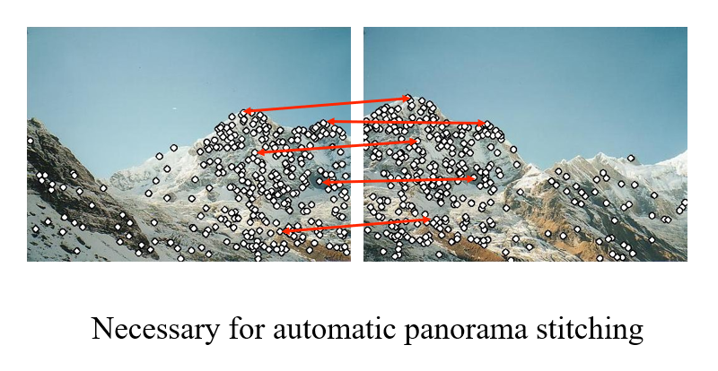
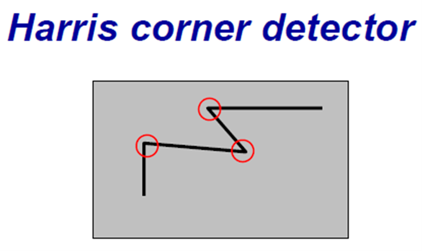
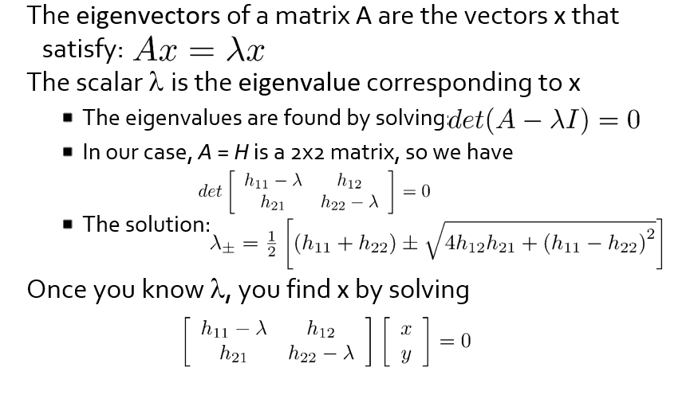
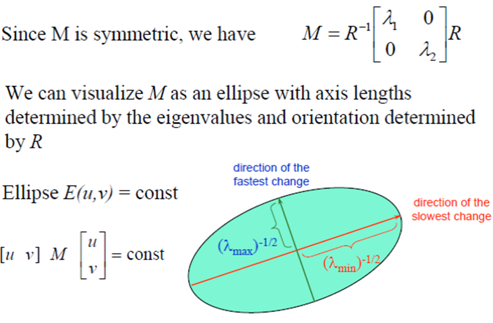
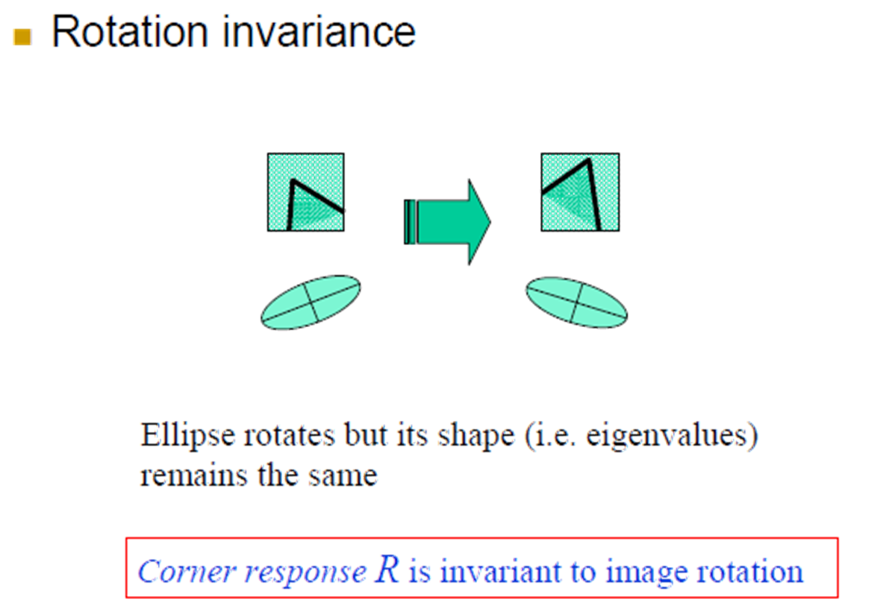
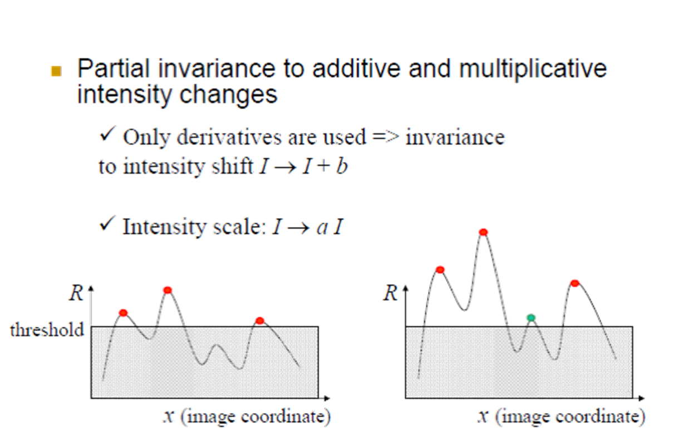
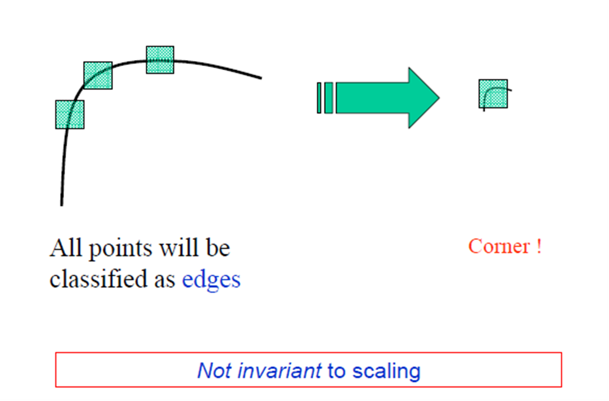
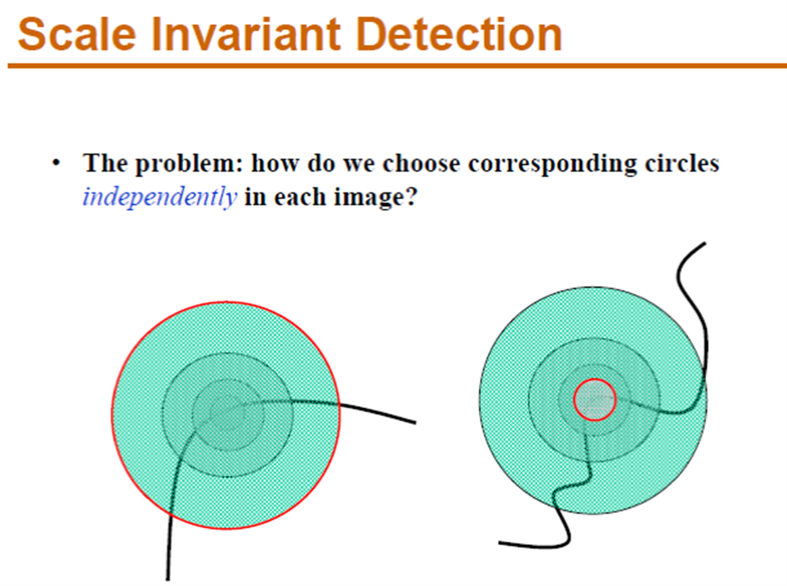
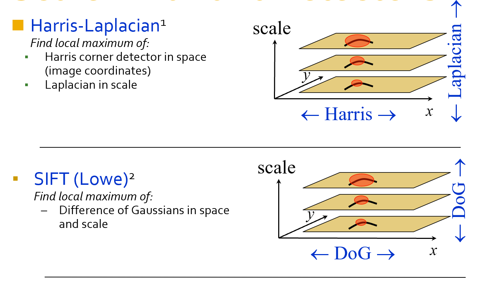

# Image Feature

!!! Abstract

    * Image feature  
        * Image matching  
        * Feature detection  
            * Harris operator  
        * Invariance  
            * Scale Invariant Feature Transform (SIFT)  

## Image Matching

Panorama(全景图)

做图像拼接: 检测两张图像的特征点，找到对应的点对，用这些点对对齐图像

## Feature detection  

提取出局部的具有几何不变性的特征

怎样找到一个好的特征？  ——找到一个非同寻常的区域

{width=50%}

我们考虑一个小窗口的像素  

* *flat*: 在任何方向都不会有像素的改变
* *edge*: 沿着边的方向不会有像素的改变
* *corner*: 在任何方向都会有明显的改变  

量化窗口像素的变化: $W$ 表示窗口，$(u,v)$ 表示方向

$$E(u,v)=\sum\limits_{(x,y)\in W}[I(x+u,y+v)-I(x,y)]^2$$  

泰勒展开:

$$I(x+u,y+v)-I(x,y)=\dfrac{\partial I}{\partial x}u + \dfrac{\partial I}{\partial y}v + higher\ order\ terms$$

如果 $(u,v)$ 是个小量，那么我们可以用一阶微分估计：

$$I(x+u,y+v)-I(x,y)\approx \dfrac{\partial I}{\partial x}u + \dfrac{\partial I}{\partial y}v=\left[\begin{matrix}I_x & I_y \end{matrix}\right]\left[\begin{matrix}u \\ v \end{matrix}\right]$$

将式子带入之前的公式得到  

$$
\begin{align*}
E(u,v) & \approx \sum\limits_{(x,y)\in W} \left[\left[\begin{matrix}I_x & I_y \end{matrix}\right]\left[\begin{matrix}u \\ v \end{matrix}\right]\right]^2\\
& = \sum\limits_{(x,y)\in W}\left[\begin{matrix}u & v \end{matrix}\right]\left[\begin{matrix}I_x^2 & I_xI_y \\ I_yI_x & I_y^2 \end{matrix}\right] \left[\begin{matrix}u \\ v \end{matrix}\right]
\end{align*}
$$

记中间的矩阵为 $H$ 。沿着矩阵 $H$ 的两个特征向量，变化最大。

探测特征的方法就是计算 $H$ 的特征向量。

!!! note "特征值和变化大小的关系"
    

$\lambda_{+}, \lambda_{-}$ 比较大时，这是一个好的位置（因为沿各个方向的变化都较大）  

{width=70%}

一个大一个小: $edge$; 两个都小: $flat$

!!! Summary "Feature Detection"

    * 计算图像中每个点的梯度
    * 通过梯度得到每个 windows 的 $H$ 矩阵
    * 计算特征值
    * 找到相应较大的点($\lambda_- > Threshold$)  
    * 选择那些 $\lambda_-$ 是局部极大值的点作为特征

### The Harries operator  

$\lambda_-$ 是 **Harries operator** 用于特征检测的变体

$$
\begin{align*}
f & = \dfrac{\lambda_1\lambda_2}{\lambda_1 + \lambda_2}\\
& = \dfrac{det(H)}{trace(H)}
\end{align*}
$$  

* $trace(H)=h_{11}+h_{22}$
* 这就是 “Harris Corner Detector” or “Harris Operator”, 这个算子得到的是一个响应值  

### Some properties

* 旋转不变性  
    椭圆旋转，但长轴短轴的形状不变，特征值也不变  
    
* 图像强度不影响
    * 对加法和数乘强度变化保持不变 $I\rightarrow I+b,I\rightarrow aI$  
    * 极值点不变
    {width=70%}
* 图像尺度变化会有影响！
    {width=50%}

### Scale Invariant Detection

{width=70%}

在区域内设计一个比例不变的函数  

在不同的图像(比例不同)，极值点在同一个位置出现

a. edge, 没有极值点

b. 好几个极值点 不知道是哪个

c. good

能筛掉前两种

二者思路相同, kernal 略有差异  

$f=Kernal * Image$  

**kernals**:

* $L=\sigma^2(G_{xx}(x,y\sigma)+G_{yy}(x,y,\sigma))$
* $DoG=G(x,y,k\sigma)-G(x,y,\sigma)$ 其中 $G(x,y,\sigma)=\dfrac{1}{\sqrt{2\pi}}e^{-\frac{x^2+y^2}{2\sigma^2}}$

 
  

#### Harris-Laplacian

不同维度计算方法不一样  

* 初始化：多尺度的 Harris corner detection(改变清晰度后，单独找角点)  
只有在任何尺度上都是角点的点，才能被保留  
* 基于拉普拉斯算子，进行尺度选择。对一个位置，哪一个尺度上拉普拉斯值最大，将这个位置和尺度作为角点。（唯一性，在这个尺度上是极大值，那么在另一个尺度上也是极大值，只是极大值的数值可能不同）

Laplacian-of-Gaussian = "blob" detector $\nabla^2 g=\dfrac{\partial^2 g}{\partial x^2}+\dfrac{\partial^2 g}{\partial y^2}$  

在图像中给定的一个点，我们定义拉普拉斯响应值达到峰值的尺度为**特征尺度(characteristic scale)**

 
  

#### SIFT

!!! note ""
    详细介绍：[SIFT](../../CS_Online/ML-4360/Lec3/Note%203-1%20Preliminaries.md)

 

三个方向都是 DOG.  

 

对于画 × 的需要比较26个邻居才能得出其是否是极值，计算速度相对较慢。

得到角点后，我们可以提取角点的特征，如方向性  

* 梯度和角度  
其中 $m(x,y)$ 是点的幅值，即 x 方向的差分和 y 方向的差分的平方和  
$\theta(x,y)$ 是通过 y 方向的梯度和比上 x 方向的梯度的反正切计算  
    
 

* 方向选择
    
 

    可以用投票的方式定义邻域的朝向

### SIFT Descriptor

Invariance:
假设这里有两幅图像 $I_1, I_2$, 其中 $I_2$ 是 $I_1$ 经过某种变换后的版本（仿射变换，亮度等）  
在变换中不变的特征称为**变换不变性**  

SIFT 特征：旋转不变性  
根据其主要梯度方向(dominant gradient orientation)旋转 patch, 这样可以使他处于规范方向  

**Scale Invariant Feature Transform**  
基本思想

* 在检测到的特征角点周围选取 $16\times16$ 的方形窗口
* 计算每个像素的边的朝向(梯度的角度- 90°)
* 剔除弱边缘(小于阈值梯度幅度)
* 创建剩下边的方向的直方图

 

 

完整版：

* 将 $16\times16$ 的窗口 划分为 $4\times4$ 的网格  
* 对每个网格计算其方向直方图  
* 16 cells * 8 orientations = 128 dimensional descriptor(128 维向量)

!!! Summary "SIFT Feature"

    * Descriptor 128-D
        * 4×4块，每块为8维梯度角直方图: 4×4×8 = 128
        * 归一化以减少光照变化的影响。
    * 特征位置 $(x,y)$
    * 尺度，控制特征提取的覆盖范围
    * 方向，实现旋转不变的 descriptor

SIFT 特征可以对图像进行分类  

#### Bag of visual words

基于采集到的图像，利用高斯差分法检测感兴趣点，提取 SIFT 特征。然后将提取的描述符聚类，使用分层k-means聚类生成词汇树。将每个聚类中心称为 视觉单词(visual word )

!!! Summary "Conclusion of SIFT"

    * 优点
        * 期望在比例、旋转、光照等变化中的不变性。
        * 局部 patch 具有很强的区分性和表征能力。
        * 在刚性对象表示上非常有效。
    * 缺点
        * 提取耗时  
        对于大小为400 *400的图像，平均需要1秒。
        * 对非刚性物体性能较差。  
        如人脸、动物等。
        * 在严重的仿射失真下可能无法工作。  
        局部补丁是一个圆，而不是一个椭圆调整到仿射失真。

## SURF detectors and descriptors

!!! note ""
    SIFT – scale invariant feature transform (Lowe 2004)

    SURF – speeded up robust features (Bay et al. 2006)

* 角点检测应该是可重复的
* 特征提取：描述能力必须具有显著性和鲁棒性(distinctive and robust)

都需要 fast

### SURF algorithm

* **Interest point detector:**
    * 计算积分图像  
    坐标 $(x,y)$ 的像素值是 前缀和 $s(x,y)$(左上方长方形的像素值求和).
    * 应用二阶导数(近似，求差分的差分，可以用积分图近似)滤波器对图像滤波操作
    * 非极大抑制(在 $(x,y,\sigma)$ 空间中寻找局部极大值，其他的丢掉)
    * 二次插值法

* **Interest point descriptor:**
    * 把窗口分为 $t\times 4$(16 个子窗口)  
    * 计算 Haar 小波特征（离散情况下的近似）
    * 在每个子窗口内，计算 $v_{subregion}=\left[\sum dx,\sum dy,\sum |dx|,\sum|dy|\right]$  
    * 这得到 64 个特征

### Integral Image

Integral Image(a.k.a. Summed area table) 是

 

* $S(x,y)=\sum\sum I(x,y)$
* $V(l,t,r,b)=S(l,t)+S(r,b)-S(l,b)-S(r,t)$ 得到矩形内的像素值的和

 

积分图让我们很方便的对尺度进行**上采样**

### Interpolation

不同尺度之间可以用插值来计算中间的尺度。

 

!!! note "SURF descriptor"
    

!!! Info "Why SURF is better than SIFT"

    * 维度低, 只用 64 维特征  
    * 在均匀、渐变、只有一条边的图像上 SIFT 无法分辨，但 SURF 可以  
    * 带噪声会使 SIFT 特征凌乱，对 SURF 几乎没有影响

## RANSAC

!!! note ""

    RANSAC 解决图像拼接的离群点  

**RANSAC**: **RAN**dom **SA**mple **C**onsensus

方法：排除离群点，只关注并使用 inliers.  

思想：如果离群点被选中计算当前的匹配，那么回归出来的线肯定不足以支撑剩下点的匹配，和真正 inlier 得到的线有很大的差异。

!!! note "RANSAC Loop"

    1. 随机选择一组种子点作为变换估计的基础(例如，一组匹配)
    2. 计算种子点的变换  
    3. 找到这次变换的 inliers
    4. 如果 inliners 的数目足够多，那么重新计算所有 inliners 上的最小二乘法估计
    5. 回归之后再计算 inliners 如此往复，继续调整。如果没有调整那我们可以停止循环。最终使得回归出的线达到最多的 inliners.

### RANSAC 采样次数

需要多少次取样？假设 $w$ 是 inliners 的一部分, $n$ 个需要用来定义前提的点，进行了 $k$ 次取样。  

* $n$ 个点都是正确的概率为 $w^n$
* $k$ 次采样都失败的概率为 $(1-w^n)^k$
* 选择达到足够大的 $k$ 使得失败的概率低于阈值  

RANSAC 将数据划分为 outiler 和 inliner.

* 优点
    * 对于模型拟合问题是一种通用的方法
    * 容易实现，容易计算失败率
* 缺点
    * 只能解决适度 outliers 时的情况，否则开销比较高
    * 很多实际问题中的 outliers 的比率较高（但有时挑选策略可以有帮助，而非随机选取）

## Image Blending - Pyramid Creation  

 

!!! Info "Image Stitching"

    * Detect key points 检测特征点
    * Build the SIFT descriptors 提取 SIFT 特征
    * Match SIFT descriptors SIFT 特征匹配（求欧氏距离）
    * Fitting the transformation 计算变换
    * RANSAC 筛除外点
    * Image Blending 图像融合，解决跳变
