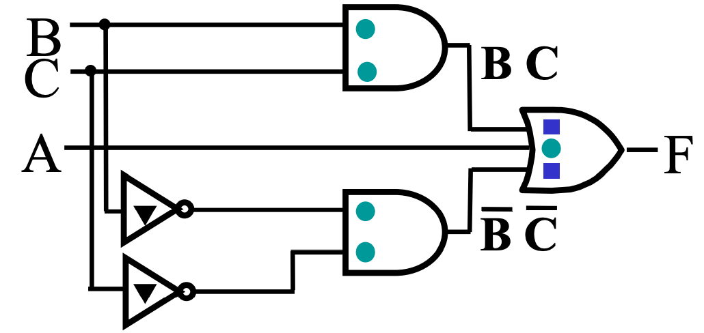
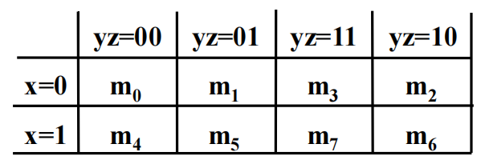
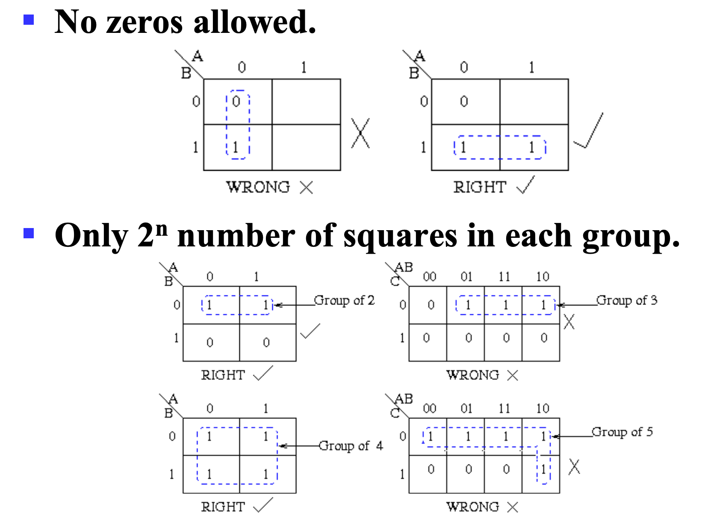
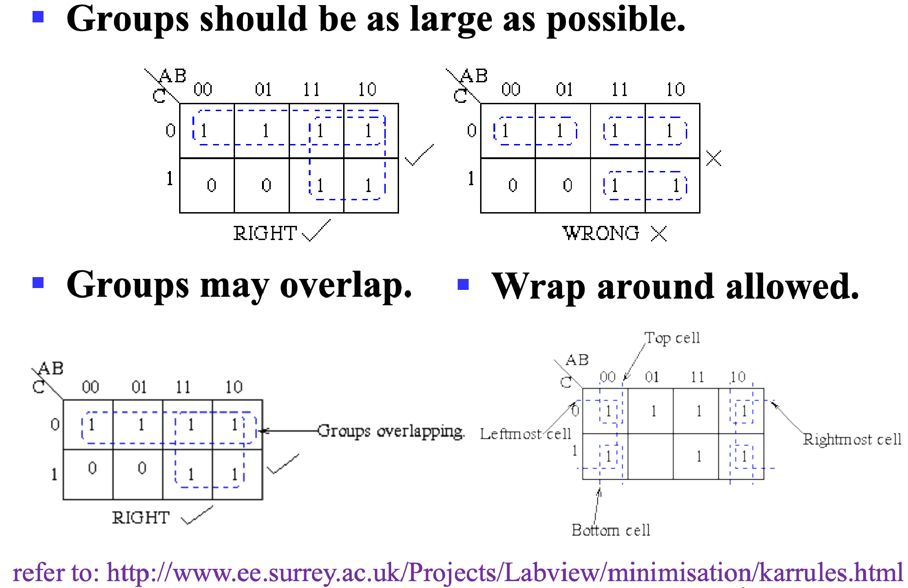
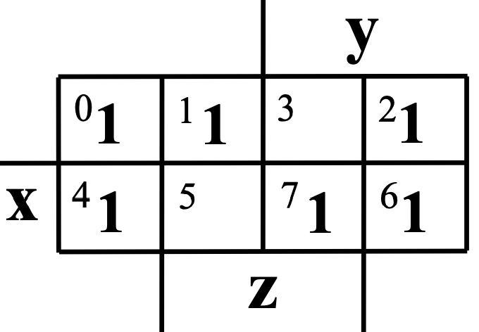
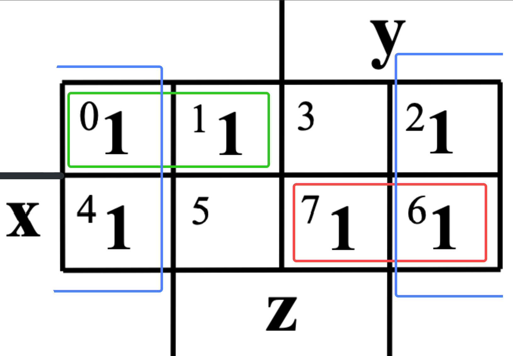
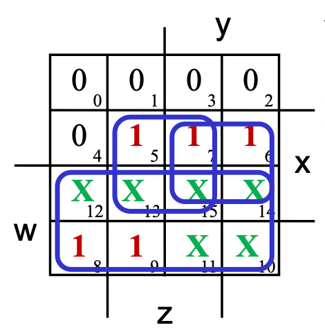

# 电路实现与经典组合电路

## 电路实现与优化

!!! info "引入"
    我们当然可以直接通过标准形式来得到对应的电路，但是在实际情况中，这样做会导致成本过高以及电路复杂（因为门太多了），所以我们需要对电路进行优化。在这里，我们介绍通过 **卡诺图(Karnaugh map)** 来优化逻辑电路的方法。

    不过再开始“优化”的话题之前，我们需要定义什么是“优”，也就是给出一个电路成本的衡量依据，即 **成本标准(cost criteria)**。

---

### 成本标准

在成本标准中，我们需要介绍的主要有三种标准，分别是：

- 文字输入代价(literal cost)：$L$
- 门输入代价，不计非门(gate-input cost)：$G$
- 门输入代价，计非门(gate-input cost with NOTs)：$GN$

---

#### 文字输入代价

很直白，就是按照表达式中有多少字面量来计算，例如：

- $F = BD + A\overline{B}C + A\overline{C}\,\overline{D}$ 中 $L = 8$；
- $F = ABC+\overline{A}\,\overline{B}\,\overline{C}$ 中 $L = 6$；
- $F = (A+B+C)(\overline{A}+\overline{B} + \overline{C})$ 中 $L = 6$；

可以想象，虽然这种计算方法非常的简单，但是感觉不太靠谱。比如，后面两个例子，虽然他们的 literal cost 是一样的，但是显然开销不太一样（因为一个是 3+3 一个是 2+2+2）。所以我们需要一个更合适的计算方法。

---

#### 门输入代价

按照门输入代价计，就是按照逻辑门输入引脚的总个数来计算，这里的输入并不仅仅是直接来自于字面量输入的那些引脚，也包括字面量做运算后得到的结果作为输入传入下一级逻辑门的引脚。

!!! warning "注意"
    虽然非门也是门，但是我们通常不把非门直接计入 gate-input cost，所以接下来提到的“输入引脚”默认是不包含非门的输入引脚的。

例如这张对应表达式 $F = A+BC+\overline{B}\,\overline{C}$ 的图中：

- 绿色原点表示一级输入引脚；
- 蓝色方点表示二级输入引脚；
- 黑色三角表示非门的输入引脚；

也就是说，这里一共有 5 + 2 = 7 个输入引脚，以及 2 个非门输入引脚。

从表达式来看，它可以看作是每一层运算的参数数量求和，不过我们忽略非门。

例如，式子 $F=AB+\overline{B}C+C\overline{D}$ 中，最顶层的运算是一个三输入或运算，所以有 3 个输入；接下来有三个二输入与运算，所以各计 2 个输入，一共 2 * 3 = 6 个输入，一共是 9 个输入。

当然，实际上从底层往上数更方便：

- A 和 B 各自算一个，AB 整体算一个，一共 3 个；
- 一共有三组类似 AB 的结构，所以一共是 3 * 3 = 9 个；
- 即 $G=9$；

总之，就是类似于在做算式化简，每做一次化简都需要计入一次操作数的数量。

而对于 gate-input cost with NOTs，只要再额外计入非门的输入即可。例如上面那个式子：

- 发现有两个被非了的字面量，所以要额外计 2 个，一共是 11 个；
- 即 $GN=11$；

!!! warning "注意"
    如果出现了比如 $F=\overline{A}B+\overline{A}C$ 的情况，非门只需要计 1 个，因为我们实际上是把非了以后的东西当作了一个字面量再用的，在实际电路中，我们只需要非一次，之后只需要把这个输出值拿走去用就行。

接下来放几道例题。

!!! warning "注意"
    最后的输出结果是不需要计入的！也就是说点$(\overline{A}\overline{C}+AC)(B+\overline{D})$的$G$为10，而不用加上最终`与`的输出

!!! note ""
    === "题面"
        计算 $F=ABC+\overline{A}\,\overline{B}\,\overline{C}$ 的 $L$、$G$、$GN$。
    === "答案"
        - $L = 6$；
        - $G = 8$；
        - $GN = 11$；

!!! note ""
    === "题面"
        计算 $F=(A+\overline{C})(\overline{B}+C)(\overline{A}+B)$ 的 $L$、$G$、$GN$。
    === "答案"
        - $L = 6$；
        - $G = 9$；
        - $GN = 12$；

!!! note ""
    === "题面"
        计算 $F=(A+\overline{B})(A+D)(B+C+\overline{D})(\overline{B}+\overline{C}+D)$ 的 $L$、$G$、$GN$。
    === "答案"
        - $L = 10$；
        - $G = 14$；
        - $GN = 17$；

        这里需要注意，出现了重复的被非了的字面量，不要重复计算！

!!! note ""
    === "题面"
        计算 $F=BD+A\overline{B}C+A\overline{B}\,\overline{D}+AB\overline{C}$ 的 $L$、$G$、$GN$。
    === "答案"
        - $L = 11$；
        - $G = 15$；
        - $GN = 18$；

        这里同样需要注意，出现了重复的被非了的字面量，不要重复计算！

!!! note ""
    === "题面"
        计算 $F=\overline{A}\,\overline{C}(B+\overline{D})+AC(B+\overline{D})$ 的 $L$、$G$、$GN$。
    === "答案"
        - $L = 8$；
        - $G = 12$；
        - $GN = 15$；

        这里同样需要注意，出现了比较复杂的逻辑运算，以 $\overline{A}\,\overline{C}(B+\overline{D})$ 为例，自顶向下是：⓵三输入与门，⓶二输入或门；所以应该是 $1^{\overline{A}} + 1^{\overline{C}} + 1^{B} + 1^{\overline{D}} + 1^{B+\overline{D}} + 1^{\overline{A}\,\overline{C}(B+\overline{D})}$，即 6。

### 卡诺图 | Karnaugh Map

---

#### 卡诺图的思想

优化逻辑表达式最直白的思想就是减少门电路，也就是去减少 gate-input cost。那么要如何做呢？

我们考虑到逻辑运算律中的这个推广：$XY+X\overline{Y}=X(Y+\overline{Y})=X$，也就是说，如果两个最小项只差一个字面量的非，那么他们是可以合并的；当然，对称的，根据$(X+Y)(X+\overline{Y})=X+Y\overline{Y}=X$，我们也可以得到这个结论对最大项也成立。

是不是觉得“只差一个”很耳熟？是的！我们想到了格雷码！假设我们将 n 个字面量排列成一个 n bits 的向量，那么只需要按照格雷码排序，一旦发现有相邻的最小项，我们就可以合并他们。

但这还不够充分，例如在一个有三个字面量的逻辑表达式中，“与一个表达式相邻”的表达式其实有三个，但是用线性的表示方法又没法很好的表示这一点，所以我们想到将它写成一张二维的表，即将字面量拆成两组 bit 向量，各自按照格雷码排列，形成一张二维表，这就是 **卡诺图(Karnaugh Map)**，也叫 **K-map**。

也就是

可以发现，任意两个相邻的格子都只差一个字面量的非，而且是充要的，即所有“相邻”都可以在这张图表现出来。

!!! tip "说明"
    由于格雷码的性质是一个在“满”状态下 **环状成立** 的性质，所以卡诺图也需要用“环状”的思路去看，这里可以联想一下行列式的形象化计算方法，将这张表当作一个无限扩展的表格。

!!! question "思考题"
    在这里，也可以尝试着感受一下两个字面量的情况下，即实际上“相邻也只有2个”的情况下，也可以使用“4个相邻”的卡诺图。事实上，三个字面量也只有“3个相邻”，但是为什么可以用明明有“4个相邻”的卡诺图来实现呢？

---

#### 卡诺图的局限性

然而，上面的说法其实很牵强。因为一张二维表中，能与一个元素相邻的元素最多只有四个，也就是说我们撑死也只能用卡诺图表示 4 个字面量的情况（当然更多的变量也有处理的方法，但是多少有点麻烦了）。因此，实际上卡诺图只能用于化简非常简单的逻辑表达式。

!!! quote "cm 老师如是说"
    更多情况下，卡诺图实际上只适合我们做题。但是其思路是非常有意思的。

---

#### 卡诺图的结构

这里我们以 3 元的逻辑表达式为例，2 元和 4 元的思路是一样的。

同样，举一个 🌰 ：$F(X,Y,Z) = \sum m(2,3,4,5)$

首先我们按照比特向量的形式把最小项写出来：

|值|X|Y|Z|
|-|-|-|-|
|2|0|1|0|
|3|0|1|1|
|4|1|0|0|
|5|1|0|1|

接下来，我们来绘制卡诺图，我们将 bit 向量 `[x, y, z]` 拆成 `[x]` 和 `[y, z]` 做如下表格：

||**`yz` = `00`**|**`yz` = `01`**|**`yz` = `11`**|**`yz` = `10`**|
|:-:|:-:|:-:|:-:|:-:|
|**`x` = `0`**|0|0|1|1|
|**`x` = `1`**|1|1|0|0|

另外一种标注表格的方式是这样，它可能更清晰：

{width=300px}

但是他们的本质都是格雷码。

4 元字面量的卡诺图则长这个样子：

{width=500.px}

---

#### 使用卡诺图优化

已经讲了思想和卡诺图的结构，那么到底要如何利用卡诺图进行优化呢？

让我们回顾优化的方法，即合并相邻两项，也就是找到卡诺图中相邻的部分。但是这不够，我们还要思考是不是能合并已经相邻的部分，比如：

我们通过卡诺图，首先合并了 $WXYZ$ 和 $WXY\overline{Z}$，$WX\overline{Y}Z$ 和 $WX\overline{Y}\,\overline{Z}$，分别得到了 $WXY$ 和 $WX\overline{Y}$，显然这两个东西也是可以合并的；而在卡诺图上，这表现为两个相邻的 `1*2` 的矩形。

总而言之，这种迭代合并的行为最终可以划归为这样一个行为：

我们在卡诺图中寻找若干 **极大** 的 **2 幂矩形**，即元素个数为 2 的幂次（自然边长也都为 2 的幂次）的矩形，而每一个矩形所覆盖的元素都应该是 **最小项**/最大项（一般都是做最小项）。需要注意，“循环”的性质仍然满足，即第一列和最后一列，第一行和最后一行也可以认为是相邻的。

例如：

{width=300.px}

例如：

{width=300.px}

再例如：

{width=500.px}

都是合理的卡诺图划分。

在得到这些划分后，我们就可以很方便地将这些项拎出来，写出它们的表达式。

而至于如何拎出来——不难发现，如果一个方框中，某一个字面量的值既可以是 `0`，又可以是 `1` 时（这里指的是输入的值，并非输出结果），在这个优化项的结果中就可以不用写出这个字面量；反之，如果这个字面量 $X$ 的值都是 `0`，则结果中会包含 $\overline{X}$，如果都是 `1`，则结果中会包含 $X$。

!!! note ""
    === "题面"
        利用卡诺图优化 $F(X,Y,Z) = \sum m(0,1,2,4,6,7)$ 的结果。
    === "答案"
        画出这个表达式对应的卡诺图：

        {width=300.png}

        然后划出其中的极大最小项优化项：

        {width=300.png align=left}

        写出来是：

        - 绿：$x=0,\;y=0,\;z=0/1$
            - 所以是：$\overline{X}\,\overline{Y}$；
        - 蓝：$x=0/1,\;y=0/1,\;z=0$
            - 所以是：$\overline{Z}$；
        - 红：$x=1,\;y=1,\;z=0/1$
            - 所以是：$XY$

        综上所述，优化结果是 $F = \overline{X}\,\overline{Y} + \overline{Z} + XY$

---

#### 无关项/自由项 | Don't Cares

!!! quote "推荐阅读"
    <https://www.geeksforgeeks.org/dont-care-x-conditions-in-k-maps/>

**无关项/自由项(Don't Cares)** 指的是需要化简的逻辑函数中，没有给出定义的几项，它们可能是：
  
- 输入组合不会出现；
- 输入组合的输出不被使用；

对于这种项，在卡诺图中用 X 来表示，在最小项之和中用 $\sum d(...)$ 表示。我们可以随意定义它们的输出，此时就可以利用这些项来方便我们的优化——当我们画出来的极大矩阵越大，成本就越低。

例如，我们定义一个函数，当输入的 BCD 码表示的数字大于等于 5 时返回 `1`，则它可以通过这样的形式来优化：

根据结果，写出优化后的表达式为：$F(W,X,Y,Z) = W + XY + XZ$。

---

!!! tip "由卡诺图得到乘积结果"
    尽管我们不停强调 与 和 或 是对称的，但是仍然有很多操作是鉴于我们对 `1` 的偏爱才会顺手的（你会发现，把乘除换成我们完全不熟悉的符号，你甚至可能无从下手）。

    所以，在卡诺图的问题中，如果要利用卡诺图得到 $F$ 优化后的乘积形式，也可以将问题转化为求 $\overline{F}$ 优化后的和形式，然后再对其取反过，利用德·摩根定律来得到结果。

    具体来说就是反转 K-map 中所有的 `0` 和 `1`，然后着眼于 SOM 进行优化，最后再对结果取反，用德·摩根定律来得到结果。

    ??? example "eg"
        

---

#### 蕴含项、主蕴含项与基本主蕴含项

**蕴含项(implicant)** 分为 **主蕴含项(prime implicant)** 和 **基本主蕴含项(essential prime implicant)**。

- 在卡诺图中，一个蕴含项就是任意一个包含 $2^n$ 个 `1` 的单元；
- 而主蕴含项则是在卡诺图中的 **极大** 蕴含项；
    - 对于存在 Dont'cares 的 K-map，如果我们关注的是 `1`，那我们积极地将他们当作 `1` 来处理，反之亦然；
    - 但是单独的 `X` 不会被认为是主蕴含项；
- 基本主蕴含项是包含 只被它(基本主蕴含项)覆盖的 `1` 的主蕴含项；

> 如图，左侧的两个主蕴含项因为包括了 ⓵ 和 ⓶ 这两个唯一的 `1`，所以是基本主蕴含项；
>
> 而右侧的蕴含项则是一个冗余的蕴含项；

!!! warning "注意"
    对于任意函数，主蕴含项一定存在，但是基本主蕴含项不一定存在。

!!! tip "🤔"
    正因为有基本主蕴含项的存在，对于一个任意函数，优化的多解结果总有一部分是不变的（只不过没有基本主蕴含项的时候这部分为零）。

---

!!! tip "麦克拉奎因算法 | Quine–McCluskey Algorithm"

---

## 经典组合电路

!!! note "引入"
    在实际设计中，我们有一些现成的组合电路能够使用，来方便我们设计。

    不过我没有全写出来；

---

### 三态门

**三态缓冲器(3-State Buffer)**:

除了输入和输出，它还有一个 **使能端(enable)** 来控制输出。

所谓的三态指的是：

- 当使能端为 `1`，且输入为 `1` 时，输出为 `1`；
- 当使能端为 `1`，且输入为 `0` 时，输出为 `0`；
- 当使能端为 `0`，输出为 `Hi-Z`/`Z`/`z`(浮动，高阻态)；

!!! note "作用"
    我们可以用三态门来解决多路输出互联的问题。正如在 [ICS](https://www.yuque.com/isshikixiu/codes/ics) 笔记中提到的，可以让多个输入在同一时刻只有一个被输出到总线中——实现的手段就是通过电路来使同一时刻只有一个使能端为 `1`。

    在数字逻辑设计中，三态门实现总线的相关知识将在 **[第六章](Chap06.md#三态门实现)** 提到。

!!! tip "碎碎念"

    所以什么是「高阻态」？它要如何理解？以下是我根据它的应用反推得到的结论：

    高阻态同它字面意思相同，我们可以当它此时是断路，而高阻态重点要与低电平做区分：如果现在存在一个“导线”，它有三个端，其中我们人为地认为其中两个是输入，分别命名为 a 和 b，另外一个认为是输出，命名为 c。

    此时，我们是不允许 a 和 b 一个为高电平，一个为低电平的，因为我们这里人为定义的输入输出并不影响电流的流动方向，所以当 a 为 `1`，b 为 `0` 时，电流很可能会变成从 a 流向 b，电源可能直接接地，这是我们不希望看到的，这也是为什么我们需要一个或门来实现这个逻辑行为（换言之，这种“三端”电路是相当危险的，不过当我们人为定义多个输出时，一般作为接收端的电路都有二极管防止逆流，所以单输入多输出是很常见的）。

    从更抽象地角度来理解，一根导线最多承载一份信息，然而有两个输入介入，此时我们只有 `0`/`1` 两态，不管怎么样，我们都同时拿到了来自两个输入的数据，而对于只能承载一份信息的导线来说，这两个信息冲突了。所以我们需要 `MUX` 来选择我们需要的到底是哪个信息，然后再给导线。

    而三态门，在高低电平外引入了「高阻态」，就非常巧妙地解决了这个「多输入」危险的问题，当我们不希望这个数据被输入时，我们直接把它断开，类似于直接把开关断开，只要我们让导线的若干输入中只有一个三态门不在「高阻态」，就能够优雅地实现多路输出互联。

---

### 复杂门

通过一些基本门组合出来的门，它们的表示方法大致如下：

