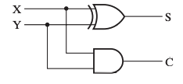
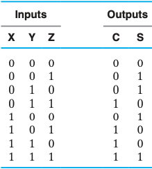
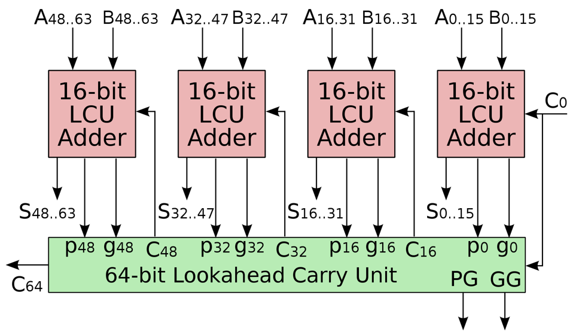
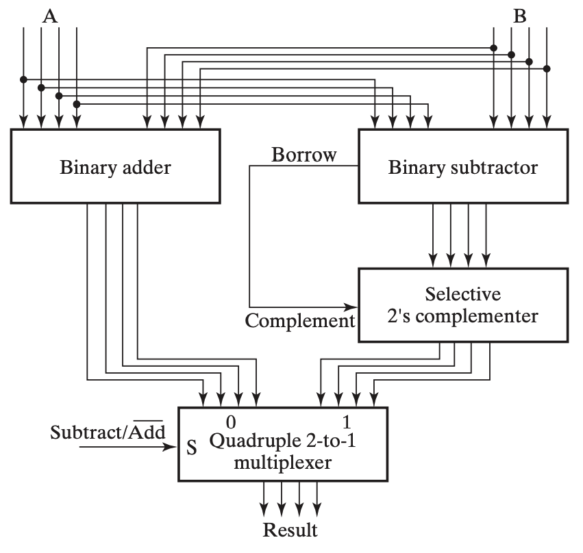
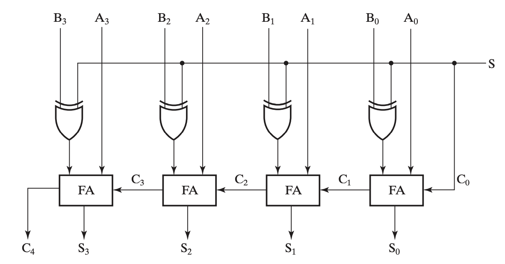

# 算术函数 | Arithmetic Functions

我们主要讨论的计算主要包括逻辑运算和算术运算，前者由于可以直接通过基本门很方便实现，所以我们不过多考虑；在此主要介绍算术运算。在计算机硬件中，承担计算工作的主要部件为 `ALU`(Arithmetic Logical Unit)。

---

!!! info "引入"
    在之前 **[#译码器](./Chap03_2.md/#_2)** 和 **[#多路选择器](#./Chap03_2.md/#_7)** 的部分中已经介绍过一些实现 1 bit 加法器的方法，接下来我们就来详细看看加法器这个东西。

    首先我们需要了解加法器最底层的单元，即实现 1 bit 运算的 **半加器(half adder)** 和 **全加器(full adder)**，接下来需要将他们组合在一起，实现 n bits 的加法器，其中主要介绍 **行波加法器(binary ripple carry adder)**。此外，基于一些编码的知识，我们还可以将它改装成加减法器。

---

## 半加器 & 全加器 | Half Adder & Full Adder

对于二进制加法，其输出无疑有当前位的和 `S` 和进位 `C`，而输入除了两个操作数 `X` 和 `Y` 以外，还可能有上一位的进位 `Z`(或者`C{n-1}`)。而对于一个二进制数的第一位，显然不会有进位，或者说 `Z=0`，所以我们可以将这个 `Z` 去掉，即输入只有 `X` 和 `Y`，这就是 半加器(half adder)；显然，对应的，如果输入中有上一位的进位 `Z`，则称为 **全加器(full adder)**。

!!! note ""

    === "半加器"
        !!! note ""
            
            === "逻辑表达式"

                $$
                S=\overline{X}Y+X\overline{Y}=X\oplus Y$$

                $$
                C = XY
                $$

            === "真值表"
                
                <figure markdown>
                    
                </figure>

            === "电路图"
                
                <figure markdown>
                    
                </figure>
            
    === "全加器"
        !!! note ""
            
            === "逻辑表达式"

                $$
                S=\overline{X}\,\overline{Y}Z + \overline{X}Y\overline{Z} + X\overline{Y}\,\overline{Z} + XYZ$$

                $$
                C = XY + XZ + YZ
                $$

            === "真值表"
                
                <figure markdown>
                    
                </figure>

            === "卡诺图"
                
                <figure markdown>
                    
                </figure>
            
            === "逻辑表达式 with XOR"

                $$
                S = (X\oplus Y)\oplus Z $$
                
                $$
                C = XY + Z(X\oplus Y)
                $$

                !!! note ""

                    更符合 Carry 产生的原理：
                    
                    - 记 $X\cdot Y$ 是carry generate(产生进位)；
                    - 记 $X\oplus Y$ 是carry propagate(传递进位)。
            
            === "电路图"

                

---

## 行波加法器 | Ripple Carry Adder

行波加法器是朴素的 n bits 加法器实现。其核心思想也就是模拟我们使用“竖式”来计算加法，从低位开始逐位计算，并将进位给到下一位作为输入。

实际上无论是只用半加器或是只用全加器，都可以实现行波加法器，但是殊途同归，无非是通过外部器件来进行互相转化而已。如果只使用全加器来实现，则以 4 bits 行波加法器为例，其大致逻辑如下：

其中，在加法器中，$C_0$ 必然是 `0`。

加减法器，或者说加法器，一般情况下在 `ALU` 中是最影响效率的部分，而且如果使用行波加法器，随着位数增加效率会越来越慢。

所以会有类似于超前进位加法器之类的东西来解决这个问题。

更多的内容可以看**[xxjj 的计组笔记](https://xuan-insr.github.io/computer_organization/3_arithmetic/#311-1-bit-alu)**。（数逻中最多了解到超前进位加法器即可。）

---

## 超前进位加法器

首先我们先把注意力放在一个全加器上。要把多个全加器连接起来形成能够计算更大数据的加法器，关键在于如何处理好全加器之间「进位」的问题。对于一个全加器而言，它向后一个全加器的进位（$C$，carry）有两个来源，一个是自身加法产生的进位，记为 $G$（generate），另一个是前一个全加器传递过来的进位，记为 $P$（propagate），我们有：

$$
S_i = A_i \oplus B_i \oplus C_i = P_i \oplus C_i$$

$$
C_{i+1} = A_i B_i + (A_i \oplus B_i) C_i = G_i + P_i \cdot C_i
$$

具体电路实现如下图：

{:width=30%}

最自然的想法是把全加器直接链式连接，即直接把前一个全加器的进位连接到后一个全加器上，这样的做法叫做行波加法器（ripple-carry adder）。行波加法器最大的弊端在于，后一个全加器需要等待前一个全加器的计算完毕后，才能把进位传递过来，当处理较大数据的加法时，行波加法器的**效率就太低了**。

所以，有没有办法提前把进位传递下去，而不需要等待前面的全加器完全计算完毕呢？**超前进位加法器**（carry-lookahead adder, or CLA）就是用来解决这个问题的。那么超前进位加法器是怎么做到提前把进位传递下去的呢？让我们再把注意力转向公式推导：

$$
C_1 = G_0 + P_0 C_0
$$

$$
\begin{aligned}
C_2 & = G_1 + P_1 C_1 = G_1 + P_1 (G_0 + P_0 C_0) \cr
& = G_1 + P_1 G_0 + P_1 P_0 C_0
\end{aligned}
$$

$$
\cdots
$$

$$
C_4 = G_3 + P_3 G_2 + P_3 P_2 G_1 + P_3 P_2 P_1 G_0 + P_3 P_2 P_1 P_0 C_0
$$

我们发现，$C_4$ 不再依赖于 $C_3$，而是直接依赖于 $C_0$。我们只需要并行计算每个全加器的 $P$ 和 $G$，然后把 $C_0$ 与它们结合即可计算得出每个全加器向后传递的进位 $C_{i+1} = G_{0\sim i} + P_{0\sim i} C_0$。

具体电路实现如下图，我们发现所有全加器的 $P$ 和 $G$ 都是并行计算的，而对于每个进位的计算，只需要额外消耗 $C_0$ 经过一个与门和一个或门的时间：

!!! quote "Source: <a href="https://en.wikipedia.org/wiki/Carry-lookahead_adder">https://en.wikipedia.org/wiki/Carry-lookahead_adder</a>"

### 模块化

但我们发现，这样的超前进位加法器虽然解决了进位延迟的问题，但是仍然无法大规模使用，问题的关键在于电路中的多输入与门和或门，如果我们要连接 $n$ 个全加器，那么就需要 $n+1$ 输入的与门和或门，这是不现实的。所以我们考虑把这一个 4-bit 超前进位加法器作为一个模块，并在此基础上组建更大的超前进位加法器。

$$
C_4 = G_{0\sim 3} + P_{0\sim 3} C_0
$$

$$
C_8 = G_{4\sim 7} + P_{4\sim 7} C_4
$$

$$
\cdots
$$

$$
\begin{aligned}
C_{16} & = G_{12\sim 15} + P_{12\sim 15} C_12 \cr
& = G_{12\sim 15} + P_{12\sim 15} G_{8\sim 11} + P_{12\sim 15} P_{8\sim 11} G_{4\sim 7} \cr
& + P_{12\sim 15} P_{8\sim 11} P_{4\sim 7} G_{0\sim 3} + P_{12\sim 15} P_{8\sim 11} P_{4\sim 7} P_{0\sim 3} C_0
\end{aligned}
$$

我们惊讶地发现，这个 $C_{16}$ 表达式的写法和之前推导超前进位加法器时 $C_4$ 的写法是完全一致的，只需要做一些下标变换即可。这就启发我们如何组建更大规模的超前进位加法器：我们把若干个小的超前进位加法器连接起来，就像我们当初把若干个全加器连接成超前进位加法器一样！

=== "4-bit CLA"

    {:width=60%}

=== "16-bit CLA"

    {:width=60%}

=== "64-bit CLA"

    {:width=60%}

!!! quote "Source: <a href="https://en.wikipedia.org/wiki/Lookahead_carry_unit">https://en.wikipedia.org/wiki/Lookahead_carry_unit</a>"

## 二进制减法

首先，在开始二进制减法的介绍之前，你需要了解 **补码(2's complement)**，这可以查看修佬的 [C 小笔记的补码内容](https://note.isshikih.top/cour_note/D1QD_CXiaoCheng/#%E8%A1%A5%E7%A0%81)。

结合补码，我们再来观察行波加法器，我们需要对减数的每一位取反，并对整个数加一，再直接将它们相加即可，即将减法转化为补码下的加法。

其中加一这一步恰好可以通过在加法器中必定为 `0` 的 $C_0$ 来实现，然后我们再在输入中添加 `MUX`，就可以实现加减法器。

---

### 有符号数的表示与计算

- [ ] TODO: 补充这里。

---
