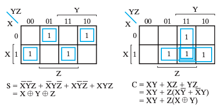
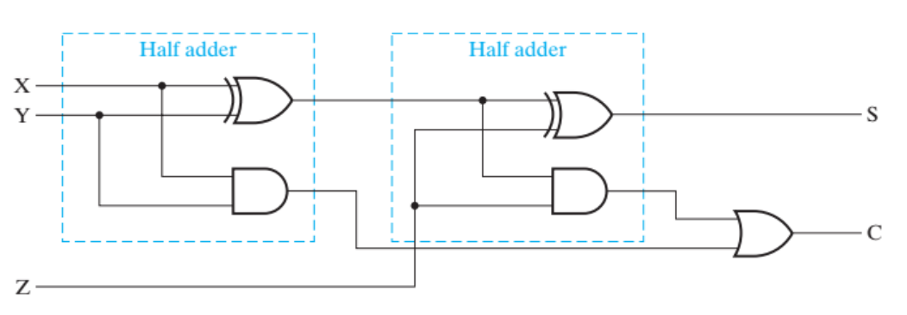
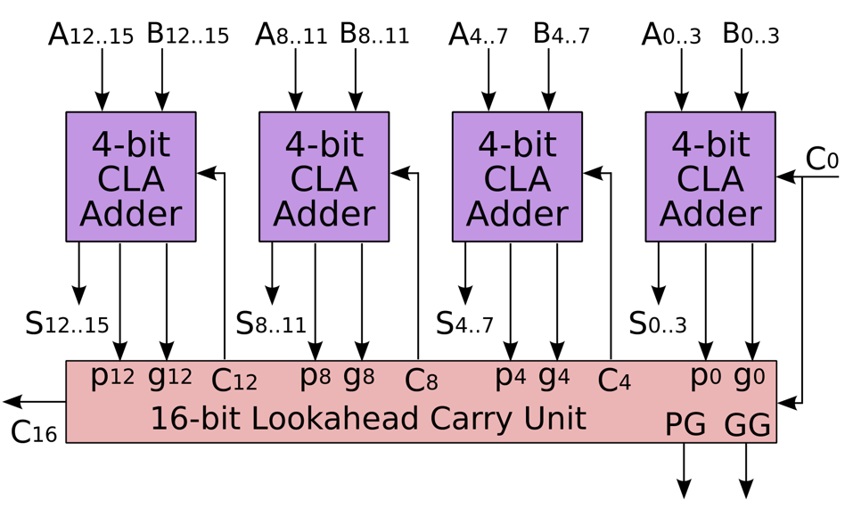
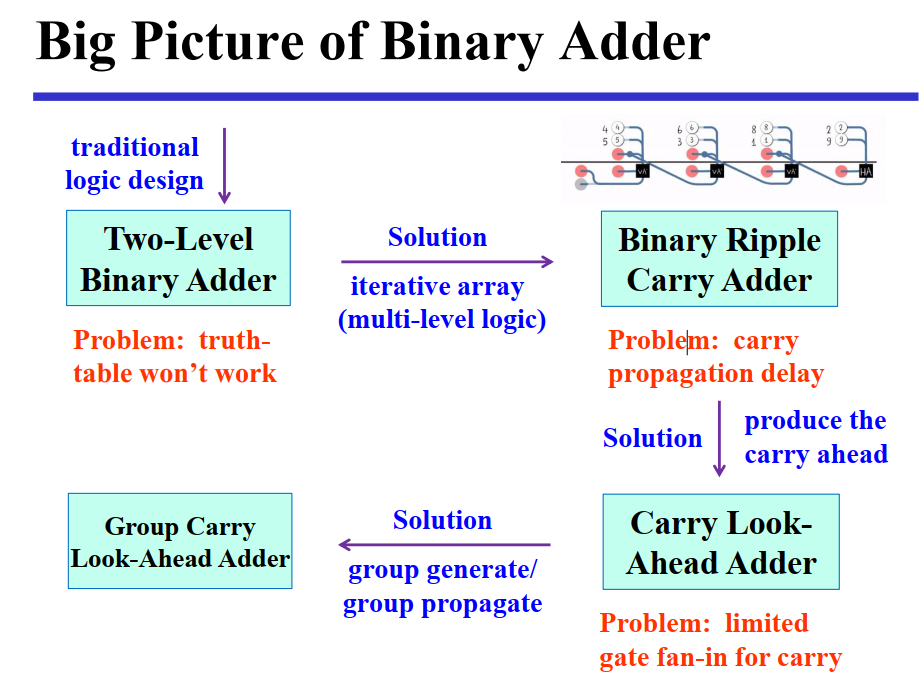
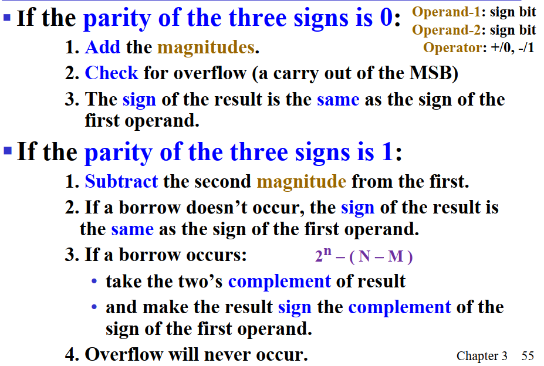
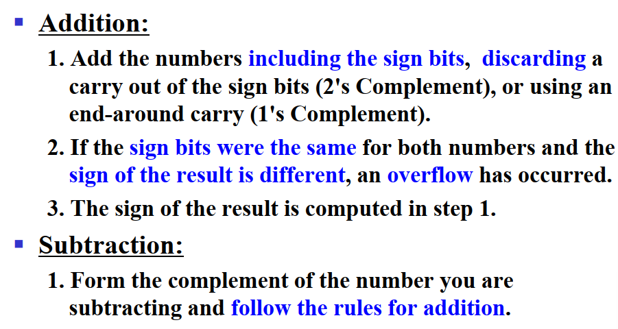
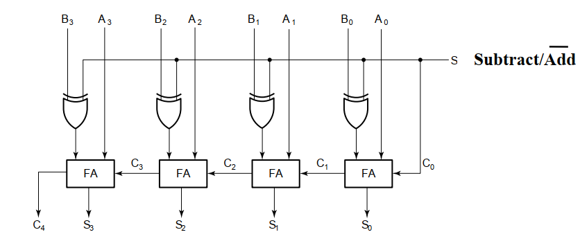
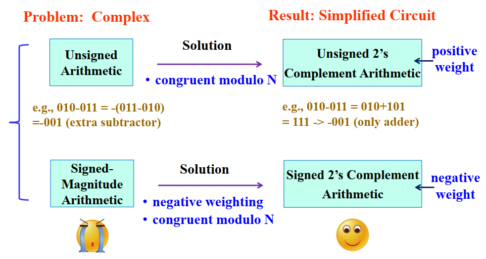

# 算术函数 | Arithmetic Functions

我们主要讨论的计算主要包括逻辑运算和算术运算，前者由于可以直接通过基本门很方便实现，所以我们不过多考虑；在此主要介绍算术运算。在计算机硬件中，承担计算工作的主要部件为 `ALU`(Arithmetic Logical Unit)。

---

!!! info "引入"
    在之前 **[#译码器](./Chap03_2.md/#_2)** 和 **[#多路选择器](#./Chap03_2.md/#_7)** 的部分中已经介绍过一些实现 1 bit 加法器的方法，接下来我们就来详细看看加法器这个东西。

    首先我们需要了解加法器最底层的单元，即实现 1 bit 运算的 **半加器(half adder)** 和 **全加器(full adder)**，接下来需要将他们组合在一起，实现 n bits 的加法器，其中主要介绍 **行波加法器(binary ripple carry adder)**。此外，基于一些编码的知识，我们还可以将它改装成加减法器。

---

## 加法器 | Adder

### 半加器 & 全加器 | Half Adder & Full Adder

对于二进制加法，其输出无疑有当前位的和 `S` 和进位 `C`，而输入除了两个操作数 `X` 和 `Y` 以外，还可能有上一位的进位 `Z`(或者`C_{n-1}`)。而对于一个二进制数的第一位，显然不会有进位，或者说 `Z=0`，所以我们可以将这个 `Z` 去掉，即输入只有 `X` 和 `Y`，这就是 半加器(half adder)；显然，对应的，如果输入中有上一位的进位 `Z`，则称为 **全加器(full adder)**。

!!! note ""

    === "半加器"
        !!! note ""
            
            === "逻辑表达式"

                $$
                S=\overline{X}Y+X\overline{Y}=X\oplus Y$$

                $$
                C = XY
                $$

            === "真值表"
                
                <figure markdown>
                    
                </figure>

            === "电路图"
                
                <figure markdown>
                    
                </figure>
            
    === "全加器"
        !!! note ""
            
            === "逻辑表达式"

                $$
                S=\overline{X}\,\overline{Y}Z + \overline{X}Y\overline{Z} + X\overline{Y}\,\overline{Z} + XYZ$$

                $$
                C = XY + XZ + YZ
                $$

            === "真值表"
                
                <figure markdown>
                    
                </figure>

            === "卡诺图"
                
                <figure markdown>
                    
                </figure>
            
            === "逻辑表达式 with XOR"

                $$
                S = (X\oplus Y)\oplus Z $$
                
                $$
                C = XY + Z(X\oplus Y)
                $$

                !!! note ""

                    更符合 Carry 产生的原理：
                    
                    - 记 $X\cdot Y$ 是carry generate(产生进位)；
                    - 记 $X\oplus Y$ 是carry propagate(传递进位)。
            
            === "电路图"

                

---

### 行波加法器 | Ripple Carry Adder

行波加法器是朴素的 n bits 加法器实现。其核心思想也就是模拟我们使用“竖式”来计算加法，从低位开始逐位计算，并将进位给到下一位作为输入。

实际上无论是只用半加器或是只用全加器，都可以实现行波加法器，无非是通过外部器件来进行互相转化而已。如果只使用全加器来实现，则以 4 bits 行波加法器为例，其大致逻辑如下：

其中，在加法器中，$C_0$ 必然是 `0`。

加减法器，或者说加法器，一般情况下在 `ALU` 中是最影响效率的部分，而且如果使用行波加法器，随着位数增加效率会越来越慢。

所以会有类似于超前进位加法器之类的东西来解决这个问题。

更多的内容可以看**[咸鱼暄的计组笔记](https://xuan-insr.github.io/computer_organization/3_arithmetic/#311-1-bit-alu)**。（数逻中最多了解到超前进位加法器即可。）

---

### 超前进位加法器 Carry Look-Ahead Adder

首先我们先把注意力放在一个全加器上。要把多个全加器连接起来形成能够计算更大数据的加法器，关键在于如何处理好全加器之间「进位」的问题。对于一个全加器而言，它向后一个全加器的进位（$C$，carry）有两个来源，一个是自身加法产生的进位，记为 $G$（generate），另一个是前一个全加器传递过来的进位，记为 $P$（propagate），我们有：

$$
S_i = A_i \oplus B_i \oplus C_i = P_i \oplus C_i$$

$$
C_{i+1} = A_i B_i + (A_i \oplus B_i) C_i = G_i + P_i \cdot C_i
$$

具体电路实现如下图：

{:width=30%}

最自然的想法是把全加器直接链式连接，即直接把前一个全加器的进位连接到后一个全加器上，这样的做法叫做行波加法器（ripple-carry adder）。行波加法器最大的弊端在于，后一个全加器需要等待前一个全加器的计算完毕后，才能把进位传递过来，当处理较大数据的加法时，行波加法器的**效率就太低了**。

所以，有没有办法提前把进位传递下去，而不需要等待前面的全加器完全计算完毕呢？**超前进位加法器**（carry-lookahead adder, or CLA）就是用来解决这个问题的。那么超前进位加法器是怎么做到提前把进位传递下去的呢？让我们再把注意力转向公式推导：

$$
C_1 = G_0 + P_0 C_0
$$

$$
\begin{aligned}
C_2 & = G_1 + P_1 C_1 = G_1 + P_1 (G_0 + P_0 C_0) \cr
& = G_1 + P_1 G_0 + P_1 P_0 C_0
\end{aligned}
$$

$$
\cdots
$$

$$
C_4 = G_3 + P_3 G_2 + P_3 P_2 G_1 + P_3 P_2 P_1 G_0 + P_3 P_2 P_1 P_0 C_0
$$

我们发现，$C_4$ 不再依赖于 $C_3$，而是直接依赖于 $C_0$。我们只需要并行计算每个全加器的 $P$ 和 $G$，然后把 $C_0$ 与它们结合即可计算得出每个全加器向后传递的进位 $C_{i+1} = G_{0\sim i} + P_{0\sim i} C_0$。

具体电路实现如下图，我们发现所有全加器的 $P$ 和 $G$ 都是并行计算的，而对于每个进位的计算，只需要额外消耗 $C_0$ 经过一个与门和一个或门的时间：

!!! quote "Source: <a href="https://en.wikipedia.org/wiki/Carry-lookahead_adder">https://en.wikipedia.org/wiki/Carry-lookahead_adder</a>"

### 模块化超前进位加法器 | Group Carry Look-Ahead Adder

但我们发现，这样的超前进位加法器虽然解决了进位延迟的问题，但是仍然无法大规模使用，问题的关键在于电路中的多输入与门和或门，如果我们要连接 $n$ 个全加器，那么就需要 $n+1$ 输入的与门和或门，这是不现实的。所以我们考虑把这一个 4-bit 超前进位加法器作为一个模块，并在此基础上组建更大的超前进位加法器。

$$
C_4 = G_{0\sim 3} + P_{0\sim 3} C_0
$$

$$
C_8 = G_{4\sim 7} + P_{4\sim 7} C_4
$$

$$
\cdots
$$

$$
\begin{aligned}
C_{16} & = G_{12\sim 15} + P_{12\sim 15} C_{12} \cr
& = G_{12\sim 15} + P_{12\sim 15} G_{8\sim 11} + P_{12\sim 15} P_{8\sim 11} G_{4\sim 7} \cr
& + P_{12\sim 15} P_{8\sim 11} P_{4\sim 7} G_{0\sim 3} + P_{12\sim 15} P_{8\sim 11} P_{4\sim 7} P_{0\sim 3} C_0
\end{aligned}
$$

我们惊讶地发现，这个 $C_{16}$ 表达式的写法和之前推导超前进位加法器时 $C_4$ 的写法是完全一致的，只需要做一些下标变换即可。这就启发我们如何组建更大规模的超前进位加法器：我们把若干个小的超前进位加法器连接起来，就像我们当初把若干个全加器连接成超前进位加法器一样！

=== "4-bit CLA"

    {:width=60%}

=== "16-bit CLA"

    {:width=60%}

=== "64-bit CLA"

    {:width=60%}

!!! quote "Source: <a href="https://en.wikipedia.org/wiki/Lookahead_carry_unit">https://en.wikipedia.org/wiki/Lookahead_carry_unit</a>"

### 小结

## 二进制减法

### 无符号数的表示与计算

为了实现减法，我们需要将减法转化为加法（这样子可以复用前文实现的加法器），即 $A-B=A+(-B)$，其中 $-B$ 表示 $B$ 的相反数。而对于二进制数，我们可以通过 **补码(2's complement)** 来表示一个数的相反数，即 $-B=\overline{B}+1$，其中 $\overline{B}$ 表示 $B$ 的按位取反。

首先，在开始二进制减法的介绍之前，你需要了解 **补码(2's complement)**，这可以查看修佬的 [C 小笔记的补码内容](https://note.isshikih.top/cour_note/D1QD_CXiaoCheng/#%E8%A1%A5%E7%A0%81)。

!!! note "Radix Complement"

    !!! note "定义"
        
        $r$ 进制下的 $r$ 补码，表示为 $r^n-x$，其中 $x$ 为 $n$ 位数，$n$ 为 $r$ 进制下的数的位数。

        在二进制下，这称作 **2 补码（2's Complement）**，$2^n-x$ 即为 $x$ 的二进制补码。例如 $x=1010$，则 $2^4-x=0110$，即 二进制补码为 $0110$。

    !!! note ""
        还可通过取反加一来得到补码，即 $x$ 的补码为 $\overline{x}+1$。

!!! note "Diminished Radix Complement"

    !!! note "定义"
        
        $r$ 进制下的 $r-1$ 补码，表示为 $(r^n-1)-x$，其中 $x$ 为 $n$ 位数，$n$ 为 $r$ 进制下的数的位数。

        在二进制下，这称作 **1 补码（1's Complement）**，$(2^n-1)-x$ 即为 $x$ 的二进制反码。例如 $x=1010$，则 $(2^4-1)-x=0101$，即 二进制反码为 $0101$。

    !!! note ""
        还可通过取反来得到反码，即 $x$ 的反码为 $\overline{x}$。

!!! note ""
    对于其他进制，例如三进制，其补码为 $3^n-x$，反码为 $3^n-1-x$，分别称作 **3 补码** 和 **2 补码**。

!!! warning "注意"
    无符号数在较小数减较大数时，会出现溢出。

---

### 有符号数的表示与计算

因为无符号数在较小数减较大数时，会出现溢出。所以我们需要引入有符号数。

有符号数相较于无符号数，其最高位为符号位，`0` 表示正数，`1` 表示负数。

这样我们用能将正数和负数都用有符号数表示出来了。

{: width=50%}

对于有符号数的补码，它的符号位是有效位，代表负权重。我们记最高位为 $S$，其余位为 $A$，则由符号数的补码，我们可以计算得到其值为 $-S2^{n-1}+(A)_{10}$，其中 $n$ 为补码位数。

!!! note ""
    对正数，这肯定成立。

    对负数，根据定义，记二进制数为 $X$（最高位为1），有
    
    $$\text{结果值}=-(2^n-(X)_{10})=-2^n+2^{n-1}+(X_{1:})_{10}=-2^{n-1}+(A)_{10}$$

    其中 $X_{1:}$ 表示 $X$ 除去最高位的部分。

#### 符号扩展 | Sign Extension

对有符号数的补码，我们可以通过符号扩展来将其扩展为更多位的补码，即将符号位复制到更高位。

!!! example ""

    $$0111\Rightarrow 00000111$$

    $$1001\Rightarrow 11111001$$

!!! note "prove"
    {: width=50%}

---

#### 溢出 | Overflow

有符号数的上下界分别为 $2^{n-1}-1$ 和 $-2^{n-1}$，当计算结果超出这个范围时，就会发生溢出。

对于有符号数的加法，我们可以通过判断符号位是否相同来判断是否溢出（因为符号扩展，我们允许多个相同的符号位），`01`类型代表上溢，`10`类型代表下溢例如：

{: width=80%}

---

#### 有符号的数值计算 | Signed-Magnitude

就是给绝对值的原码附上符号位

!!! note ""

    

!!! example ""

    

法 1 太繁琐了，我们介绍法 2 。

#### 补码计算 | Signed-Complement

!!! note ""

    

结合补码，我们再来观察行波加法器，我们需要对减数的每一位取反，并对整个数加一，再直接将它们相加即可，即将减法转化为补码下的加法。

{: width=70%}

其中加一这一步我们通过引入 `S` 来实现，即 `S` 为 `1` 时，加一，为 `0` 时，不加一。

{: width=70%}

#### 溢出检测 | Overflow Detection

根据真值表

|$X$|$Y$|$C_{in}$|$S$|$C_{out}$|Overflow?|
|:-:|:-:|:-:|:-:|:-:|:-:|
|0|0|0|0|0|×|
|0|0|1|1|0|√|
|0|1|0|1|0|×|
|0|1|1|0|1|×|
|1|0|0|1|0|×|
|1|0|1|0|1|×|
|1|1|0|0|1|√|
|1|1|1|1|1|×|

由于在$X$，$Y$，$C_{in}$为 `001` 或 `110`为溢出，我们可以写出很多检测溢出的逻辑表达式，在其中，门输入最低的是

$$V = C_{in} \oplus C_{out}$$

### 2-补码计算总结

## 其他算术函数

- 自增（incrementing）与自减（decrementing）
    - 自增与自减运算可以通过对加减法器进行收缩（contraction）得到
    - 具体而言就是把加减法器的其中一个输入设为常量（自增自减的步长）
- 乘法与除法
    - 与 $2^n$ 的乘数是最简单的，只需要通过移位就可以实现
    !!! note "逻辑移位和算术移位 | Logic shift and Arithmetic shift"

        

        逻辑移位：直接补零

        算术移位：移位后把原符号位再赋给首位

        !!! note ""
            除此，移位的方法还有循环移位（barrel shifter）

    - 任意常数的乘除的一种实现思路是，拆分成与若干个 $2^n$ 的乘除
- （移位时）零扩展（zero fill）与符号位扩展（extension）