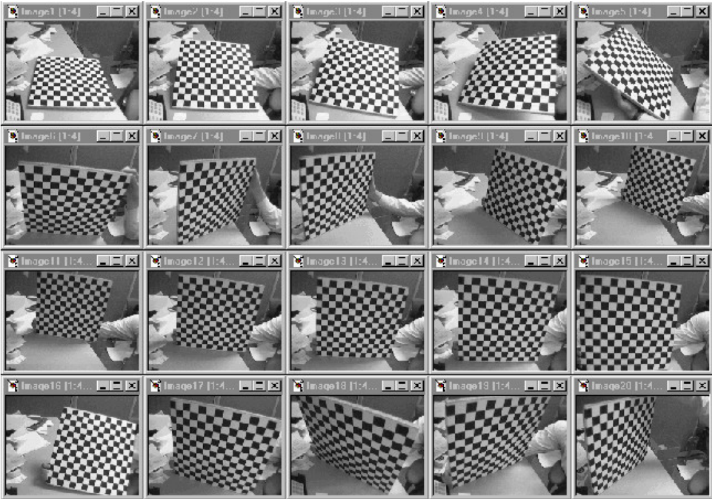
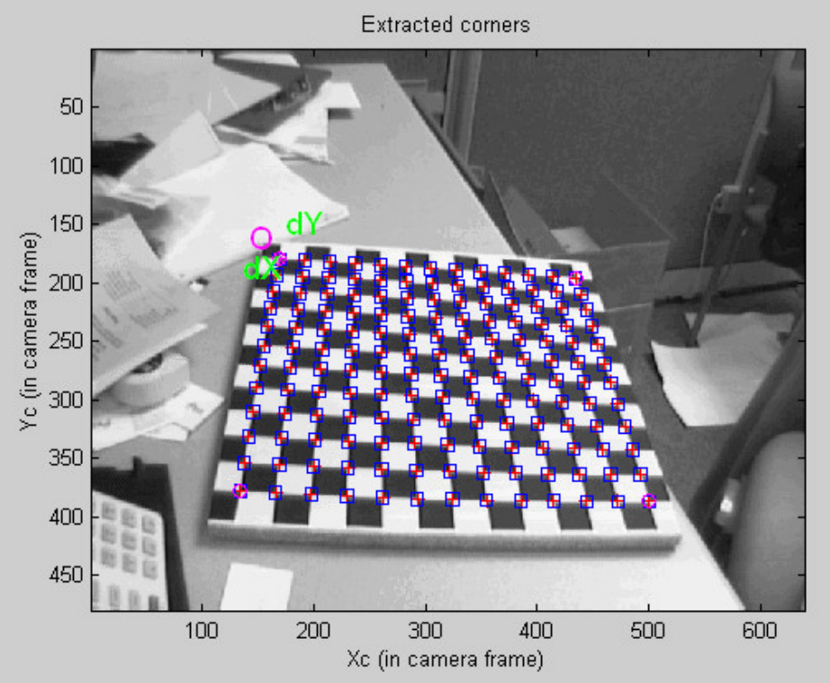
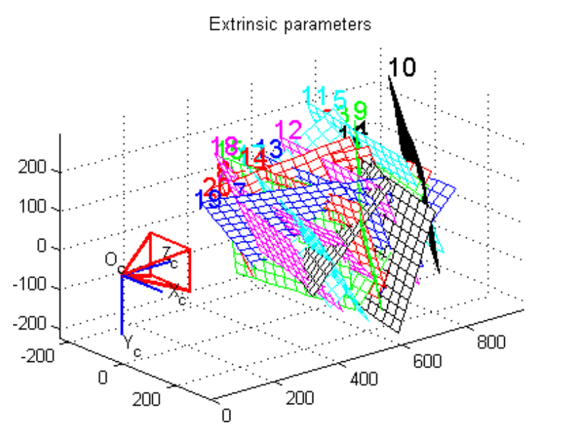
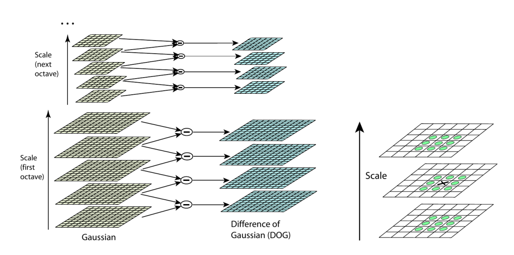
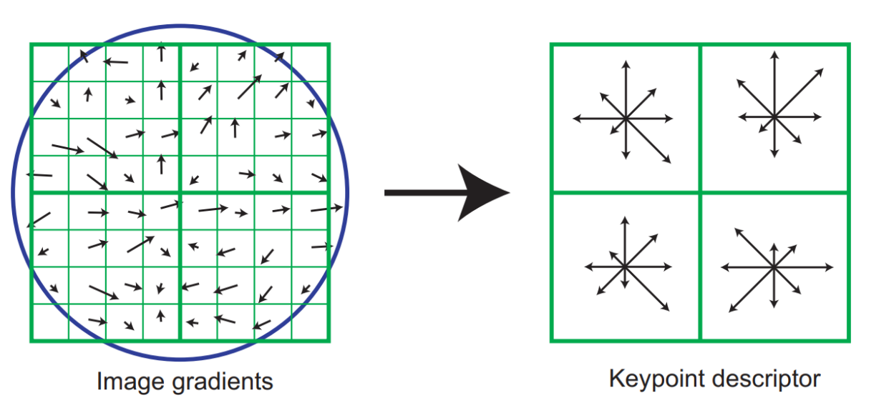
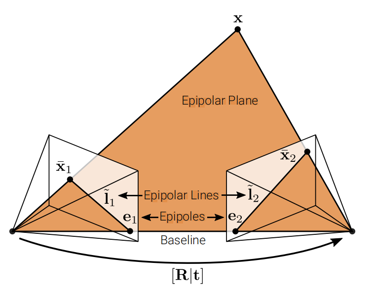
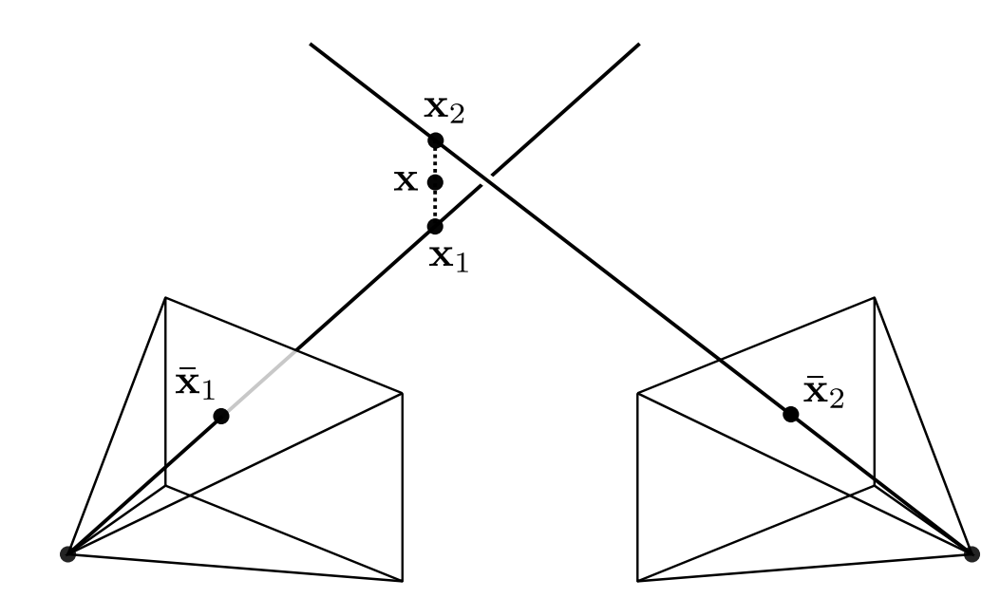
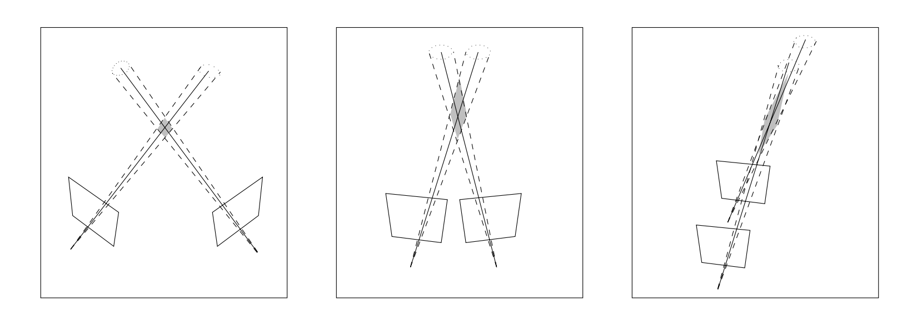

# 3 Structure from Motion

This lecture builds on the concepts from the second lecture to reason about the 3D structure of a static scene from multiple images observing that scene.
(本讲座建立在第二讲的概念之上，从多个观察场景的图像推断静态场景的三维结构。)

## 3.1 预先准备

### 3.1.1 Camera Calibration(相机标定)

> To infer 3D-information from a collection of (2D) images, it is important to know the intrinsics and extrinsics of the camera setup.

The process of **finding the intrinsic and extrinsic parameters** is known as **camera calibration**. Most commonly, a known calibration target is used, such as an image or a checkerboard.

- First, this target is **captured in different poses**.

- Then, **features**, such as corners, are detected in the images.

- Finally, the **camera intrinsics and extrinsics** are **jointly optimized** by non-linear optimization of reprojection errors.
  - **Closed-form solution** initializes all parameters except for distortion parameters
  - **Non-linear optimization** of all parameters by minimizing reprojection errors

- There exists a variety of calibration techniques that are used in different settings.
- These methods differ algorithmically, but also in the type of assumptions and calibration targets they use: 2D/3D targets, planes, vanishing points, etc.

**Further Readings:**

- [Camera Calibration Toolbox for Matlab](https://data.caltech.edu/records/jx9cx-fdh55)
- [OpenCV Camera Calibration](https://docs.opencv.org/4.x/dc/dbb/tutorial_py_calibration.html)
- Szeliski Book, Chapter 11.1

### 3.1.2 Feature Detection and Description(特征检测与描述)

#### Point Features

- **Point features** describe the appearance of **local, salient regions** in an image. They can be used to **describe and match images** taken from different viewpoints

- Features should be **invariant** to **perspective effects and illumination** and the same point should have **similar vectors** independent of pose or viewpoint. Plain RGB / intensity patches will not have this property, we need something better.

> As an example, think of the RGB matrices that describe one image and the same exact image rotated 180◦. The matrices will be completely different, although they describe the exact same set of points.

#### Scale Invariant Feature Transform (SIFT)(尺度不变特征变换)

SIFT was a seminal work due to its invariance and robustness, which revolutionized recognition and in particular matching and enabled the development of large-scale SfM techniques.

[SIFT算法详解(CSDN)](https://blog.csdn.net/lingyunxianhe/article/details/79063547)

One algorithm that provides us with what we need is **the Scale Invariant Feature Transform (SIFT)**.它在空间尺度中寻找极值点，并提取出其位置、尺度、旋转不变量。

- SIFT constructs a scale space by **iteratively filtering** the image with a Gaussian and scaling the image down at regular intervals.

- Adjacent scales are subtracted, yielding Difference of Gaussian (DoG) images.
- > 左图对相邻的两个高斯图像做差，得到的图像称为高斯差分图像）
- Difference of Gaussian filters are ”blob detectors”; the interest points (blobs) are detected as extrema in the resulting scale space.（
- > 右图正在进行极值点检测，中间的检测点和它同尺度的8个相邻点和上下相邻尺度对应的9×2个点共26个点比较，以确保在尺度空间和二维图像空间都检测到极值点。）
- > 由于要在相邻尺度进行比较，如图3.3右侧每组含4层的高斯差分金子塔，只能在中间两层中进行两个尺度的极值点检测，其它尺度则只能在不同组中进行。为了在每组中检测S个尺度的极值点，则DOG金字塔每组需S+2层图像，而DOG金字塔由高斯金字塔相邻两层相减得到，则高斯金字塔每组需S+3层图像，实际计算时S在3到5之间。
- > 当然这样产生的极值点并不全都是稳定的特征点，因为某些极值点响应较弱，而且DOG算子会产生较强的边缘响应

- After extracting the interest points, SIFT rotates the descriptor to align with the dominant gradient orientation.
- Then, gradient histograms are computed for local sub-regions of the descriptor which are concatenated and normalized to form a $128D$ feature vector (the keypoint descriptor).
  
  > 这128维的特征向量由128维的局部特征向量连接而成，为了保证特征向量的旋转不变性，将主方向作为参考坐标系，对坐标系进行旋转，使得旋转后的坐标系与水平方向保持一致，然后将旋转后的坐标系分成4\*4的小方格，统计每个小方格内的梯度直方图，每个小方格内8个方向的梯度直方图组成一个8维的局部特征向量，4\*4个小方格共32个局部特征向量组成128维的SIFT特征向量。

- These operations make the descriptor invariant to rotation and brightness changes.

The feature vectors constructed by SIFT can be used to find matching points in two or more images by efficient nearest neighbor search algorithms. Ambiguous matches are typically filtered by computing the ratio of distance from the closest neighbor to the distance of the second closest; **a large ratio** (> 0.8) indicates that the found match **might not be the correct one**.

## 3.2 Two-frame Structure-from-Motion

### 3.2.1 Epipolar Geometry(极线几何)

**Goal**: Recovery of camera pose (and 3D structure) from image correspondences

The required relationships are described by the two-view **epipolar geometry**.

- In the illustration, the rotation matrix $\mathbf{R}$ and the translation vector $\mathbf{t}$ denote the relative pose between two perspective cameras.
- A 3D point $\mathbf{x}$ is projected to pixel $\bar{\mathbf{x}}_1$ in image 1 and to pixel $\bar{\mathbf{x}}_2$ in image 2.
- The 3D point $\mathbf{x}$ and the two camera centers span the **epipolar plane**, on which also the two points $\bar{\mathbf{x}}_1$ and $\bar{\mathbf{x}}_2$ lie.
- The correspondence of pixel $\bar{\mathbf{x}}_1$ in image 2 must lie on the **epipolar line** $\bar{l}_2$ in image 2.

> This means that, if the epipolar plane is known (i.e. $\mathbf{R}$ and $\mathbf{t}$ as well as camera intrinsics are known), to find the matching point $\bar{\mathbf{x}}_2$ to $\bar{\mathbf{x}}_1$, one only has to search along a one-dimensional search space (the epipolar line $\bar{l}_2$).

- Finally, all epipolar lines must pass though the **epipoles**, which are the points on the image planes where the **baseline** (the connection of the two camera centers) passes though the image planes (this point can also lie at infinity).

### 3.2.2 Estimate epipolar geometry

The challenge now is to estimate the epipolar geometry based on **detected matching features** in the two images.

As noted above, the inverse problem (matching features when knowing the epipolar geometry) is harder.(所以我们先有点，然后计算极线几何)

Let us assume the camera matrices $(\mathbf{K}_i \in \mathbb{R}^{3 \times 3})_{i=1}^2$ are known, for example through calibration (Sec. 3.1.1). Let $\tilde{\mathbf{x}}_i = \mathbf{K}_i^{-1} \bar{\mathbf{x}}_i$ denote the local ray direction of pixel $\bar{\mathbf{x}}_i$ in camera $i$. Then we have:

$$\tilde{\mathbf{x}}_2 \propto \mathbf{x}_2 = \mathbf{R} \mathbf{x}_1 + \mathbf{t} \propto \mathbf{R} \tilde{\mathbf{x}}_1 + s\mathbf{t} $$

> 因为$\tilde{\mathbf{x}}_i$和$\mathbf{x}_i$是同一条射线，所以$\tilde{\mathbf{x}}_i$和$\mathbf{x}_i$是成比例的，即$\tilde{\mathbf{x}}_i \propto \mathbf{x}_i$，所以$\tilde{\mathbf{x}}_2 \propto \mathbf{x}_2$。

对上式左叉乘$\mathbf{t}$，得到：

$$\mathbf{t} \times \tilde{\mathbf{x}}_2 \propto \mathbf{t} \times (\mathbf{R} \tilde{\mathbf{x}}_1+ s\mathbf{t}) = \mathbf{t} \times \mathbf{R} \tilde{\mathbf{x}}_1 $$

即：

$$[\mathbf{t}]_\times \tilde{\mathbf{x}}_2 \propto [\mathbf{t}]_\times \mathbf{R} \tilde{\mathbf{x}}_1 $$

对上式左点乘$\tilde{\mathbf{x}}^T_2$，得到：

$$0 = \tilde{\mathbf{x}}^T_2 [\mathbf{t}]_\times \tilde{\mathbf{x}}_2 \propto \tilde{\mathbf{x}}^T_2 [\mathbf{t}]_\times \mathbf{R} \tilde{\mathbf{x}}_1 = \tilde{\mathbf{x}}^T_2 \mathbf{E} \tilde{\mathbf{x}}_1 $$

> 为什么 $0 = \tilde{\mathbf{x}}_2^T [\mathbf{t}]_\times \tilde{\mathbf{x}}_2$ 成立 ?
>
> 1. $[\mathbf{t}]_\times$ 是反对称矩阵,满足: $[\mathbf{t}]_\times^T = -[\mathbf{t}]_\times$
>
> 2. 任意向量$\mathbf{x}$与反对称矩阵$\mathbf{A}$的乘积满足: $\mathbf{x}^T\mathbf{A}\mathbf{x} = 0$
> 证明:
>
> $$\begin{align*}
> \mathbf{x}^T\mathbf{A}\mathbf{x} &= (\mathbf{x}^T\mathbf{A}\mathbf{x})^T && (\because \mathbf{x}^T\mathbf{A}\mathbf{x}是一个数)\\
> &= \mathbf{x}^T\mathbf{A}^T\mathbf{x}\\
> &= -\mathbf{x}^T\mathbf{A}\mathbf{x}\\
> &= 0
> \end{align*}
> $$
>
> 因此,有: $0 = \tilde{\mathbf{x}}_2^T [\mathbf{t}]_\times \tilde{\mathbf{x}}_2$

We arrive at the **epipolar constraint**(极线约束):

$$\tilde{\mathbf{x}}^T_2 \tilde{\mathbf{E}} \tilde{\mathbf{x}}_1 = 0 $$

where $\tilde{\mathbf{E}} = [\mathbf{t}]_\times \mathbf{R}$ is the **essential matrix**.

> $\tilde{\mathbf{E}}$ maps a point $\tilde{\mathbf{x}}_1$ in image 1 to the corresponding epipolar line in image 2.

while $$\tilde{\mathbf{x}}_2^T \tilde{\mathbf{l}}_2 = 0 $$

我们有： $$\tilde{\mathbf{l}}_2 = \tilde{\mathbf{E}} \tilde{\mathbf{x}}_1 $$

对上述epipolar constraint取转置，以及$\tilde{\mathbf{x}}_1^T \tilde{\mathbf{l}}_1 = 0$，还可以得到： $$\tilde{\mathbf{l}}_1 = \tilde{\mathbf{E}}^T \tilde{\mathbf{x}}_2 $$

我们将两个epipolar代入上面epipolar constraint的式子，由于我们只固定一个epipolar，另一点可以任意取，得到：

$$\tilde{\mathbf{e}}_2^T \tilde{\mathbf{E}} = 0 ,\tilde{\mathbf{E}} \tilde{\mathbf{e}}_1 = 0 $$

> Thus, $\tilde{\mathbf{e}}_2^T$ and $\tilde{\mathbf{e}}_1$ are the left and right null-space vectors of $\tilde{\mathbf{E}}$.

#### Estimating the Epipolar Geometry

We can recover the essential matrix $\tilde{\mathbf{E}}$ from $N$ image correspondences forming $N$ homogeneous equations in the nine elements of $\tilde{\mathbf{E}}$, using the **epipolar constraint** from above:

$$
\begin{align*}
&&x_1x_2e_{11}& &+& &x_2y_1e_{12}& &+& &x_2e_{13}&\\
&+& x_1y_2e_{11}& &+& &y_1y_2e_{12}& &+& &y_2e_{13}&\\
&+& x_1e_{11}& &+& &y_1e_{12}& &+& &e_{13}& = 0
\end{align*}
$$

> - As $\tilde{\mathbf{E}}$ is homogeneous, we use **singular value decomposition** to constrain the scale. This algorithm is also called the 8-point algorithm, because to solve this system of equations, we would need 8 points (because $\tilde{\mathbf{E}}$ is a 3-by-3 matrix that is defined up to scale).
> - However, the essential matrix actually has only 5 DoF (3 for rotation $\mathbf{R}$, 2 for translation $\hat{\mathbf{t}}$), and there exist algorithms that need fewer than 8 points.
> - Note that some terms are products of two image measurements and hence amplify measurement noise asymmetrically. Thus, *the normalized 8-point algorithm* whitens the observations to have zero-mean and unit variance before the calculation and back-transforms the matrix recovered by SVD accordingly.

From the essential matrix $\tilde{\mathbf{E}}$, we can recover the direction $\hat{\mathbf{t}}$ of the translation vector $\mathbf{t}$
> Only the direction of $\mathbf{t}$ can be recovered, because the scale is not uniquely determined.

我们有：

$$\hat{\mathbf{t}}^T \tilde{\mathbf{E}} = \hat{\mathbf{t}}^T [\mathbf{t}]_\times \mathbf{R} = 0$$

> 因此，$\tilde{\mathbf{E}}$ is singular and we obtain $\hat{\mathbf{t}}$ as the left singular vector associated with singular value 0.
> In practice the singular value will not be exactly 0 due to measurement noise, and we choose the smallest one. The other two singular values are roughly equal. The rotation matrix $\mathbf{R}$ can also be calculated,

#### Estimating the Epipolar Geometry with unknown Intrinsics

Up to now, we assumed the calibration matrices($\mathbf{K}_i$) to be known. However, in practice, we often do not know the intrinsics of the cameras. We cannot use the local ray directions $\tilde{\mathbf{x}}_i = \mathbf{K}_i^{-1} \bar{\mathbf{x}}_i$ anymore, but we can change the epipolar constraint to use the image coordinates $\bar{\mathbf{x}}_i$ directly:

$$
0 = \tilde{\mathbf{x}}_2^T \tilde{\mathbf{E}} \tilde{\mathbf{x}}_1 = \bar{\mathbf{x}}_2^T \mathbf{K}_2^{-T} \tilde{\mathbf{E}} \mathbf{K}_1^{-1} \bar{\mathbf{x}}_1 = \bar{\mathbf{x}}_2^T \tilde{\mathbf{F}} \bar{\mathbf{x}}_1
$$

where $\tilde{\mathbf{F}} = \mathbf{K}_2^{-T} \tilde{\mathbf{E}} \mathbf{K}_1^{-1}$ is the **fundamental matrix**.

> Like $\tilde{\mathbf{E}}$, $\tilde{\mathbf{F}}$ is a rank-2 matrix and o and the epipoles can be recovered in the same way. However, the intrinsic parameters cannot be directly determined, i.e., we obtain only a perspective reconstruction and not a metric one. Additional information like vanishing points, a constancy of $\mathbf{K}$ across time, zero skew or an aspect ratio can be used to upgrade a perspective reconstruction to a metric one

### 3.2.3 Triangulation(三角化)

Now that the camera intrinsics and extrinsics are known, how can we reconstruct the 3D points? In principle, this is easy: we just have to check where the two rays $\tilde{\mathbf{x}}_1$ and $\tilde{\mathbf{x}}_2$ intersect.

However, due to **measurement errors**, the rays might not exactly intersect. So we want to find the point $\mathbf{x}$ that is **closest to both rays**

Let $\tilde{\mathbf{x}}_i^s = \tilde{\mathbf{P}}_i\tilde{\mathbf{x}}_w$ denote the projection of a 3D world point $\tilde{\mathbf{x}}_w$ onto the image of the $i$th camera $\tilde{\mathbf{x}}_i^s$. As both sides are homogeneous, they have the same direction but may differ in magnitude. To account for this, we consider the cross product $\tilde{\mathbf{x}}_i^s \times \tilde{\mathbf{P}}_i \tilde{\mathbf{x}}_w = 0$. Using $\tilde{\mathbf{p}}^T_{ik}$ to denote the $k$th row of the $i$th camera’s projection matrix $\tilde{\mathbf{P}}_i$, we obtain:

$$\begin{align*}
&\tilde{\mathbf{x}}_i^s \times \tilde{\mathbf{P}}_i \tilde{\mathbf{x}}_w \\
=& \begin{pmatrix} x_i^s \\ y_i^s \\ 1 \end{pmatrix} \times \begin{pmatrix} \tilde{\mathbf{p}}^T_{i1} \\ \tilde{\mathbf{p}}^T_{i2} \\ \tilde{\mathbf{p}}^T_{i3} \end{pmatrix} \tilde{\mathbf{x}}_w \\
=& \begin{bmatrix} 0 & -1 & y_i^s \\ 1 & 0 & -x_i^s \\ -y_i^s & x_i^s & 0 \end{bmatrix} \begin{pmatrix} \tilde{\mathbf{p}}^T_{i1} \\ \tilde{\mathbf{p}}^T_{i2} \\ \tilde{\mathbf{p}}^T_{i3} \end{pmatrix} \tilde{\mathbf{x}}_w \\
=& \begin{bmatrix} -\tilde{\mathbf{p}}^T_{i2} + y_i^s \tilde{\mathbf{p}}^T_{i3} \\ \tilde{\mathbf{p}}^T_{i1} - x_i^s \tilde{\mathbf{p}}^T_{i3} \\ x_i^s \tilde{\mathbf{p}}^T_{i2} - y_i^s \tilde{\mathbf{p}}^T_{i1} \end{bmatrix} \tilde{\mathbf{x}}_w \\
\end{align*}
$$

由于第三行是第一行和第二行的线性组合，所以第三行可以不用考虑，我们有：

$$
\begin{bmatrix} x_i^s \tilde{\mathbf{p}}^T_{i3} - \tilde{\mathbf{p}}^T_{i1} \\ y_i^s \tilde{\mathbf{p}}^T_{i3} - \tilde{\mathbf{p}}^T_{i2} \end{bmatrix} \tilde{\mathbf{x}}_w = 0
$$

> Stacking $N \geq 2$ observations of a point, we obtain a linear system $\mathbf{A}\tilde{\mathbf{x}}_w = 0$. As $\tilde{\mathbf{x}}_w$ is homogeneous this leads to a constrained least squares problem. The solution to this problem is the right singular vector corresponding to the smallest singular value of $\mathbf{A}$. This is the **Direct Linear Transformation** we are already familiar with from Lecture 2.

**Reprojection Error Minimization:**

While DLT often works well, it is not invariant to perspective transformations.

The gold standard is to **minimize the reprojection error** using numerical methods. This allows to take measurement noise appropriately into account:

$$
\bar{\mathbf{x}}^*_w=\arg\min_{\bar{\mathbf{x}}_w} \sum_{i=1}^N \left\| \bar{\mathbf{x}}^s_i(\bar{\mathbf{x}}_w)-\bar{\mathbf{x}}^o_i \right\|_2^2
$$

where $\bar{\mathbf{x}}^s_i(\bar{\mathbf{x}}_w)$ is the projection of $\bar{\mathbf{x}}_w$ into the image of the $i$th camera and $\bar{\mathbf{x}}^o_i$ is the observed image point.

- Triangulation works differently well depending on the relative camera pose.
- Note that the shaded region increases as the rays become more parallel (i.e. the camera poses become more similar).
- This means that there is a **trade-off** here: **Feature matching** becomes easier the **closer** the camera poses are, but **triangulation** becomes harder and vice-versa.

## 3.3 Factorization

视图增加！：

Up to now, we have only talked about using two views to reconstruct 3D-geometry. Intuitively, we should get more accurate results if we use more than two views. We will talk about that approach in this section as well as the next.

Let $\mathcal{W} = {(x_{ip}, y_{ip})|i = 1, . . . , N, p = 1, . . . , P}$ denote $P$ feature points tracked over $N$ frames. Given $\mathcal{W}$ and assuming orthographic projection our goal is to recover both camera motion (rotation) and the structure (3D points $\tilde{\mathbf{x_p}}$ corresponding to $(x_{ip}, y_{ip})$). We assume that all feature points are visible in all frames. The setup is visualized in the Figure below

Under orthographic projection, a 3D point $\tilde{\mathbf{x}}_p$ maps to a pixel $(x_{ip}, y_{ip})$ in the $i$th frame as follows:

$$x_{ip}= \mathbf{u}^T_i(\mathbf{x}_p-\mathbf{t}_i) \\
 y_{ip}= \mathbf{v}^T_i(\mathbf{x}_p-\mathbf{t}_i) $$

Without loss of generality, we assume that the 3D coordinate system is at the center:

$$\frac{1}{P} \sum_{p=1}^P \mathbf{x}_p = \mathbf{0} $$

Let $(x_{ip}, y_{ip})$ denote the 2D location of feature $p$ in frame $i$. Centering the features per frame (zero-mean) and collecting them yields **the centered measurement matrix** $\tilde{\mathbf{W}}$:

$$\tilde{\mathbf{W}} = \begin{bmatrix} \tilde{x}_{11} \cdots \tilde{x}_{1P} \\ \vdots \ddots \vdots \\ \tilde{x}_{N1} \cdots \tilde{x}_{NP} \\ \tilde{y}_{11} \cdots \tilde{y}_{1P} \\ \vdots \ddots \vdots \\ \tilde{y}_{N1} \cdots \tilde{y}_{NP} \end{bmatrix} $$

where $\tilde{x}_{ip} = x_{ip} - \frac{1}{P} \sum_{p=1}^P x_{iq}$ and $\tilde{y}_{ip} = y_{ip} - \frac{1}{P} \sum_{p=1}^P y_{iq}$.

> - zero-mean(零均值):让所有训练图像中每个位置的像素均值为0，使得像素范围变成 [-128, 127]，以0为中心。是指变量减去它的均值；
> - 这里的 ~ 意味着中心化(centered)，而不是homogeneous。

Because

$$\begin{align*}\tilde{x}_{ip} &= x_{ip} - \frac{1}{P} \sum_{p=1}^P x_{iq}\\
&= \mathbf{u}^T_i(\mathbf{x}_p-\mathbf{t}_i) - \frac{1}{P} \sum_{p=1}^P \mathbf{u}^T_i(\mathbf{x}_q-\mathbf{t}_i)\\
&= \mathbf{u}^T_i(\mathbf{x}_p-\mathbf{t}_i) - \mathbf{u}^T_i(\frac{1}{P} \sum_{p=1}^P \mathbf{x}_q-\mathbf{t}_i)\\
&= \mathbf{u}^T_i(\mathbf{x}_p-\mathbf{t}_i) - \mathbf{u}^T_i(\mathbf{0}-\mathbf{t}_i)\\
&= \mathbf{u}^T_i\mathbf{x}_p
\end{align*}$$

For $\tilde{y}_{ip}$ we have: $$\tilde{y}_{ip} = \mathbf{v}^T_i\mathbf{x}_p$$

The **centered measurement matrix** $\tilde{\mathbf{W}}$ can be factorized into the product of a **camera matrix** $\mathbf{R}$(represents the **camera motion (rotation)**) and a **structure matrix** $\mathbf{X}$:

$$
\tilde{\mathbf{W} } = \mathbf{R}\mathbf{X} \quad\text{with} \quad\tilde{\mathbf{W} }=\begin{bmatrix} \tilde{x}_{11} \cdots \tilde{x}_{1P}
\\ \vdots \ddots \vdots
\\ \tilde{x}_{N1} \cdots \tilde{x}_{NP}
\\ \tilde{y}_{11} \cdots \tilde{y}_{1P} \\ \vdots \ddots \vdots \\ \tilde{y}_{N1} \cdots \tilde{y}_{NP} \end{bmatrix}, \mathbf{R}=\begin{bmatrix} \mathbf{u}_1^T \\ \vdots \\ \mathbf{u}_N^T \\ \mathbf{v}_1^T \\ \vdots \\ \mathbf{v}_N^T \end{bmatrix}, \mathbf{X}=\begin{bmatrix} \mathbf{x}_1 \cdots \mathbf{x}_P \end{bmatrix}
$$

- $\mathbf{R}$ is a $2N \times 3$ matrix and $\mathbf{X}$ is a $3 \times P$ matrix, so **in the absence of noise**, the centered measurement matrix $\tilde{\mathbf{W}}$ has at most rank 3.
- When **adding noise**, the matrix becomes full rank(denota $\hat{\mathbf{W}}$).

### 3.3.1 SVD

- We can recover the rank-3 matrix $\tilde{\mathbf{W}}$ by doing a low-rank approximation of $\hat{\mathbf{W}}$ using SVD (singular value decomposition):$$\hat{\mathbf{W}} = \mathbf{U}\mathbf{\Sigma}\mathbf{V}^T$$
- We obtain the rank 3 factorization by considering the singular vectors corresponding to the top 3 singular values (the others should be small and capture noise primarily):

$$\hat{\mathbf{R}}_{2N \times 3} = \mathbf{U}_{2N \times 3}\mathbf{\Sigma}_{3 \times 3}^{\frac{1}{2}}, \hat{\mathbf{X}}_{3 \times P} = \mathbf{\Sigma}_{3 \times 3}^{\frac{1}{2}}\mathbf{V}_{3 \times P}^T$$

- This approach minimizes the distance in Frobenius norm between the two matrices:$\left\| \hat{\mathbf{W}} - \tilde{\mathbf{W}} \right\|_F^2$. while  making sure that $\hat{\mathbf{w}}$ is of rank 3.

> **Frobenius norm** of a matrix $A \in \mathbb{R}^{m \times n}$ is defined as $\|A\|_F = \sqrt{\sum_{i=1}^m \sum_{j=1}^n a_{ij}^2}$

---

### 3.3.2 Another decomposition

- However, this decomposition is not unique as there exists a matrix $\mathbf{Q} \in \mathbb{R}^{3 \times 3}$ such that:$$\hat{\mathbf{W}} = (\hat{\mathbf{R}}\mathbf{Q})(\mathbf{Q}^{-1}\hat{\mathbf{X}})$$
- We observe that the rows of $\hat{\mathbf{R}}$ are unit vectors and the first half are orthogonal to the corresponding second half of $\hat{\mathbf{R}}$

> 

- We can use this to constrain the factorization to be unique by requiring that the first half of the rows of $\hat{\mathbf{R}}$ are orthogonal to the second half of the rows of $\hat{\mathbf{R}}$.
- We obtain the **metric constraint**:

$$
\begin{align*}
\hat{\mathbf{u}}_i^T \mathbf{Q} (\hat{\mathbf{u}}_i^T \mathbf{Q})^T = 1,\\
\hat{\mathbf{v}}_i^T \mathbf{Q} (\hat{\mathbf{v}}_i^T \mathbf{Q})^T = 1,\\
\hat{\mathbf{u}}_i^T \mathbf{Q} (\hat{\mathbf{v}}_i^T \mathbf{Q})^T = 0
\end{align*}
$$

> 这些式子来确保经由$\mathbf{Q}$变化后，长度不变，且两个向量正交。稳定性好。
>
> This gives us a large set of linear equations for the entries in the matrix $\mathbf{Q} \mathbf{Q}^T$, from which the matrix $\mathbf{Q}$ can be recovered using standard Cholesky decomposition.
>
> Thus, the final algorithm for recovering both the camera motion as well as the 3D structure is the following:

### 3.3.3 Algorithm

1. Take measurement $\hat{\mathbf{W}}$
2. Compute SVD $\hat{\mathbf{W}} = \mathbf{U}\mathbf{\Sigma}\mathbf{V}^T$ and keep the top 3 singular values
3. Define $\hat{\mathbf{R}}_{2N \times 3} = \mathbf{U}_{2N \times 3}\mathbf{\Sigma}_{3 \times 3}^{\frac{1}{2}}, \hat{\mathbf{X}}_{3 \times P} = \mathbf{\Sigma}_{3 \times 3}^{\frac{1}{2}}\mathbf{V}_{3 \times P}^T$
4. Solve for $\mathbf{Q}$ using the metric constraint
5. Compute $\mathbf{R} = \hat{\mathbf{R}}\mathbf{Q}$ and $\mathbf{X} = \mathbf{Q}^{-1}\hat{\mathbf{X}}$

### 3.3.4 advantages and disadvantages

Advantages:

It is very fast because it has a closed-form solution (which is determined up to an arbitrary global rotation); there are no local minima.

Disadvantages:

Complete feature tracks are required, which means that it cannot handle occlusions of feature points.

## 3.4 Bundle Adjustment（光束平差法）

