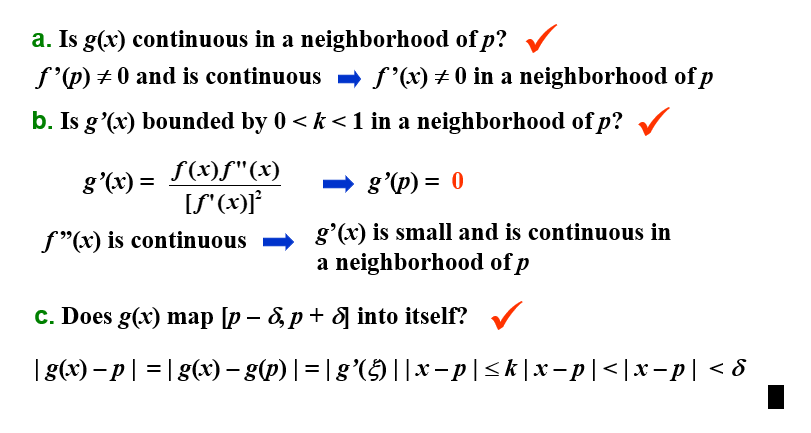

# Chapter 2 一元方程的求解 | Solutions of Equations in One Variable

## 2.0 停机程序 | Stopping procedure

我们可以选择一个精度要求$\epsilon$，逐步迭代，直到满足下列条件之一：

1. $|x_{i+1} - x_i| < \epsilon$
2. $|f(x_{i+1})| < \epsilon$
3. $\frac{|x_{i+1} - x_i|}{|x_{i+1}|} < \epsilon$

如果$|x_{i+1} - x_i|$收敛于0而序列本身发散 ，1号会失效。

也有可能$f(x)$与0很接近，但是$x_n$与$x$差别很大，2号也不行了。

3号条件是能运用的最好的停机准则，因为它最接近测试相对误差。

## 2.1 二分法 | Bisection Method

!!! question "为什么要用a+(b-a)/2，而不用(b+a)/2？"
    1. 因为a和b可能是很大的数，相加可能会溢出。
    2. 因为a和b可能是很小的数，相加可能会产生舍入误差。用此方法可以确保a+(b-a)/2落在a和b之间。
       1. 例如，用截断保留2位有效数字，a=0.91，b=0.93，(a+b)/2=1.8/2=0.9，而a+(b-a)/2=0.91+(0.93-0.91)/2=0.92。

## 2.2 不动点迭代 | Fixed-Point Iteration

不动点的存在性和唯一性的充分条件：

a. $g\in C[a,b]$且$g(x)\in [a,b], \forall x\in [a,b]$，则$g$在$[a,b]$上有不动点。

b. $|g'(x)|\leq k < 1, \forall x\in (a,b)$，则该不动点是唯一的。

则对于任意$p_0\in [a,b]$，不动点迭代序列$p_{n+1}=g(x_n)$收敛于不动点。

且我们有误差限$|p_n-p| \leq \frac{k^n}{1-k}|p_1-p_0|$，这将收敛速率和一阶导数的界联系起来。

!!! note "误差界分析"
    $$
    \begin{align*}
    |p_{n+1}-p_n| &= |g(p_n)-g(p_{n-1})| = |g'(\xi)||p_n-p_{n-1}| \leq k|p_n-p_{n-1}| \\
    &\leq k^2|p_{n-1}-p_{n-2}| \leq \ldots \leq k^n|p_1-p_0|
    \end{align*}
    $$

    $$
    \begin{align*}
    |p_{n}-p| &= |p_{n}-p_{n-1}+p_{n-1}-p_{n-2}+\ldots+p_1-p_0| \\
    &\leq |p_{n}-p_{n-1}|+|p_{n-1}-p_{n-2}|+\ldots+|p_1-p_0| \\
    &\leq (k^{n-1}+k^{n-2}+\ldots+1)|p_1-p_0| \\
    &= \frac{k^n-1}{k-1}|p_1-p_0| \leq \frac{k^n}{1-k}|p_1-p_0|
    \end{align*}
    $$

## 2.3 牛顿迭代法 | Newton's Method

就是用切线逼近零点，然后求切线与x轴的交点，作为下一个点，如此往复。

$$
x_{n+1} = x_n - \frac{f(x_n)}{f'(x_n)}
$$

!!! note "定理：设$f\in C^2[a,b]$，如果$p\in [a,b]$满足$f(p)=0$且$f'(p)\neq 0$，则存在$\delta>0$，使得对任何初始值$p_0\in (p-\delta, p+\delta)$，牛顿迭代法产生收敛于$p$的序列$\{p_n\}_{n=1}^\infty$。"

    证明：

    

牛顿迭代法的收敛性取决于初始近似值的选择。

## 2.4 迭代法的误差分析 | Error Analysis for Iterative Methods

假设$\{p_n\}_{n=0}^\infty$收敛于$p$，其中对$\forall p_n \neq p$。如果存在正数$\lambda$和$\alpha$，使得

$$
\lim_{n\to\infty}\frac{|p_{n+1}-p|}{|p_n-p|^\alpha} = \lambda
$$

则称$\{p_n\}_{n=0}^\infty$是$\alpha$阶收敛的(converges to p of order α)，$\lambda$称为**渐进误差常数**(asymptotic error constant)。

一般具有高阶收敛性的序列收敛速度更快。

- 如果$\alpha=1$，则该序列是**线性收敛**的(linearly convergent)。

- 如果$\alpha=2$，则该序列是**二次收敛**的(quadratically convergent)。

### 不动点法

不动点法的收敛阶和渐进误差常数：

$$
\begin{aligned}
p_{n+1}-p = g(p_n)-g(p) = g'(\xi)(p_n-p) &\Rightarrow \frac{|p_{n+1}-p|}{|p_n-p|} = |g'(\xi)|\\
&\Rightarrow \lim_{n\to\infty}\frac{|p_{n+1}-p|}{|p_n-p|} = \lim_{n\to\infty}|g'(\xi)| = |g'(p)|
\end{aligned}
$$

因此，如果$g'(p)\neq 0$，则不动点迭代法是线性收敛的，且渐进误差常数为$|g'(p)|$。

### 牛顿迭代法

牛顿迭代法的收敛阶和渐进误差常数：

由泰勒展开：

$$
\begin{aligned}
0 &= f(p) = f(p_n) + f'(p_n)(p-p_n) + \frac{f''(\xi)}{2}(p-p_n)^2\\
&\Rightarrow p =     p_n-\frac{f(p_n)}{f'(p_n)} - \frac{f''(\xi)}{2f'(p_n)}(p-p_n)^2\\
&\Rightarrow \lim_{n\to\infty}\frac{|p_{n+1}-p|}{|p_n-p|^2} = \lim_{n\to\infty}\frac{|f''(\xi)|}{2|f'(p_n)|} = \frac{|f''(p)|}{2|f'(p)|}
\end{aligned}
$$

因此，牛顿迭代法是二次收敛的，且渐进误差常数为$\frac{|f''(p)|}{2|f'(p)|}$。

### 不动点法的多重根情况

如果$p$是$g(x)$的不动点，存在正整数$m$，使得$g'(p)=g''(p)=\ldots=g^{(m-1)}(p)=0$，且$g^{(m)}(p)\neq 0$，则称$p_n = g(p_{n-1})$以阶$m$收敛于$p$，渐进误差常数为$\frac{|g^{(m)}(p)|}{m!}$。

$$
\begin{aligned}
p_{n+1} &= g(p_n) = g(p) + g'(p)(p_n-p) + \frac{g''(\xi)}{2}(p_n-p)^2 + \ldots + \frac{g^{(m)}(\xi)}{m!}(p_n-p)^m\\
&\Rightarrow \lim_{n\to\infty}\frac{|p_{n+1}-p|}{|p_n-p|^m} = \lim_{n\to\infty}\frac{|g^{(m)}(\xi)|}{m!} = \frac{|g^{(m)}(p)|}{m!}
\end{aligned}
$$

### 牛顿法的多重根情况

如果$p$是$f$的$m$重零点，则有$f(x)=(x-p)^mq(x)$，记$g(x)=x-\frac{f(x)}{f'(x)}$，牛顿法即为 $p_n=g(p_{n-1})$

$$
\begin{align*}
g'(x)
&= 1-\frac{f'(x)^2-f(x)f''(x)}{(f'(x))^2} \\
&= \frac{f(x)f''(x)}{(f'(x))^2} \\
&= \frac{(x-p)^mq(x)(m(m-1)(x-p)^{m-2}q(x)+2m(x-p)^{m-1}q'(x)+q''(x)(x-p)^m)}{(m(x-p)^{m-1}q(x)+q'(x)(x-p)^m)^2} \\
&= \frac{(x-p)^{2m-2}q(x)(m(m-1)q(x)+2m(x-p)q'(x)+q''(x)(x-p)^2)}{(x-p)^{2m-2}(mq(x)+q'(x)(x-p))^2} \\
&= \frac{q(x)(m(m-1)q(x)+2m(x-p)q'(x)+q''(x)(x-p)^2)}{(mq(x)+q'(x)(x-p))^2}
\end{align*}
$$

所以

$$g'(p)=\frac{q(p)m(m-1)q(p)}{(mq(p))^2}=1-\frac{1}{m}<1$$

由不动点法的迭代情况可知，此时为线性收敛，不为二次收敛。

### 牛顿法多重根下的优化

定义

$$\mu(x)=\frac{f(x)}{f'(x)}$$

如果$p$是$f$ 的$m$重零点，$f(x)=(x-p)^mq(x)$，则

$$\mu(x)=\frac{(x-p)^mq(x)}{m(x-p)^{m-1}q(x)+q'(x)(x-p)^m}=\frac{(x-p)q(x)}{mq(x)+q'(x)(x-p)}$$

又$q(p)\neq 0$，且

$$\frac{q(p)}{mq(p)+q'(p)(p-p)}=\frac{1}{m}\neq 0$$

所以$p$是$\mu(x)$的单根，那么我们对$\mu$应用牛顿迭代法，就有

$$
\begin{align*}
p_{n+1}=g(p_n) &= p_n-\frac{\mu(p_n)}{\mu'(p_n)} \\
&= p_n-\frac{\frac{f(p_n)}{f'(p_n)}}{\frac{f'(p_n)f'(p_n)-f(p_n)f''(p_n)}{(f'(p_n))^2}} \\
&= p_n-\frac{f(p_n)f'(p_n)}{f'(p_n)^2-f(p_n)f''(p_n)} \\
\end{align*}
$$

这就是让有多重根的牛顿法二次收敛的方法。

!!! warning ""
    1. 要求二阶导
    2. 分母由两个接近于0的数相减，会引起严重的舍入误差。

## 2.5 加速收敛 | Accelerating Convergence

二次收敛是很少可以得到的，我们在日常中总会碰到线性收敛。为了考虑如何加速线性受理立案序列的收敛速度，下面介绍——**AITKEN$\Delta^2$方法**。

### AITKEN$\Delta^2$方法

!!! note "$\Delta$"
    对于给定的序列，向前差分(forward difference)定义为$\Delta p_n = p_{n+1}-p_n$，对于更高的幂，我们有$\Delta^k p_n = \Delta(\Delta^{k-1}p_n)$，比如$\Delta^2 p_n = \Delta(\Delta p_n)= \Delta(p_{n+1}-p_n) = (p_{n+2}-p_{n+1}) -(p_{n+1}-p_n)$

假设$\{p_n\}_{n=0}^\infty$是线性收敛的，其极限为$p$。

为了便于构造比$\{p_n\}_{n=0}^\infty$收敛更快的序列$\{\hat{p}_n\}_{n=0}^\infty$，我们假设$p_n-p, p_{n+1}-p, p_{n+2}-p$的符号一致，又假设$n$足够大，有

$$
\frac{p_{n+1}-p}{p_n-p} \approx \frac{p_{n+2}-p}{p_{n+1}-p}
$$

从而

$$
p_{n+1}^2-2p_{n+1}p+p^2 \approx p_{n+2}p_n-(p_n+p_{n+2})p+p^2
$$

解出$p$，得到

$$
p \approx \frac{p_{n+2}p_{n}-p_{n+1}^2}{p_{n+2}-2p_{n+1}+p_n} \approx p_n - \frac{(p_{n+1}-p_n)^2}{p_{n+2}-2p_{n+1}+p_n}
$$

于是，我们可以构造序列$\{\hat{p}_n\}_{n=0}^\infty$，其中

$$
\hat{p}_n = p_n - \frac{(p_{n+1}-p_n)^2}{p_{n+2}-2p_{n+1}+p_n}=p_n -\frac{(\Delta p_n)^2}{\Delta^2 p_n}
$$

这样定义序列的方法就是AITKEN$\Delta^2$法

!!! note "为什么说更快？"

    可以证明

    $$\lim_{n\rightarrow \infty} \frac{\hat{p_n}-p}{p_n-p} = 0$$

!!! note "怎么迭代？"
    其实还是用序列本身的迭代法，不过在计算值的时候采取了AITKEN$\Delta^2$法。

    构造按如下顺序：

    $$
    p_0, p_1 = g(p_0), p_2 = g(p_1)  \\
    \hat{p_0} = \{\Delta^2\}(p_0)\\
    p_3 = g(p_2) \\
    \hat{p_1} = \{\Delta^2\}(p_1)\\
    \vdots
    $$

### Steffensen 方法

这个方法假设$\hat{p_0}$比$p_2$更好地逼近$p$，从而把上述过程第三行的不动点迭代应用到$\hat{p_0}$上

$$
p_0^{(0)}, p_1^{(0)} = g(p_0^{(0)}), p_2^{(0)} = g(p_1^{(0)})  \\
p_0^{(1)} = \{\Delta^2\}(p_0^{(0)})\\
p_1^{(1)} = g(p_0^{(0)}) \\
\vdots
$$

算法如下：

注意$\Delta^2 p_n$可能为0，如果发生，则终止并选取$p_2^{(n-1)}$为近似解。

!!! note ""
    我们一般要求$g'(p)\neq 0$，则在邻域内Steffensen法是二次收敛的
