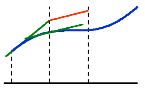
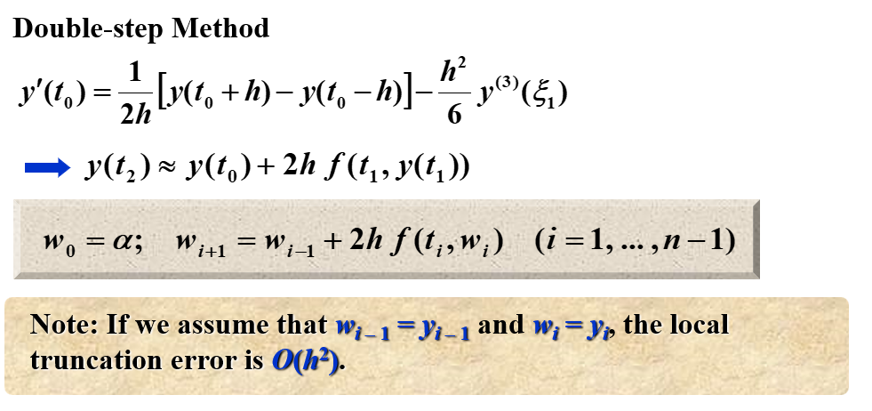
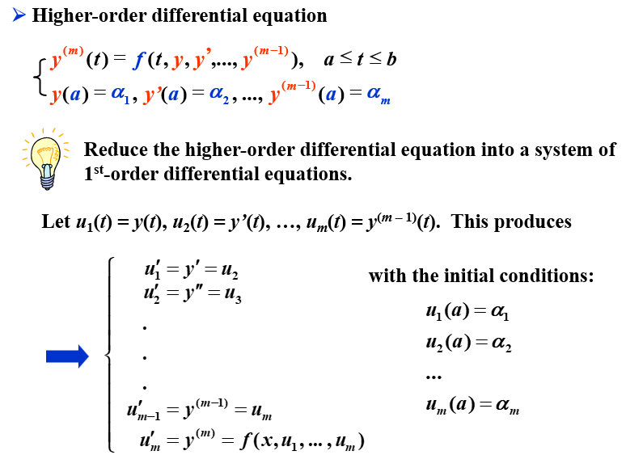
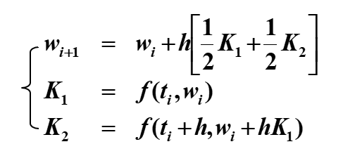
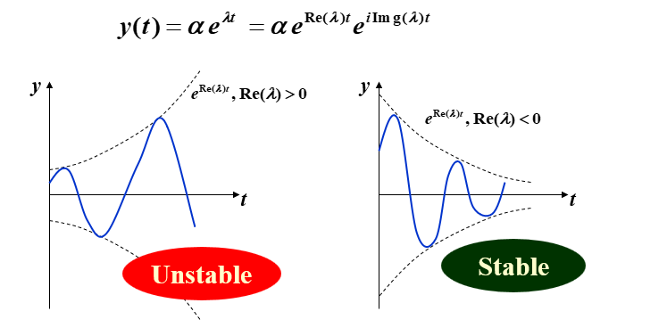

# Chapter 5 常微分方程的初值问题 | Initial-Value Problems for Ordinary Differential Equations

用数值方法来求解常微分方程的初值问题，就是找到 $w_0,w_1,\cdots,w_N$，使得 $w_i\approx y(t_i)$。

## 5.1 初值问题的基本理论 | The Elementary Theory of Initial-Value Problems

### Lipschitz 条件 | Lipschitz Condition

!!! note ""
    实际上，就是关于 $y$ 的偏导数（如果可导）的上界

在 Lipschitz 条件下，初值问题的解是唯一的：

### 良态问题 | Well-Posed Problems

!!! note ""
    $z(t)$ 那行的式子是原式的摄动问题（perturbed problem），即在原式的基础上加上一个扰动项（嘉定微分方程可能有误差$\delta$，或者初值有误差$\epsilon$）

在 Lipschitz 条件下，初值问题是良态的：

## 5.2 Euler 法 | Euler's Method

Euler 法的目的是获得如下形式的近似解：

$$
\begin{cases}\frac{dy}{dt}=f\left(t,y\right)\quad t\in[a,b]\\y(a)=\alpha&\end{cases}
$$

得到的是一系列点的近似值。

Euler 法的思想是，用 $f(t,y)$ 在 $(t_i,y_i)$ 处的线性近似值来代替 $f(t,y)$，即：

$$w_{i+1}=w_i+hf(t_i,w_i)$$

我们称其为**差分方程**（difference equation）

{width=50%}

!!! note ""
    就是用一个点的导数值作为这个区间上的导数值

### 误差界

如果考虑每次计算中的舍入误差，则有

此时，往往有 $h>\sqrt{2\delta /M}$（$\delta$ 通常很小），所以随着 $h$ 的减小，误差会越来越小。（打勾函数的右沿）

### 其他 Euler 法

#### 隐式欧拉法 | Implicit Euler Method

隐式欧拉法(implicit Euler method)，又称后退欧拉法，是按照隐式公式进行数值求解的方法。隐式公式不能直接求解，一般需要用欧拉显式公式得到初值，然后用欧拉隐式公式进行迭代求解。因此，隐式公式比显式公式计算复杂，但稳定性好。

#### 梯形法 | Trapezoidal Method

梯形法(trapezoidal method)是一种求解常微分方程初值问题的数值方法。它是欧拉法和隐式欧拉法的结合，是一种二阶方法。梯形法的基本思想是用 $f(t_i,y_i)$ 和 $f(t_{i+1},y_{i+1})$ 的平均值来代替 $f(t,y)$，即：

$$w_{i+1}=w_i+\frac{h}{2}(f(t_i,w_i)+f(t_{i+1},w_{i+1}))$$

!!! note ""
    Note: The local truncation error is indeed $O(h^2)$.  However an implicit equation has to be solved iteratively.

#### 双步法 | Double-step Method

双步法相较于之前的方法，需要两个初始值，即 $w_0$ 和 $w_1$，然后用这两个初始值来计算 $w_2$，再用 $w_1$ 和 $w_2$ 来计算 $w_3$，以此类推。

#### 对比

## 5.3 高阶 Taylor 法 | Higher-Order Taylor Methods

### 局部截断误差

局部截断误差只考虑一步的误差，即假设前面没有误差：

$$w_0=\alpha$$

$$w_{i+1}=w_i+h\phi(t_i,w_i),\quad i=0,1,\cdots,N-1$$

有局部截断误差

$$ \tau_{i+1}(h)=\frac{y_{i+1}-(y_i+h\phi(t_i,y_i))}{h}=\frac{y_{i+1}-y_i}{h}-\phi(t_i,y_i)$$

!!! note "对于 Euler 法"

    

Euler 法实际上就是高阶 Taylor 法的一阶近似。

### 高阶 Taylor 法

$$y_{i+1}=y_i+hf(t_i,y_i)+\frac{h^2}2f^{\prime}(t_i,y_i)+\cdots+\frac{h^n}{n!}f^{(n-1)}(t_i,y_i)+\frac{h^{n+1}}{(n+1)!}f^{(n)}(\xi_i,y(\xi_i))$$

$n$ 阶的 Taylor 法：

$$
\begin{aligned}
w_{0}&=\alpha  \\
w_{i+1}&=w_{i}+hT^{(n)}(t_{i},w_{i})\quad(i=0,...,n-1) \\
&\text{where}\quad T^{(n)}(t_i,w_i)=f(t_i,w_i)+\frac{h}{2}f^{\prime}(t_i,w_i)+...+\frac{h^{n-1}}{n!}f^{(n-1)}(t_i,w_i)
\end{aligned}
$$

其局部截断误差为 $O(h^{n})$（如果 $y\in C^{n+1}[a,b]$）。

??? note "例子"

    

    !!! note ""
        
        求 $f(t,y(t))=\frac{2}{t}y(t)+t^2e^t$ 关于 $t$ 的一阶导数

        $$
        \begin{aligned}
        f(t,y(t))&=\frac2ty+t^2e^t\\
        f'(t,y(t))&=\frac2ty'-\frac{2}{t^2}y+2te^t+t^2e^t\\
        &=\frac{2}{t}(\frac{2}{t}y+t^2e^t)-\frac{2}{t^2}y+2te^t+t^2e^t\\
        &=\frac{4}{t^2}y+2te^t-\frac{2}{t^2}y+2te^t+t^2e^t\\
        &=\frac{2}{t^2}y+4te^t+t^2e^t
        \end{aligned}
        $$

        $$
        \begin{aligned}
        T^{(2)}(t_i,w_i)&=f(t_i,w_i)+\frac{h}{2}f'(t_i,w_i)\\
        &=\frac{2}{t_i}w_i+t_i^2e^{t_i}+\frac{h}{2}(\frac{2}{t_i^2}w_i+4t_ie^{t_i}+t_i^2e^{t_i})\\
        \end{aligned}
        $$

        所以 $w_{i+1}$ 的表达式为：

        $$
        \begin{aligned}
        w_{i+1}&=w_i+hf(t_i,w_i)+\frac{h^2}{2}f'(t_i,w_i)\\
        &=w_i+h(\frac{2}{t_i}w_i+t_i^2e^{t_i})+\frac{h^2}{2}(\frac{2}{t_i^2}w_i+4t_ie^{t_i}+t_i^2e^{t_i})\\
        \end{aligned}
        $$

        $h=0.1$ 时：

        |$i$|$t_i$|$w_i$|$y(t_i)$|
        |:-:|:-:|:-:|:-:|
        |0|1.00|0.0000000|0.0000000|
        |1|1.10|0.3397852|0.3459199|
        |2|1.20|0.8521434|0.8666425|
        |3|1.30|1.581770|1.607215|
        |4|1.40|2.580997|2.620360|
        |5|1.50|3.910985|3.967666|
        |6|1.60|5.643081|5.720962|
        |7|1.70|7.860382|7.963874|
        |8|1.80|10.65951|10.79362|
        |9|1.90|14.15268|14.32308|
        |10|2.00|18.46999|18.68310|

    !!! note ""
        应用线性插值法，我们有

        $$
        \begin{aligned}
        y(1.04)&\approx 0.6y(1.00)+0.4y(1.10)\\
        &=0.6*0.0000000+0.4*0.3397852\\
        &=0.1359141\\
        y(1.55)&\approx 0.5y(1.50)+0.5y(1.60)\\
        &=0.5*3.910985+0.5*5.643081\\
        &=4.777033\\
        y(1.97)&\approx 0.3y(1.90)+0.7y(2.00)\\
        &=0.3*14.15268+0.7*18.46999\\
        &=17.17480
        \end{aligned}
        $$

        其精确值为：

        $$
        \begin{aligned}
        y(1.04)&=0.1199875\\
        y(1.55)&=4.788635\\
        y(1.97)&=17.27930
        \end{aligned}
        $$

## 5.4 Runge-Kutta 法 | Runge-Kutta Methods

!!! note ""

    泰勒方法需要计算 $f(t,y)$ 的导数并求值，这是一个复杂、耗时的过程。Runge-Kutta 方法具有 Taylor 方法的高阶局部截断误差，但是不需要计算 $f(t,y)$ 的导数。

### 二阶 Runge-Kutta 法 | Runge-Kutta method of order 2

我们考察改进欧拉法 $K$ 前面的系数以及 $K_2$ 的步长，使局部截断误差为 $O(h^2)$：

$$
\begin{cases}w_{i+1}&=&w_i+h[{\color{red}{\lambda_1}}K_1+{\color{red}{\lambda_2}}K_2]\\K_1&=&f(t_i,w_i)\\K_2&=&f(t_i+{\color{red}{p}}h,w_i+{\color{red}{p}}hK_1)\end{cases}$$

这有无穷多种可能，我们称其为 **二阶 Runge-Kutta 方法**（Runge-Kutta method of order 2）。

!!! note ""
    以下三个是二阶 Runge-Kutta 方法的特例

#### 中点法 | Midpoint Method

$$\begin{cases}w_0=\alpha\\
w_{i+1}=w_i+hf(t_i+\frac{h}{2},w_i+\frac{h}{2}f(t_i,w_i))\end{cases}$$

#### 改进欧拉法 | Modified Euler Method

$$\begin{cases}w_0=\alpha\\
w_{i+1}=w_i+h(\frac12K_1+\frac12K_2)\\
K_1=f(t_i,w_i)\\
K_2=f(t_{i}+h,w_i+hK_1)\end{cases}$$

!!! note "是不是感觉和梯形法很像？"

    梯形法是用 $f(t_i,w_i)$ 和 $f(t_{i+1},w_{i+1})$ 的平均值来代替 $f(t,y)$，而改进欧拉法是用 $f(t_i,w_i)$ 和 $f(t_{i}+h,w_i+hK_1)$ 的平均值来代替 $f(t,y)$。区别在于前者是隐式的，后者是显式的。

#### Heun 法 | Heun's Method

$$\begin{cases}w_0=\alpha\\
w_{i+1}=w_i+h(\frac{1}{4}K_1+\frac{3}{4}K_2)\\
K_1=f(t_i,w_i)\\
K_2=f(t_{i}+\frac{2}{3}h,w_i+\frac{2}{3}hK_1)\end{cases}$$

### 高阶 Runge-Kutta 法 | Runge-Kutta methods of order $m$

$$\begin{cases}w_0=\alpha\\
w_{i+1}=w_i+h({\color{red}{\lambda_1}}K_1+{\color{red}{\lambda_2}}K_2+\cdots+{\color{red}{\lambda_m}}K_m)\\
K_1=f(t_i,w_i)\\
K_2=f(t_i+{\color{red}{\alpha_2}}h,w_i+{\color{red}{\beta_{21}}}hK_1)\\
K_3=f(t_i+{\color{red}{\alpha_3}}h,w_i+{\color{red}{\beta_{31}}}hK_1+{\color{red}{\beta_{32}}}hK_2)\\
\vdots\\
K_m=f(t_i+{\color{red}{\alpha_m}}h,w_i+{\color{red}{\beta_{m1}}}hK_1+{\color{red}{\beta_{m2}}}hK_2+\cdots+{\color{red}{\beta_{m,m-1}}}hK_{m-1})\end{cases}$$

!!! note "Order 4-the most popular one"

    $$\begin{cases}w_0=\alpha\\
    w_{i+1}=w_i+h(\frac16K_1+\frac13K_2+\frac13K_3+\frac16K_4)\\
    K_1=f(t_i,w_i)\\
    K_2=f(t_i+\frac{h}{2},w_i+\frac{h}{2}K_1)\\
    K_3=f(t_i+\frac{h}{2},w_i+\frac{h}{2}K_2)\\
    K_4=f(t_i+h,w_i+hK_3)\end{cases}$$

!!! note ""

    我们给出每步的求值次数和局部阶段误差的阶之间的关系：

    

    这说明了为什么人们更喜欢使用具有较小步长的小于 5 阶的 Runge-Kutta 方法。

!!! note ""

    因为 Runge-Kutta 方法是基于 Taylor 展开的，所以 y 必须足够平滑，才能获得更高阶方法的更高精度。通常情况下，人们更喜欢使用较小步长的低阶方法，而不是使用较大步长的高阶方法。

    如果 $y$ 不够光滑，那么高阶的 Runge-Kutta 方法也不会有很好的效果，所以一般会用低阶的 Runge-Kutta 方法，但是步长会更小

## 5.6 多步法 | Multistep Methods

!!! note ""
    在一些网格点（mesh points）上使用 $y$ 和 $y'$ 的线性组合来更好地近似 $y(t_{i+1})$

求解初值问题

$$y'=f(t,y),\quad a\leq t\leq b,\quad y(a)=\alpha$$

的 $m$ 步多步法（$m$-step multistep method）的一般形式为

$$\begin{aligned}
w_{i+1}=&{\color{red}{a_{m-1}}}w_i+{\color{red}{a_{m-2}}}w_{i-1}+...+{\color{red}{a_0}}w_{i+1-m}\\+&h[{\color{red}{b_m}}f(t_{i+1},w_{i+1})+{\color{red}{b_{m-1}}}f(t_i,w_i)+...+{\color{red}{b_0}}f(t_{i+1-m},w_{i+1-m})]
\end{aligned}$$

其中 $h=(b-a)/N$，给定 $m$ 个初始值 $w_0,w_1,...,w_{m-1}$，$a_0,a_1,...,a_{m-1}$ 和 $b_0,b_1,...,b_m$ 是常数。

!!! note ""
    $b_m=0$ 的方法称为**显式**（explicit）；$b_m\neq 0$ 的方法称为**隐式**（implicit）

**局部截断误差**（local truncation error）为

$$
\begin{aligned}
\tau_{i+1}(h)&=\frac{y_{i+1}-w_{i+1}}{h}\\
&=\frac{y_{i+1}-{\color{red}{a_{m-1}}}y_i-{\color{red}{a_{m-2}}}y_{i-1}-...-{\color{red}{a_0}}y_{i+1-m}}{h}\\
&-{\color{red}{b_m}}f(t_{i+1},y_{i+1})-{\color{red}{b_{m-1}}}f(t_i,y_i)-...-{\color{red}{b_0}}f(t_{i+1-m},y_{i+1-m})
\end{aligned}
$$

### Adams-Bashforth 显式 m 步方法 | Adams-Bashforth explicit m-step technique

注意到

$$y(t_{i+1})=y(t_i)+\int_{t_i}^{t_{i+1}}f(t,y(t))dt$$

为了推导 Adams-Bashforth 显式 m 步方法，我们通过$(t_i,f(t_i,y(t_i)))$，$(t_{i-1},f(t_{i-1},y(t_{i-1})))$，$(t_{i-2},f(t_{i-2},y(t_{i-2})))$，...，$(t_{i+1-m},f(t_{i+1-m},y(t_{i+1-m})))$ 形成[向后差分多项式](./Chapter_03.md/#_10) $P_{m-1}(t)$，然后用 $P_{m-1}(t)$ 来代替 $f(t,y(t))$，从而得到

$$f(t,y(t))=P_{m-1}(t)+\frac{f^{(m)}(\xi_i,y(\xi_i))}{m!}(t-t_i)(t-t_{i-1})...(t-t_{i+1-m})$$

!!! note "向后差分多项式"
    $$P_n(x_s)=\sum\limits_{k=0}^n(-1)^k\begin{pmatrix}-s\\k\end{pmatrix}\nabla^kf(x_n)$$

$$\begin{aligned}
\int_{t_i}^{t_{i+1}}f(t,y(t))dt&=\int_{t_i}^{t_{i+1}}P_{m-1}(t)dt+\int_{t_i}^{t_{i+1}}R_{m-1}(t)dt\\
&=h\int_{0}^{1}P_{m-1}(t_i+sh)ds+h\int_{0}^{1}R_{m-1}(t_i+sh)ds\\
&=h\sum\limits_{k=0}^{m-1}\nabla^kf(t_i,y(t_i))(-1)^k\int_{0}^{1}\begin{pmatrix}-s\\k\end{pmatrix}ds\\&+\frac{h^{m+1}}{m!}\int_{0}^{1}f^{(m)}(\xi_i,y(\xi_i))s(s+1)...(s+m-1)ds\\
\end{aligned}$$

其中 $R_{m-1}(t)$ 是余项，也就是截断误差。

我们有

$$
\begin{aligned}
w_{i+1}&=w_i+h\int_{0}^{1}P_{m-1}(t_i+sh)ds\\
&=w_i+h\sum\limits_{k=0}^{m-1}\nabla^kf(t_i,y(t_i))(-1)^k\int_{0}^{1}\begin{pmatrix}-s\\k\end{pmatrix}ds\\
\int_{t_i}^{t_{i+1}}R_{m-1}(t)dt&=\frac{h^{m+1}}{m!}\int_{0}^{1}f^{(m)}(\xi_i,y(\xi_i))s(s+1)...(s+m-1)ds\\
&=\frac{h^{m+1}f^{(m)}(\mu_i,y(\mu_i))}{m!}\int_{0}^{1}s(s+1)...(s+m-1)ds\\
&={h^{m+1}f^{(m)}(\mu_i,y(\mu_i))}(-1)^m\int_{0}^{1}\begin{pmatrix}-s\\m\end{pmatrix}ds\\
\end{aligned}
$$

其**局部截断误差**为

$$
\begin{aligned}
\tau_{i+1}(h)&=\frac{y_{i+1}-{\color{red}{a_{m-1}}}y_i-{\color{red}{a_{m-2}}}y_{i-1}-...-{\color{red}{a_0}}y_{i+1-m}}{h}\\
&-{\color{red}{b_m}}f(t_{i+1},y_{i+1})-{\color{red}{b_{m-1}}}f(t_i,y_i)-...-{\color{red}{b_0}}f(t_{i+1-m},y_{i+1-m})\\
&=\frac{1}{h}\int_{t_i}^{t_{i+1}}R_{m-1}(t)dt\\
&={h^{m}f^{(m)}(\mu_i,y(\mu_i))}(-1)^m\int_{0}^{1}\begin{pmatrix}-s\\m\end{pmatrix}ds
\end{aligned}
$$

!!! note "$(-1)^k\int_{0}^{1}\begin{pmatrix}-s\\k\end{pmatrix}ds$"

    |$k$|$(-1)^k\int_{0}^{1}\begin{pmatrix}-s\\k\end{pmatrix}ds$|
    |:-:|:-:|
    |$0$|$1$|
    |$1$|$\frac{1}{2}$|
    |$2$|$\frac{5}{12}$|
    |$3$|$\frac{3}{8}$|
    |$4$|$\frac{251}{720}$|
    |$5$|$\frac{95}{288}$|

!!! example "2步"

    取 $m=2$，我们有

    $$
    \begin{aligned}
    w_{i+1}&=w_i+h[\nabla^0f(t_i,w_i)+\frac12\nabla^1f(t_i,w_i)]\\
    &=w_i+h[\frac32f(t_i,w_i)-\frac12f(t_{i-1},w_{i-1})]\\
    \end{aligned}
    $$

    因为 $y_{i+1}=y_i+h[{\color{red}{b_m}}f(t_{i+1},w_{i+1})+{\color{red}{b_{m-1}}}f(t_i,w_i)+...+{\color{red}{b_0}}f(t_{i+1-m},w_{i+1-m})]+\int_{t_i}^{t_{i+1}}R_{m-1}(t)dt$，所以

    其局部截断误差为

    $$
    \begin{aligned}
    \tau_{i+1}(h)&={h^{m}f^{(m)}(\mu_i,y(\mu_i))}(-1)^m\int_{0}^{1}\begin{pmatrix}-s\\m\end{pmatrix}ds\\
    &=\frac{5}{12}h^2f''(\mu_i,y(\mu_i))\\
    &=\frac{5}{12}h^2y'''(\mu_i)    
    \end{aligned}
    $$

|$m$|$f_i$|$f_{i-1}$|$f_{i-2}$|$f_{i-3}$|
|:-:|:-:|:-:|:-:|:-:|
|$1$|$1$|$-$|$-$|$-$|
|$2$|$\frac{3}{2}$|$-\frac{1}{2}$|$-$|$-$|
|$3$|$\frac{23}{12}$|$-\frac{4}{3}$|$\frac{5}{12}$|$-$|
|$4$|$\frac{55}{24}$|$-\frac{59}{24}$|$\frac{37}{24}$|$-\frac{3}{8}$|

查表可得，Adams-Bashforth 显式 4 步方法的为

$$w_{i+1}=w_i+\frac{h}{24}(55f_i-59f_{i-1}+37f_{i-2}-9f_{i-3})$$

### Adams-Moulton 隐式 m 步方法 | Adams-Moulton implicit m-step technique

同样的，我们采用向前差分多项式，可以得到 Adams-Moulton 隐式 m 步方法：

### Adams 预测-校正系统 | Adams predictor-corrector system

Adams 预测-校正系统是 Adams-Bashforth 显式 m 步方法和 Adams-Moulton 隐式 m 步方法的结合：

1. 用 Runge-Kutta 法计算出 $m$ 个初始值 $w_0,w_1,...,w_{m-1}$ （如果初值的个数不够）
2. **预测**：用 Adams-Bashforth 显式 m 步方法计算出 $w_m,w_{m+1},...$ 直到 $w_{N-1}$
3. **校正**：用 Adams-Moulton 隐式 m 步方法计算出 $w_m,w_{m+1},...$ 直到 $w_{N-1}$

!!! note ""
    在这三步中使用的所有公式的局部截断误差的阶必须相同。

    最常用的系统是以 4 阶 Adams-Bashforth 方法作为预测器，以 Adams-Moulton 方法的一次迭代作为校正器，其起始值来自 4 阶 Runge-Kutta 方法。

### 宏观角度：Taylor 展开

通过对比系数，可以有一族解。

通过对这个解的再限制（添加两个条件），我们可以得到多种方法。

## 5.9 高阶方程和微分方程组 | Higher-Order Equations and Systems of Differential Equations

### 微分方程组的矩阵形式

对 $m$ 阶微分方程组：

$$\begin{cases}
u_1'(t)=f_1(t,u_1(t),u_2(t),...,u_m(t))\\
\vdots\\
u_m'(t)=f_m(t,u_1(t),u_2(t),...,u_m(t))\\
\end{cases}$$

给定 $m$ 个初始值 $u_1(a),u_2(a),...,u_m(a)$，我们可以用 $m$ 步的 Runge-Kutta 法来求解。

用矩阵的形式可以记作

$$\begin{cases}
\mathbf{y}'(t)=\mathbf{f}(t,\mathbf{y}(t))\\
\mathbf{y}(a)=\mathbf{\alpha}\\
\end{cases}$$

### 高阶微分方程的转化

!!! example "例题"

    

    !!! note "modified Euler's method"
        
    
    

    
    !!! note "第一次迭代："
        {width=50%}

    !!! note "第二次迭代："
        {width=50%}

## 5.10 稳定性 | Stability

### 相容 | Consistency

!!! note ""
    注意到这个定义是在**局部**上的定义

### 收敛 | Convergence

!!! note ""
    这是对**整体**而言

### 稳定性 | Stability

除了这两个概念，我们还需要一个概念：**稳定性**。如果初始条件的小变化或扰动会导致后续近似值的相应小变化，则该方法被称为**稳定**。

#### 测试方程 | Test Equation

我们将一个特定的方法应用于一个简单的测试方程：

$$y’ = \lambda y,  y(0) = \alpha,  \text{where } Re(\lambda) < 0$$

假设舍入误差只在初始点引入。如果这个初始误差会在某个步长 $h$ 下减小，那么这个方法就被称为**绝对稳定**（absolutely stable），此时 $H = \lambda h$。所有这样的 $H$ 的集合构成了**绝对稳定域**（region of absolute stability）。

如果方法 A 的绝对稳定域比方法 B 的大，那么方法 A 就比方法 B 更稳定

##### 显式 Euler 法的稳定性

在显式 Euler 法中，我们有

$$w_{i+1}=w_i+hf(t_i,w_i)$$

在这个测试方程中，我们有

$$w_{i+1}=(1+\lambda h)w_i=(1+H)w_i=(1+H)^{i+1}\alpha$$

我们给初值加上一个扰动项 $\epsilon$，即 $\alpha^*=\alpha+\epsilon$，则

$$w_{i+1}^*=(1+H)^{i+1}(\alpha+\epsilon)$$

所以

$$\epsilon_{i+1}=(1+H)^{i+1}\epsilon$$

要确保稳定性，我们需要 $|(1+H)^{i+1}|<1$，即 $|1+H|<1$。

##### 隐式 Euler 法的稳定性

在隐式 Euler 法中，我们有

$$w_{i+1}=w_i+hf(t_{i+1},w_{i+1})$$

在这个测试方程中，我们有

$$w_{i+1}=w_i+h\lambda w_{i+1}$$

所以

$$w_{i+1}=\frac{1}{1-h\lambda}w_i=\frac{1}{1-H}w_i=(\frac{1}{1-H})^{i+1}\alpha$$

我们给初值加上一个扰动项 $\epsilon$，即 $\alpha^*=\alpha+\epsilon$，则

$$w_{i+1}^*=(\frac{1}{1-H})^{i+1}(\alpha+\epsilon)$$

所以

$$\epsilon_{i+1}=(\frac{1}{1-H})^{i+1}\epsilon$$

要确保稳定性，我们需要 $|(\frac{1}{1-H})^{i+1}|<1$，即 $|\frac{1}{1-H}|<1$。

##### 二阶 隐式 Runge-Kutta 法的稳定性

在二阶 隐式 Runge-Kutta 法中，我们有

$$
\begin{cases}w_{i+1}&=&w_i+hK_1\\K_1&=&f(t_i+\frac12h,w_i+\frac12hK_1)\end{cases}
$$

在这个测试方程中，我们有

$$
\begin{aligned}
K_1&=\lambda (w_i+\frac12hK_1)\Rightarrow K_1=\frac{\lambda w_i}{1-\frac12h\lambda}\\
w_{i+1}&=w_i+hK_1\\
&=w_i+h\frac{\lambda w_i}{1-\frac12h\lambda}\\
&=w_i+\frac{H w_i}{1-\frac12H}\\
&=\frac{2+H}{2-H}w_i\\
&=(\frac{2+H}{2-H})^{i+1}\alpha\\
\end{aligned}
$$

我们给初值加上一个扰动项 $\epsilon$，即 $\alpha^*=\alpha+\epsilon$，则

$$w_{i+1}^*=(\frac{2+H}{2-H})^{i+1}(\alpha+\epsilon)$$

所以

$$\epsilon_{i+1}=(\frac{2+H}{2-H})^{i+1}\epsilon$$

要确保稳定性，我们需要 $|\frac{2+H}{2-H}|<1$。

##### 四阶 显式 Runge-Kutta 法的稳定性

在四阶 显式 Runge-Kutta 法中，我们有

$$
\begin{cases}w_{i+1}&=&w_i+\frac{h}{6}(K_1+2K_2+2K_3+K_4)\\
K_1&=&f(t_i,w_i)\\
K_2&=&f(t_i+\frac12h,w_i+\frac12hK_1)\\
K_3&=&f(t_i+\frac12h,w_i+\frac12hK_2)\\
K_4&=&f(t_i+h,w_i+hK_3)\\
\end{cases}
$$

在这个测试方程中，我们有

$$
\begin{aligned}
K_1&=\lambda w_i\\
K_2&=\lambda (w_i+\frac12hK_1)=\lambda w_i(1+\frac12H )\\
K_3&=\lambda (w_i+\frac12hK_2)=\lambda w_i(1+\frac12H +\frac14H^2 )\\
K_4&=\lambda (w_i+hK_3)=\lambda w_i(1+H  +\frac12H^2  +\frac14H^3  )\\
w_{i+1}&=w_i+\frac{h}{6}(K_1+2K_2+2K_3+K_4)\\
&=w_i+\frac{h}{6} \lambda w_i(1+2(1+\frac12H )+2(1+\frac12H +\frac14H^2 )+(1+H  +\frac12H^2  +\frac14H^3  ))\\
&=w_i+\frac{H}{6} w_i(6+3H+H^2+\frac{1}{4}H^3)\\
&=w_i(1+H+\frac{1}{2}H^2+\frac{1}{6}H^3+\frac{1}{24}H^4)\\
&=\alpha(1+H+\frac{1}{2}H^2+\frac{1}{6}H^3+\frac{1}{24}H^4)^{i+1}\\
\end{aligned}
$$

我们给初值加上一个扰动项 $\epsilon$，即 $\alpha^*=\alpha+\epsilon$，则

$$w_{i+1}^*=\alpha^*(1+H+\frac{1}{2}H^2+\frac{1}{6}H^3+\frac{1}{24}H^4)^{i+1}$$

所以

$$\epsilon_{i+1}=(1+H+\frac{1}{2}H^2+\frac{1}{6}H^3+\frac{1}{24}H^4)^{i+1}\epsilon$$

要确保稳定性，我们需要 $|1+H+\frac{1}{2}H^2+\frac{1}{6}H^3+\frac{1}{24}H^4|<1$。

#### 微分方程组

考虑一个微分方程组

$$\begin{cases}u_1^{\prime}&=9u_1+24u_2+5\cos t-\frac13\sin t,&u_1(0)&=\frac43\\\\u_2^{\prime}&=-24u_1-51u_2-9\cos t+\frac13\sin t,&u_2(0)&=\frac23\end{cases}
$$

应用欧拉显式法，我们该如何选择步长 $h$ 才能保证稳定性？

我们将条件改写为矩阵形式：

$$
\begin{pmatrix}u_1^{\prime}\\u_2^{\prime}\end{pmatrix}=\begin{pmatrix}9&24\\-24&-51\end{pmatrix}\begin{pmatrix}u_1\\u_2\end{pmatrix}+\begin{pmatrix}5\cos t-\frac13\sin t\\-9\cos t+\frac13\sin t\end{pmatrix}
$$

应用欧拉显式法，我们有

$$
\begin{pmatrix}u_1^{i+1}\\u_2^{i+1}\end{pmatrix}=\begin{pmatrix}u_1^i\\u_2^i\end{pmatrix}+h\begin{pmatrix}9&24\\-24&-51\end{pmatrix}\begin{pmatrix}u_1^i\\u_2^i\end{pmatrix}+h\begin{pmatrix}5\cos t_i-\frac13\sin t_i\\-9\cos t_i+\frac13\sin t_i\end{pmatrix}
$$

记 $\mathbf{A}=\begin{pmatrix}9&24\\-24&-51\end{pmatrix}$，则

$$
\begin{pmatrix}u_1^{i+1}\\u_2^{i+1}\end{pmatrix}=(\mathbf{I}+h\mathbf{A})\begin{pmatrix}u_1^i\\u_2^i\end{pmatrix}+h\begin{pmatrix}5\cos t_i-\frac13\sin t_i\\-9\cos t_i+\frac13\sin t_i\end{pmatrix}
$$

我们给初值加上一个扰动项 $\epsilon_0$ 和 $\mu_0$，即 $\mathbf{u}^*_0=\mathbf{u}_0+\begin{pmatrix}\epsilon_0\\\mu_0\end{pmatrix}$，则

$$
\begin{pmatrix}u_1^{i+1*}\\u_2^{i+1*}\end{pmatrix}=(\mathbf{I}+h\mathbf{A})\begin{pmatrix}u_1^{i*}\\u_2^{i*}\end{pmatrix}+h\begin{pmatrix}5\cos t_i-\frac13\sin t_i\\-9\cos t_i+\frac13\sin t_i\end{pmatrix}
$$

上面两个式子相减，我们有

$$
\begin{pmatrix}\epsilon_{i+1}\\\mu_{i+1}\end{pmatrix}=(\mathbf{I}+h\mathbf{A})\begin{pmatrix}\epsilon_i\\\mu_i\end{pmatrix}
$$

所以

$$
\begin{pmatrix}\epsilon_{i+1}\\\mu_{i+1}\end{pmatrix}=(\mathbf{I}+h\mathbf{A})^{i+1}\begin{pmatrix}\epsilon_0\\\mu_0\end{pmatrix}
$$

要确保稳定性，我们需要 $|(\mathbf{I}+h\mathbf{A})^{i+1}|<1$。

也就是说，我们需要 $|1+h\lambda|<1\Leftrightarrow -2<h\lambda<0$，其中 $\lambda$ 是 $\mathbf{A}$ 的特征值。

我们求解 $\mathbf{A}$ 的特征值，得到 $\lambda_1=-3$ 和 $\lambda_2=-39$。

所以，我们需要 $-2<h\lambda_1<0\Leftrightarrow \frac23>h>0$ 和 $-2<h\lambda_2<0\Leftrightarrow \frac{2}{39}>h>0$。

所以，我们需要 $0<h<\frac{2}{39}$。
