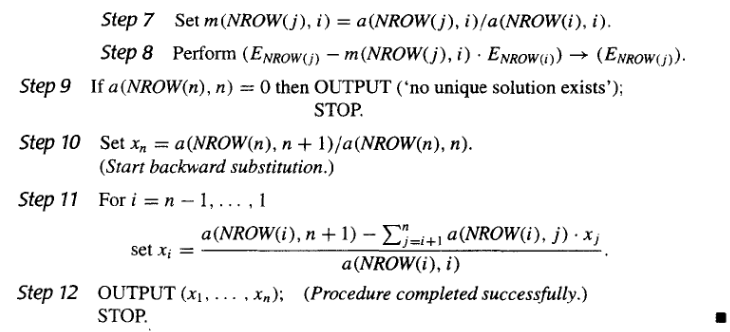
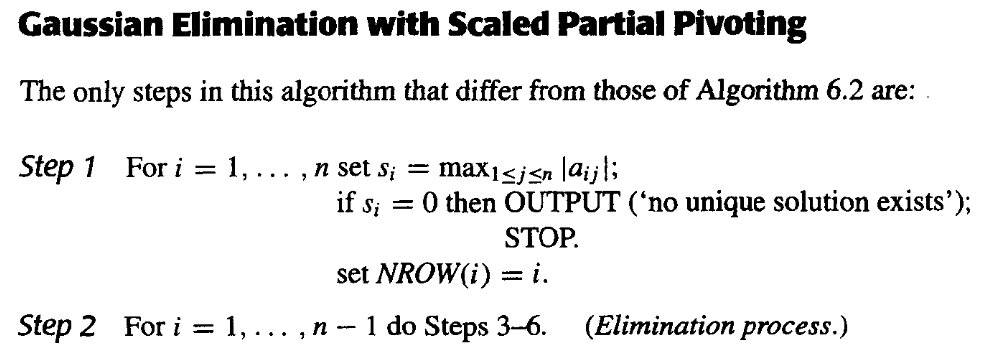
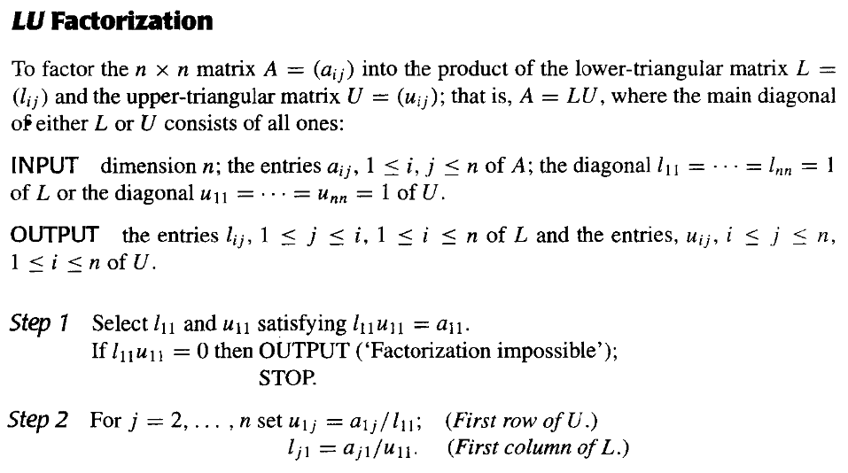
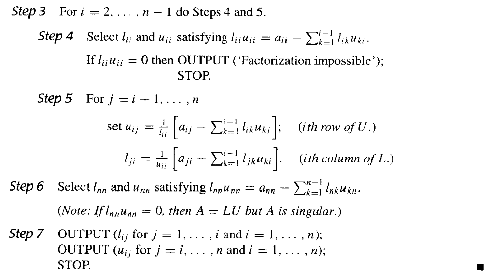
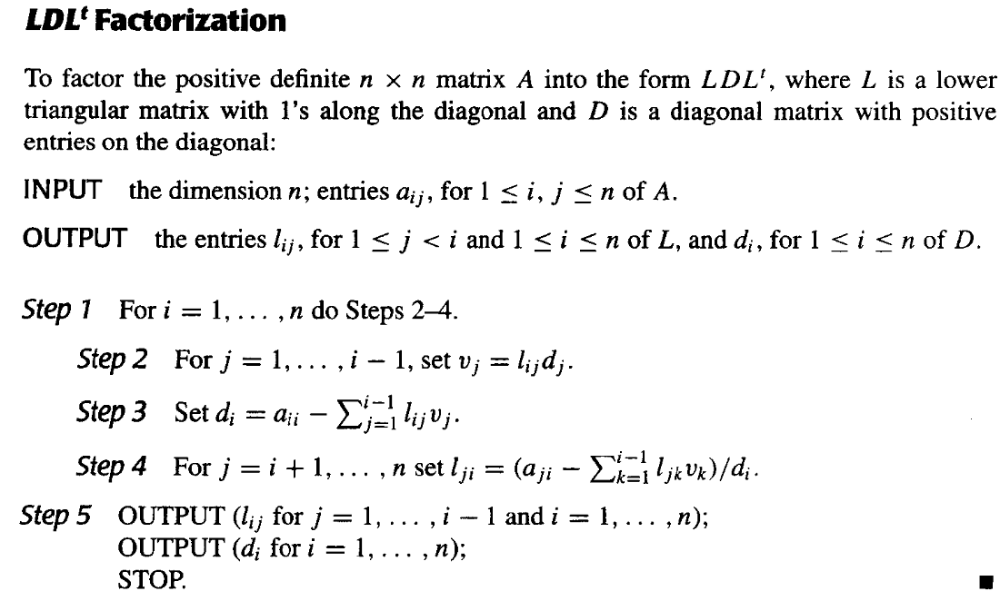

# Chapter 6 解线性方程组的直接法 | Direct Methods for Solving Linear Systems

## 6.1 回代的Gauss消去法 | Gaussian elimination with backward substitution

### 算法内容

解方程组$\mathbf{A}\vec{x}=\vec{b}$，记$\mathbf{A}^(1)=\mathbf{A}=a_{ij}^{(1)}$，$\vec{b}^{(1)}=\vec{b}=\begin{pmatrix}b_{1}^{(1)}\\b_{2}^{(1)}\\\vdots\\b_{n}^{(1)}\end{pmatrix}$，$\vec{x}^{(1)}=\vec{x}=\begin{pmatrix}x_{1}^{(1)}\\x_{2}^{(1)}\\\vdots\\x_{n}^{(1)}\end{pmatrix}$，则增广矩阵$\tilde{\mathbf{A}}$为：

$$\tilde{\mathbf{A}}=\begin{bmatrix}a_{11}^{(1)}&a_{12}^{(1)}&\cdots&a_{1n}^{(1)}&b_{1}^{(1)}\\a_{21}^{(1)}&a_{22}^{(1)}&\cdots&a_{2n}^{(1)}&b_{2}^{(1)}\\\vdots&\vdots&\ddots&\vdots&\vdots\\a_{n1}^{(1)}&a_{n2}^{(1)}&\cdots&a_{nn}^{(1)}&b_{n}^{(1)}\end{bmatrix}$$

通过高斯消元我们可以得到新的增广矩阵$\tilde{\mathbf{A}}^{(k)}$：

$$\tilde{\mathbf{A}}^{(k)}=\begin{bmatrix}a_{11}^{(k)}&a_{12}^{(k)}&\cdots&a_{1n}^{(k)}&b_{1}^{(k)}\\0&a_{22}^{(k)}&\cdots&a_{2n}^{(k)}&b_{2}^{(k)}\\\vdots&\vdots&\ddots&\vdots&\vdots\\0&0&\cdots&a_{nn}^{(k)}&b_{n}^{(k)}\end{bmatrix}$$

第$1$次迭代过程为：如果$a_{11}^{(1)}\neq 0$，记$m_{i1}^{(1)}=m_{i1}^{(1)}$，则

$$\begin{cases}a_{ij}^{(2)}=a_{ij}^{(1)}-m_{i1}^{(1)}a_{1j}^{(1)}\\b_{i}^{(2)}=b_{i}^{(1)}-m_{i1}^{(1)}b_{1}^{(1)}\end{cases}$$

第$t$次迭代过程为：如果$a_{tt}^{(t)}\neq 0$，记$m_{it}^{(t)}=m_{it}^{(t)}$，则

$$\begin{cases}a_{ij}^{(t+1)}=a_{ij}^{(t)}-m_{it}^{(t)}a_{tj}^{(t)}\\b_{i}^{(t+1)}=b_{i}^{(t)}-m_{it}^{(t)}b_{t}^{(t)}\end{cases}$$

如果$a_{tt}^{(t)}=0$，则交换第$t$行与第$k$行，使得$a_{kk}^{(k)}\neq 0$，然后再进行第$k$次迭代。如果找不到$a_{kk}^{(k)}\neq 0$，则方程组没有唯一解，算法停止。

写成伪代码如下：

### 计算次数

!!! note ""
    由于在计算机上完成乘法或除法所需的时间大致相同，且大于完成加法或减法所需的时间，所以我们分开考虑乘法和除法的计算次数。

对上述算法进行分析，可以得到计算次数如下：

#### 消元过程

在每个 $i$ 中，

- `Step 5` 需要完成 $n-i$ 次除法，
- `Step 6` 由 $E_j-m_{ji}E_i$ 代替方程 $E_j$ 的过程中，对每个 $j$ ，需要完成 $n-i+1$ 次乘法和 $n-i+1$ 次减法。所以共需要完成 $(n-i)(n-i+1)$ 次乘法和 $(n-i)(n-i+1)$ 次减法。

所以，消元过程共需要完成 $\sum_{i=1}^{n-1}((n-i)+(n-i)(n-i+1))$ 次乘法/除法和 $\sum_{i=1}^{n-1}(n-i)(n-i+1)$ 次加法/减法。

即消元过程共需要完成 $\frac{1}{3}n^3+\frac{1}{2}n^2-\frac{5}{6}n$ 次乘法/除法和 $\frac{1}{3}n^3-\frac{1}{3}n$ 次加法/减法。

#### 回代过程

`Step 8` 需要完成 $1$ 次除法。

在每个 $i$ 中，

- `Step 9` 需要完成 $n-i$ 次乘法和 $n-i-1$ 次加法（对每个相加项），然后是一次减法和一次除法。

所以，回代过程共需要完成 $1+\sum_{i=1}^{n-1}((n-i)+1)$ 次乘法/除法和 $\sum_{i=1}^{n-1}(n-i)$ 次加法/减法。

即回代过程共需要完成 $\frac{1}{2}n^2+\frac{1}{2}n$ 次乘法/除法和 $\frac{1}{2}n^2-\frac{1}{2}n$ 次加法/减法。

#### 总计算次数

乘法/除法：

$$(\frac{1}{3}n^3+\frac{1}{2}n^2-\frac{5}{6}n)+(\frac{1}{2}n^2+\frac{1}{2}n)=\frac{1}{3}n^3+n^2-\frac{1}{3}n$$

加法/减法：

$$(\frac{1}{3}n^3-\frac{1}{3}n)+(\frac{1}{2}n^2-\frac{1}{2}n)=\frac{1}{3}n^3+\frac{1}{2}n^2-\frac{5}{6}n$$

!!! note ""
    从这里我们可以得知，高斯消元法的算法复杂度为$O(N^3)$

## 6.2 选主元策略 | Pivoting Strategies

在上个算法中，我们观察到，如果与$a_{jk}^{(k)}$相比，$|a_{kk}^{(k)}|$很小，那么乘数$m_{ik}^{(k)}=\frac{a_{ik}^{(k)}}{a_{kk}^{(k)}}$就会很大，这样就会导致误差的积累。而且在代换时，$x_{k}^{(k)}$的值也会很大，这样就会导致误差的积累。所以我们需要选取一个合适的主元，使得误差的积累最小。

### 部分主元选取策略 | Partial Pivoting

我们考虑选择一个比较大的元素作为主元，这样就可以减小误差的积累。

所以我们可以在每次迭代时，从第$k$行开始，选取该列中绝对值最大的元素作为主元，然后再进行消元。

??? note "伪代码如下："

    

    

### 比例因子选取策略 | Scaling Partial Pivoting

这个方法通过比较"每一行的元素都除以该行的最大元素的绝对值"，然后通过这个结果进行部分主元选取策略，再对原方程组部分进行行交换，从而选取主元。

这里的比例因子就是每一行的最大元素的绝对值，即

$$s_{i}=\max_{1\leq j\leq n}|a_{ij}|$$

比例因子只在初始过程中计算一次，然后在每次迭代过程中，比例因子也需要参与交换。

??? note "伪代码与部分主元策略的差别如下："

    

    

### 全主元选取策略 | Complete Pivoting

上个算法中，比例因子只在初始过程中计算一次。如果考虑到过程被修改，使得每次作行变换的决定时，要确定新的比例因子，那这种方法就是全主元选取策略(Complete Pivoting)。

## 6.5 矩阵分解 | Matrix Factorization

### LU分解 | LU Factorization

假设Gauss消去法在此次解方程后没有进行行交换，Gauss消去法的第一步是对$j=2,3,\cdots,n$行进行计算：

$$(E_j-m_{j1}E_1)\rightarrow E_j,\quad m_{j1}=\frac{a_{j1}^{(1)}}{a_{11}^{(1)}}$$

那我们可以把这个过程写成矩阵的形式：

$$\begin{bmatrix}1&0&\cdots&0\\-m_{21}&1&\cdots&0\\-m_{31}&0&\cdots&0\\\vdots&\vdots&\ddots&\vdots\\-m_{n1}&0&\cdots&1\end{bmatrix}\begin{bmatrix}a_{11}^{(1)}&a_{12}^{(1)}&\cdots&a_{1n}^{(1)}\\a_{21}^{(1)}&a_{22}^{(1)}&\cdots&a_{2n}^{(1)}\\\vdots&\vdots&\ddots&\vdots\\a_{n1}^{(1)}&a_{n2}^{(1)}&\cdots&a_{nn}^{(1)}\end{bmatrix}=\begin{bmatrix}a_{11}^{(1)}&a_{12}^{(1)}&\cdots&a_{1n}^{(1)}\\0&a_{22}^{(2)}&\cdots&a_{2n}^{(2)}\\0&a_{32}^{(2)}&\cdots&a_{3n}^{(2)}\\\vdots&\vdots&\ddots&\vdots\\0&a_{n2}^{(2)}&\cdots&a_{nn}^{(2)}\end{bmatrix}$$

记最左边的矩阵为$\mathbf{M}^{(1)}$，中间的矩阵为$\mathbf{A}^{(1)}$，右边的矩阵为$\mathbf{A}^{(2)}$，则有$\mathbf{M}^{(1)}\mathbf{A}^{(1)}=\mathbf{A}^{(2)}$。

这里的$\mathbf{M}^{(1)}$称作第一Gauss交换矩阵（first Gauss transformation matrix）。

用$\mathbf{b}^{(2)}$表示$\mathbf{b^{(1)}}$经过第一次Gauss消去法后的结果，则有$\mathbf{M}^{(2)}\mathbf{x}=\mathbf{M}^{(1)}\mathbf{A}^{(1)}\mathbf{x}=\mathbf{M}^{(1)}\mathbf{b}^{(1)}=\mathbf{b}^{(2)}$。

一般的，如果$\mathbf{M}^{(k)}\mathbf{x}=\mathbf{b}^{(k)}$已经构建，则由第$k$个Gauss变换矩阵：

$$\mathbf{M}^{(k)}=
\begin{bmatrix}
1&0&\cdots&\cdots&\cdots&\cdots&\cdots&0\\
0&1&0&\cdots&\cdots&\cdots&\cdots&0\\
\vdots&\vdots&\ddots&\ddots&\cdots&\cdots&\cdots&\vdots\\
0&\cdots&\cdots&1&0&\cdots&\cdots&0\\
0&\cdots&\cdots&-m_{k+1,k}&1&\cdots&\cdots&0\\
0&\cdots&\cdots&-m_{k+2,k}&0&\ddots&\cdots&0\\
\vdots&\vdots&\vdots&\vdots&\vdots&\ddots&\ddots&\vdots\\
0&\cdots&\cdots&-m_{n,k}&0&\cdots&\cdots&1
\end{bmatrix}$$

则有$\mathbf{A}^{(k+1)}\mathbf{x}=\mathbf{M}^{(k)}\mathbf{A}^{(k)}\mathbf{x}=\mathbf{M}^{(k)}\mathbf{b}^{(k)}=\mathbf{b}^{(k+1)}$。

这个过程结束在第$\mathbf{A}^{(n)}\mathbf{x}=\mathbf{b}^{(n)}$，这里的$\mathbf{A}^{(n)}=\mathbf{M}^{(n-1)}\mathbf{A}^{(n-2)}=\cdots=\mathbf{M}^{(n-1)}\mathbf{M}^{(n-2)}\cdots\mathbf{M}^{(1)}\mathbf{A}^{(1)}$。由高斯消元法知道，$\mathbf{A}^{(n)}$是一个上三角矩阵。

此过程就形成了$\mathbf{A}=\mathbf{L}\mathbf{U}$的分解中的$\mathbf{U}$部分，而$\mathbf{L}$部分就是上文$\mathbf{A}$左侧矩阵的逆矩阵，即($\mathbf{M}^{(n-1)}\mathbf{M}^{(n-2)}\cdots\mathbf{M}^{(1)})^{-1}=\mathbf{M}^{(1)^{-1}}\mathbf{M}^{(2)^{-1}}\cdots\mathbf{M}^{(n-1)^{-1}}$。

因为$\mathbf{M}^{(k)}$的逆矩阵就是把对角线下方的元素取反，所以$\mathbf{L}$的元素为：

$$\mathbf{L}^{(k)}=(\mathbf{M}^{(k)})^{-1}=\begin{bmatrix}1&0&\cdots&\cdots&\cdots&\cdots&\cdots&0\\0&1&0&\cdots&\cdots&\cdots&\cdots&0\\\vdots&\vdots&\ddots&\ddots&\cdots&\cdots&\cdots&\vdots\\0&\cdots&\cdots&1&0&\cdots&\cdots&0\\0&\cdots&\cdots&m_{k+1,k}&1&\cdots&\cdots&0\\0&\cdots&\cdots&m_{k+2,k}&0&\ddots&\cdots&0\\\vdots&\vdots&\vdots&\vdots&\vdots&\ddots&\ddots&\vdots\\0&\cdots&\cdots&m_{n,k}&0&\cdots&\cdots&1\end{bmatrix}$$

所以

$$\mathbf{L}=\mathbf{L}^{(1)}\mathbf{L}^{(2)}\cdots\mathbf{L}^{(n-1)}=\begin{bmatrix}1&0&\cdots&\cdots&0\\m_{21}&1&0&\cdots&0\\m_{31}&m_{32}&\ddots&\ddots&\vdots\\\vdots&\vdots&\ddots&\ddots&0\\m_{n1}&m_{n2}&\cdots&m_{n,n-1}&1\end{bmatrix}$$

由此我们可以得到：

如果Gauss消去法在线性方程组$\mathbf{A}\vec{x}=\vec{b}$中没有进行行交换，则$\mathbf{A}=\mathbf{L}\mathbf{U}$，
其中

$$\mathbf{L}=\mathbf{L}^{(1)}\mathbf{L}^{(2)}\cdots\mathbf{L}^{(n-1)}=\begin{bmatrix}1&0&\cdots&\cdots&0\\m_{21}&1&0&\cdots&0\\m_{31}&m_{32}&\ddots&\ddots&\vdots\\\vdots&\vdots&\ddots&\ddots&0\\m_{n1}&m_{n2}&\cdots&m_{n,n-1}&1\end{bmatrix}$$

$$\mathbf{U}=\mathbf{A}^{(n)}=\begin{bmatrix}a_{11}^{(1)}&a_{12}^{(1)}&\cdots&a_{1n}^{(1)}\\0&a_{22}^{(2)}&\cdots&a_{2n}^{(2)}\\0&0&\cdots&a_{3n}^{(3)}\\\vdots&\vdots&\ddots&\vdots\\0&0&\cdots&a_{nn}^{(n)}\end{bmatrix}$$

如果$L$是单位下三角矩阵，则这个分解是唯一的。

用反证法。

如果$\mathbf{A}=\mathbf{L}_1\mathbf{U}_1=\mathbf{L}_2\mathbf{U}_2$，其中$\mathbf{L}_1$和$\mathbf{L}_2$是单位下三角矩阵，$\mathbf{U}_1$和$\mathbf{U}_2$是上三角矩阵。则有

$$\mathbf{U_1}\mathbf{U_2}^{-1}=\mathbf{L_1}^{-1}\mathbf{L_2}$$

因为上三角阵的逆依然是上三角阵，下三角阵同理。所以等式左右分别为上三角阵和下三角阵。又因为$\mathbf{L_1}^{-1}\mathbf{L_2}$的对角线上的元素均为$1$，所以两式相等当且仅当

$$\mathbf{U_1}\mathbf{U_2}^{-1}=\mathbf{L_1}^{-1}\mathbf{L_2}=\mathbf{I}$$

即$\mathbf{U_1}=\mathbf{U_2}$，$\mathbf{L_1}=\mathbf{L_2}$。

所以这个分解是唯一的。

#### 伪代码

先进行LU分解。

解第一个方程$\mathbf{L}\vec{y}=\vec{b}$。

解第二个方程$\mathbf{U}\vec{x}=\vec{y}$。

## 6.6 特殊类型的矩阵 | Special Types of Matrices

### 严格对角占优矩阵 | Strictly Diagonally Dominant Matrices

如果对矩阵$\mathbf{A}$的每一行，对角线上的元素的绝对值大于该行上其他元素的绝对值之和，则称$\mathbf{A}$为严格对角占优矩阵。

定理：严格对角占优矩阵是非奇异的。而且，在此情况下，Gauss消去法可用在形如$\mathbf{A}\vec{x}=\vec{b}$的方程组中以得到唯一解，而且不需要进行或列交换，并且对于舍入误差的增长而言计算是稳定的。

### 正定矩阵 | Positive Definite Matrices

!!! warning ""
    本书中的正定矩阵是指对称正定矩阵，与其他书中的定义不同。

一个矩阵$\mathbf{A}$是正定的，如果它是对称的，并且对于所有非零向量$\vec{x}$，都有$\vec{x}^T\mathbf{A}\vec{x}>0$。

!!! note "定理"

    如果$\mathbf{A}$是$n\times n$的正定矩阵，则

    a. $\mathbf{A}$是非奇异的。

    b. $a_{ii}>0$，$i=1,2,\cdots,n$。

    c. $\max\limits_{1\leq k,j\leq n}|a_{kj}|<\max\limits_{1\leq i\leq n}|a_{ii}|$。

    d. $(a_{ij})^2<a_{ii}a_{jj}$，$i\neq j$。

重要结论：如果$\mathbf{A}$是正定的，则$\mathbf{A}$的所有主子式都是正的。

#### $\mathbf{A}=\mathbf{L}\mathbf{D}\mathbf{L}^T$分解

我们可以把$\mathbf{A}=\mathbf{L}\mathbf{U}$中的$\mathbf{U}$进一步分解为对角矩阵$\mathbf{D}$和单位上三角矩阵$\widetilde{\mathbf{U}}$，如下图所示：

我们知道，$\mathbf{A}$是对称的，所以$\mathbf{A}=\mathbf{A}^T$，即$\mathbf{L}\mathbf{U}=\mathbf{L}\mathbf{D}\widetilde{\mathbf{U}}=\widetilde{\mathbf{U}}^T\mathbf{D}\mathbf{L}^T$，所以可以有$\mathbf{L}=\widetilde{\mathbf{U}}^T$，所以$\mathbf{A}=\mathbf{L}\mathbf{D}\mathbf{L}^T$。其中$\mathbf{L}$是一个主对角线为1的下三角矩阵，$\mathbf{D}$是对角线元素为正值的对角矩阵。

伪代码如下：

#### Cholesky分解

取$\widetilde{\mathbf{L}}=\mathbf{L}\mathbf{D}^{\frac{1}{2}}$，则有$\mathbf{A}=\widetilde{\mathbf{L}}\widetilde{\mathbf{L}}^T$。其中$\widetilde{\mathbf{L}}$是一个具有非零对角线元素的下三角矩阵。

伪代码如下：

### 三对角矩阵 | Tridiagonal Matrices

三对角矩阵是指除了对角线和对角线上方和下方的第一条对角线外，其他元素均为0的矩阵，形式如下：

$$\begin{bmatrix}a_{11}&a_{12}&0&\cdots&\cdots&0\\a_{21}&a_{22}&a_{23}&0&\cdots&0\\0&a_{32}&a_{33}&a_{34}&\cdots&0\\\vdots&\ddots&\ddots&\ddots&\ddots&\vdots\\\vdots&\cdots&\ddots&\ddots&\ddots&a_{n-1,n}\\0&\cdots&\cdots&0&a_{n,n-1}&a_{nn}\end{bmatrix}$$

定理：假设$\mathbf{A}$是三对角矩阵，对每个$i=2,3,\cdots,n-1$，有$a_{i,i-1}a_{i,i+1}\neq 0$，如果$|a_{11}|>|a_{12}|$，$|a_{ii}|>|a_{i,i-1}|+|a_{i,i+1}|$，$|a_{nn}|>|a_{n,n-1}|$，则$\mathbf{A}$是非奇异的，且在Crout分解中，$l_{ii}$的值都是非零的。

#### Crout分解

Crout分解是LU分解的一种特殊情况，我们可以求出具有形式

$$\mathbf{L}=\begin{bmatrix}l_{11}&0&0&\cdots&0\\l_{21}&l_{22}&0&\cdots&0\\0&l_{32}&l_{33}&\cdots&0\\\vdots&\ddots&\ddots&\ddots&\vdots\\0&\cdots&0&l_{n,n-1}&l_{nn}\end{bmatrix},\quad\mathbf{U}=\begin{bmatrix}1&u_{12}&0&\cdots&0\\0&1&u_{23}&\cdots&0\\0&0&1&\cdots&0\\\vdots&\ddots&\ddots&\ddots&\vdots\\0&\cdots&0&0&1\end{bmatrix}$$

的三对角矩阵$\mathbf{A}$的分解。

通过矩阵乘法，我们可以得到：

$$\begin{cases}a_{11}=l_{11}\\a_{i,i-1}=l_{i,i-1}\\a_{i,i}=l_{i,i-1}u_{i-1,i}+l_{i,i}\\a_{i,i+1}=l_{i,i}u_{i,i+1}\end{cases}$$

在求解部分，我们可以先解$\mathbf{L}\mathbf{z}=\mathbf{b}$，然后再解$\mathbf{U}\mathbf{x}=\mathbf{z}$。有伪代码：

