# Lec02 泊松图像编辑与交互式数字蒙太奇

!!! note "好的笔记"
    [计算摄影学03——泊松图像编辑](https://zhuanlan.zhihu.com/p/600486614)
    [计算摄影学03——交互式数字蒙太奇](https://zhuanlan.zhihu.com/p/600490441)

## 图像融合 | Image Blending

图像融合（Image Blending）是指将两幅图像进行平滑过渡，使它们在重叠区域内自然地混合在一起。这个技术在许多领域都有应用，比如全景图拼接、特效制作等。图像融合的主要目的是让两幅图像在重叠区域内无缝过渡，使得过渡自然，不会出现明显的边界。

在OpenCV中，图像融合通常是通过对两幅图像进行加权和操作来实现的。我们可以使用`cv::addWeighted`函数来进行图像融合。

``` cpp
cv::Mat image1 = cv::imread("image1.jpg");  
cv::Mat image2 = cv::imread("image2.jpg");  
  
double alpha = 0.5;  // 第一幅图像的权重  
double beta = 0.5;   // 第二幅图像的权重  
double gamma = 0.0;  // 亮度增益  
  
cv::Mat blendedImage;  
cv::addWeighted(image1, alpha, image2, beta, gamma, blendedImage);  
```

### 图像合成 | Image Composition

图像合成（Image Composition）是指将多个图像或图像的部分合并到一起，创建一个新的图像。这个过程可以包括图像的叠加、遮罩处理、透明度调整等操作，旨在产生一个视觉上连贯的合成图像。图像合成在数字图像处理、计算机视觉和图形学等领域都有广泛的应用。

举个例子，将不同图像的元素合成到一起，比如在广告设计中将产品与背景合成，或者在电影特效中将真实场景与虚构元素合成。

在OpenCV中，图像合成可以通过多种方式实现，其中包括图像叠加、遮罩处理、透明度调整等操作。我们可以使用`cv::addWeighted`函数进行简单的图像叠加合成，也可以通过遮罩处理实现更复杂的合成效果。

``` cpp
cv::Mat image1 = cv::imread("image1.jpg");  
cv::Mat image2 = cv::imread("image2.jpg");  
  
// 在image1上叠加image2，位置为(x,y)  
int x = 100;  
int y = 100;  
  
cv::Mat roi = image1(cv::Rect(x, y, image2.cols, image2.rows));  
image2.copyTo(roi);  
```

在图像合成中，通常包括以下步骤：

1. 提取精灵（Extract Sprites）：使用图像处理工具（如Photoshop中的智能剪刀工具）来提取需要合成的图像元素，例如人物、物体等。这一步骤的目的是将需要合成的元素从其原始背景中提取出来，以便后续的合成操作。

2. 合成混合（Blend）：将提取的精灵按照正确的顺序融合到合成图像中。这包括调整精灵的位置、大小和透明度，以及在合成图像中正确叠加它们，使它们看起来自然而无缝地融入到合成图像中。

在图像合成中，**泊松图像编辑**（Poisson Image Editing）和**交互式数字蒙太奇**（Interactive Digital Montage）是两种常见的高级合成方法。

## 泊松图像编辑 | Poisson Image Editing

[论文：Poisson image editing](https://dl.acm.org/doi/10.1145/1201775.882269)

泊松图像编辑（Poisson Image Editing）是一种基于泊松方程的图像合成技术，它能够实现将源图像中的内容精确地融合到目标图像中，同时保持自然的光照和色彩一致性。

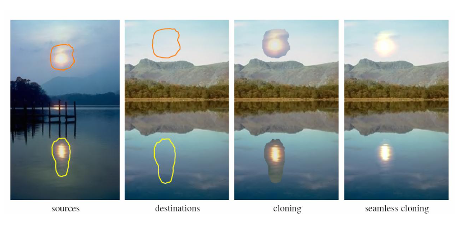

基于解泊松方程的通用插值技术，引入了各种新颖的工具，用于实现图像区域的无缝编辑。这些工具可以帮助实现图像的无缝融合、修复和增强，从而提高图像编辑的质量和效率。


我们给出记号如下：

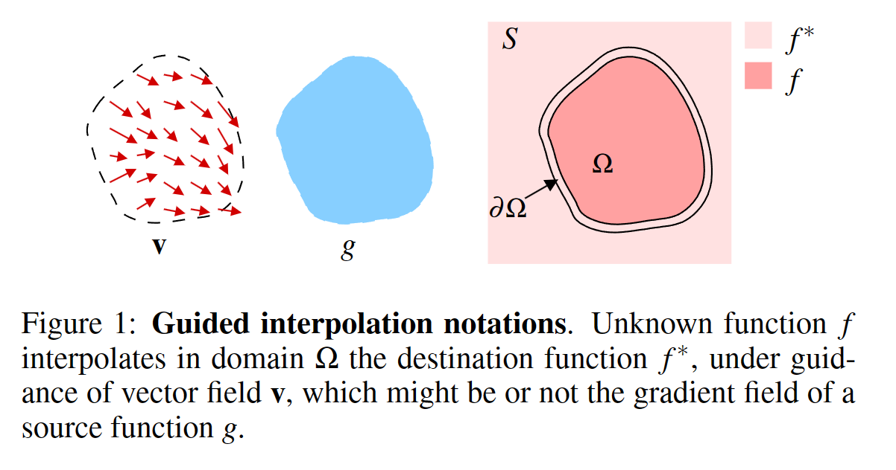

- $g$：参考图（川普的脸），已知
- $\mathbf{v}$：参考图 $g$ 的梯度向量场（川普脸上的纹理细节信息），已知
- $S$：背景图（红苹果），其二维标量场构成的函数为 $f^*$ 已知
- $\Omega$：目标区域（绿苹果），把川普的脸镶嵌到红苹果后的结果），其二维封闭标量场构成的函数为 $f$ 未知，是要求解的量
- $\partial\Omega$：目标区域的边界，已知

### 泊松方程

泊松图像编辑的核心思想是通过解决泊松方程来实现无缝融合。该技术广泛应用于图像修复、增强和合成等多个领域。

泊松方程通常表示为：

$$ \nabla^2 u = f $$

其中，$\nabla^2$ 表示拉普拉斯算子，$u$ 是待求解的标量场，$f$ 是已知的函数。在图像处理中，泊松方程的解决过程可以用于实现图像修复、无缝融合等操作，其中待求解的标量场 $u$ 通常表示图像中的像素值，而 $f$ 则表示图像中的梯度信息。

### 边界条件

**边界条件**（Boundary Conditions）在泊松方程求解中起着至关重要的作用，它们用于定义在给定边界上的待求解标量场的行为。在图像处理中，边界条件决定了图像修复或融合中边界区域的处理方式。

**Dirichlet边界条件**：指定函数在边界上的数值，即明确规定了函数在边界上的取值。在图像处理中，这意味着明确规定了图像边界上的像素值，通常用于图像修复中。

**Neumann边界条件**：指定函数在边界上的法向导数，即规定了函数在边界上的梯度信息。在图像处理中，这意味着规定了图像边界上的梯度信息，通常用于无缝图像融合中。

### 简单插值

先介绍一个简单插值（Simple Interpolation），它类似于橡皮擦的功能，是我们递进得到泊松融合的中间一步，可以帮助我们get到这个idea是怎么一步一步来的。

首先希望边界上保证一个约束，就是要 $f$ 与 $f^*$ 相同，这样就是保证可以解，因为如果只是梯度约束的话线性的可以有很多个解，然后边缘固定了，在青色区域的所有部分尽量平滑，就保证不会有前面的突变，所以整体上就可以有一个比较平滑的过渡

简单插值是一种基本的图像插值方法，用于在已知数据点之间估算新数据点的数值。可以最大化平滑性。

$$
\begin{cases}
\begin{aligned}\min_f\iint_\Omega\|\nabla f\|^2\\f|_{\partial\Omega}=f^*|_{\partial\Omega}\end{aligned}
\end{cases}
$$

方法为：Dirichlet边界条件下的拉普拉斯方程。

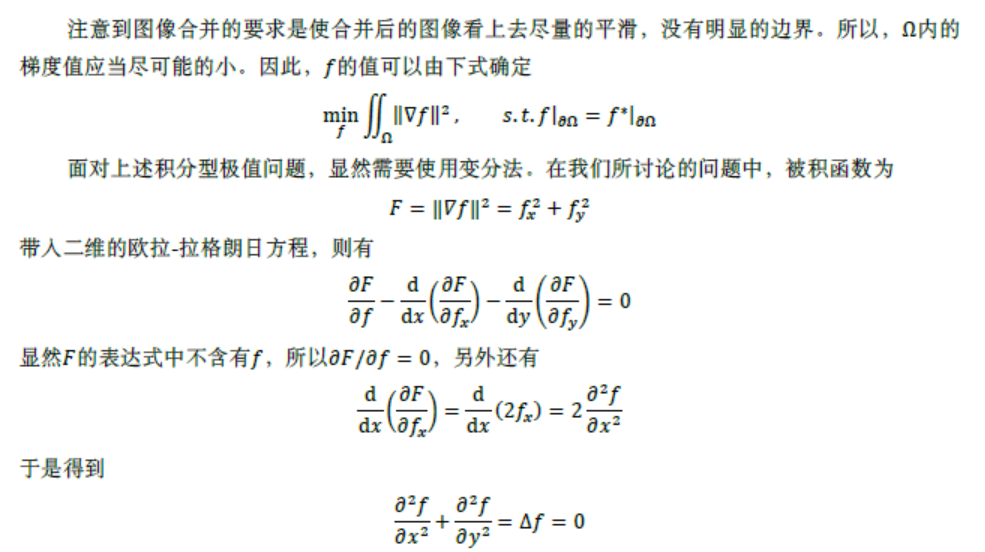

$$
\begin{cases}
\begin{aligned}\Delta f=&0\\f|_{\partial\Omega}=&f^*|_{\partial\Omega}\end{aligned}
\end{cases}
$$

这里的$\Delta = \nabla^2=\frac{\partial^2}{\partial x^2}+\frac{\partial^2}{\partial y^2}$ 是拉普拉斯算子。

### 导向插值

简单插值这样做，虽然解决了过渡的问题，但是因为是直接最小化梯度，相当于把 $S$ 上的 $\Omega$ 部分给去掉做一个简单的插值，和 $g$ 就没有关系了，所以现在我们用一个vector field来引导这个插值，使得 $g$上 的信息得以被保留，于是我们有了以下的导向插值、

导向插值是一种利用额外信息指导图像插值过程的技术。它通过引入向量场信息来提高图像放大或缩小的质量，尤其是在保持细节和边缘信息方面效果显著。

要把参考图的纹理复制到背景图上，则得到的结果和参考图在梯度上是尽可能接近的，即最小化下式

$$
\begin{cases}
\begin{aligned}\min_f\iint_\Omega\|\nabla f-\mathbf{v}\|^2\\f|_{\partial\Omega}=f^*|_{\partial\Omega}\end{aligned}
\end{cases}
$$

方法为：Dirichlet边界条件下的泊松方程。


$$
\begin{cases}
\begin{aligned}\nabla^2 f=& \nabla \cdot \mathbf{v}\\f|_{\partial\Omega}=&f^*|_{\partial\Omega}\end{aligned}
\end{cases}
$$

**应用于图像中——离散化**

在离散化的图像中，我们可以将泊松方程表示为：

$$
\min_{f|\Omega}\sum\limits_{\langle p,q\rangle\cap\boldsymbol{\Omega}\neq\boldsymbol{\emptyset}}(f_p-f_q-v_{pq})^2,\mathrm{~with~}f_p=f_p^*,\text{for all }p\in\partial\boldsymbol{\Omega}
$$

这里，$v_{pq}=\mathbf{v}(\frac{p+q}{2})\cdot\vec{v}_{pq}$

我们有

$$
\mathrm{for}\; \forall p\in\Omega,\quad|N_p|f_p-\sum\limits_{q\in\mathbb{N}_p\cap\Omega}f_q=\sum\limits_{q\in\mathbb{N}_p\cap\partial\Omega}f_q^*+\sum\limits_{q\in\mathbb{N}_p}v_{pq}
$$

这里 $ N_p$ 表示与像素点p相邻的四个像素的集合（上下左右）；整个式子就是 $|N_p|$个$f_p-f_q-v_{pq}=0$的方程。

当$p \in \partial \Omega$ 时，$|N_p|<4>$; 当 $p$ 为内部的点（$N_p \subset \Omega$），就没有右边 $f_q^*$ 的项.

$$
|N_p|f_p-\sum\limits_{q\in\mathbb{N}_p\cap\Omega}f_q=\sum\limits_{q\in\mathbb{N}_p}v_{pq}
$$

最终我们就变成了一个解线性方程组 $Af=b$ 的问题，其中 $A$ 就是所有像素点个数$\times$所有像素点个数的矩阵，边界就是属于那个位置的对角元素是1，内部点就是-4，然后相邻的就是1；$f$为待求解的像素值，$b$为右边的值。

该方程是带状稀疏（banded sparse）、对称（symmetric）、正定矩阵（positive-definite），可用高斯-塞德尔迭代法求解。

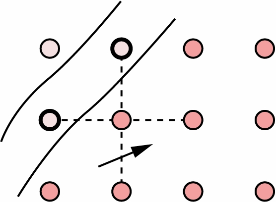

然而我不会举例子hhh.

### 应用

!!! note ""
    刚刚我想了好久 $v_{pq}$ 该怎么求，翻到下面才发现给出了公式，望周知。

#### 图像的无缝拼接 | Seamless Cloning

##### 导入梯度 | Gradient Import

源图像中的梯度场可以作为最基本的引导场 $\mathbf{v}$。

$$\mathbf{v}=\nabla g$$

此时有 $v_{pq}=g_p-g_q$。

导入梯度在 $\Omega$ 域内完全不考虑目标图像。


##### 混合梯度 | Mixed Gradient

混合梯度会将$f^*$与 $g$ 的特性组合起来。

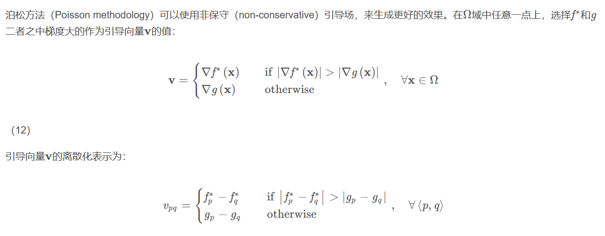

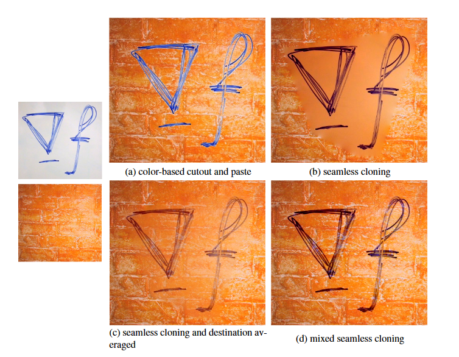

#### 选区编辑 | Selection Editing

无缝融合处理的问题是将源图像中的区域融合到目标图像中，引导场部分或完全取决于源图像 $g$ 的梯度。

选区编辑处理的问题是在单一图像上取出一块区域，对这个区域进行处理，使用完全依赖于原始图像的引导场来定义选区图像的变换。主要形式包括：纹理扁平化（Texture flattening）、局部明亮变化（Local illumination changes）、局部色彩变化（Local color changes）以及无缝拼接（seamless tiling）。

纹理扁平化和局部明亮变化是通过对原始梯度场 $\nabla f^{\ast}$  进行非线性修改实现；背景或前景色修改和无缝拼接是通过就地（in-place）无缝融合实现，原始图片经域内（提供新的源图像）或域外（提供新的边界值）修改后作为源。

##### 纹理扁平化 | Texture Flattening

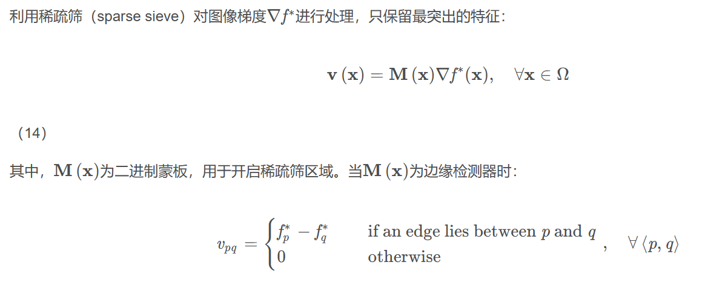

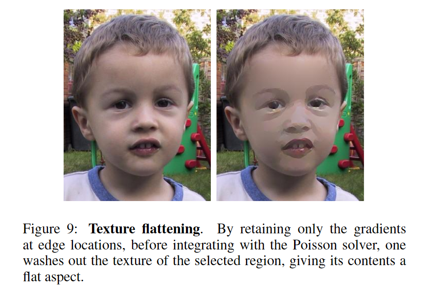

##### 局部明亮变化 | Local Illumination Changes

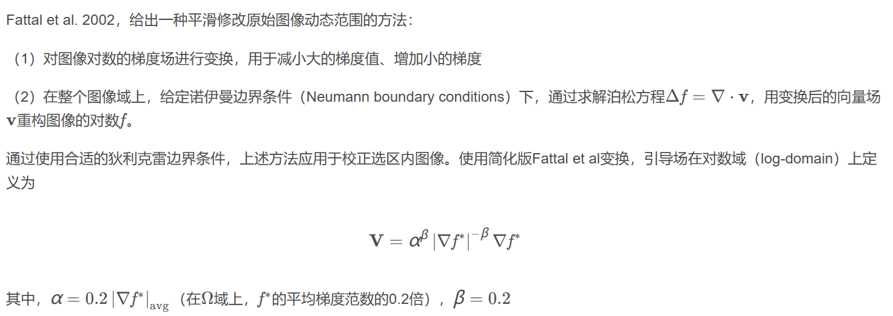


##### 局部色彩变化 | Local Color Changes

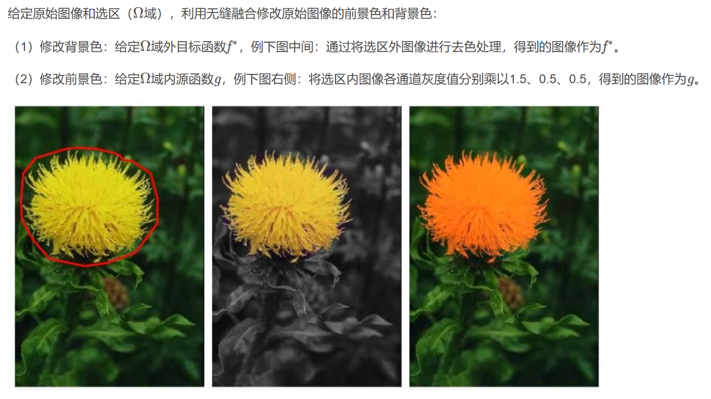

##### 无缝拼接 | Seamless Tiling


## 交互式数字蒙太奇 | Interactive Digital Montage

[论文：Interactive Digital Photomontage](https://grail.cs.washington.edu/projects/photomontage/)

交互式数字蒙太奇是一种结合了数字图像处理和人工干预的图像合成方法，它允许用户通过交互式的方式对图像进行合成。这种方法通常包括用户交互式地选择和调整图像元素，并在图像合成过程中实时预览效果，以便用户能够直观地调整合成效果。

交互式数字蒙太奇在之前介绍的泊松融合上进了一步，引入了graph cut，使得用户可以更加方便地进行交互（之前的融合区域需要自己选定，但是现在只需要用brush大致刷一下，然后graph cut会自己去计算这个边缘）

利用**graph-cut**本身就可以实现一个融合的效果，因为去优化的时候也是要求平滑的，但是这样拼接之后毕竟不是相同的照片，拼接处总会有seam存在，所以再做一次**gradient-domain fusion**，就可以效果比较好

整个操作流程分为两步

1. 首先是用户使用笔刷在图像上操作，然后由graph cut决定分割区域
2. 然后就是在梯度域上做融合

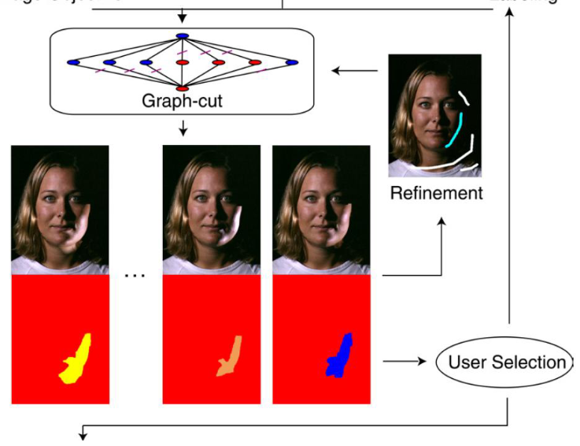

因为这个具体的分割是自动进行的，所以就可以brush多张照片，然后graph cut会在多张照片中选定边缘，最后混在一起


### 图割 | Graph Cut

Graph Cut（图形切割）应用于计算机视觉领域用来有效的解决各种低级计算机视觉问题，例如图像平滑（image smoothing）、立体应对问题（stereo correspondence problem）、图像分割（image segmentation）等等。此类方法把图像分割问题与图的最小割（min cut）问题相关联，在计算机视觉的很多类似的问题中，最小能量（minimum energy）方案对应解决方案的最大后验估计（maximum posterior estimate）。

#### 最小割

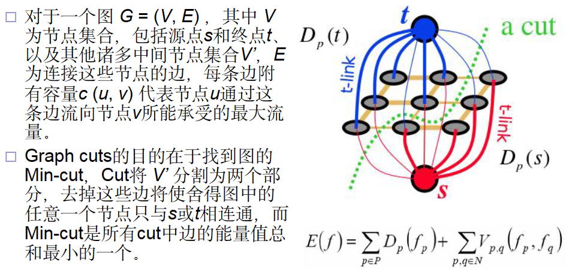

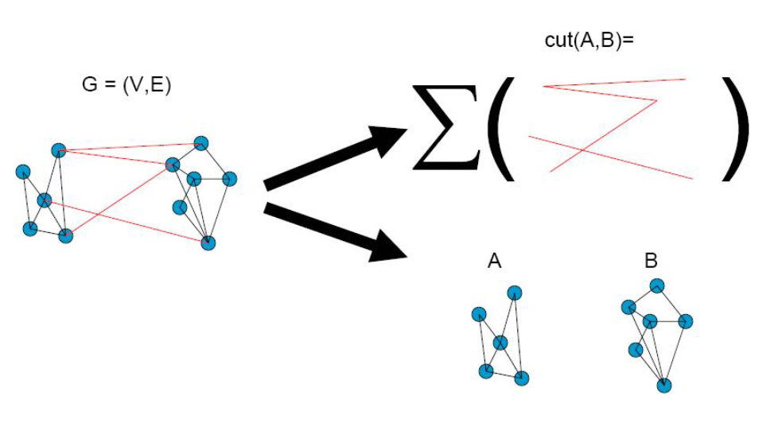

在图论中，图的最小切割是其在某种意义上是最小的切割（图形的顶点划分为由至少一个边连接的两个不相交的子集）。图的最小割可以分很多情况进行讨论，例如有向图、无向图，边的权重等。下图是一张无向无权重图和它的两个割，红色的线格割掉了三条边，而绿色的线割掉了两条边，很明显绿色的线为该图的最小割

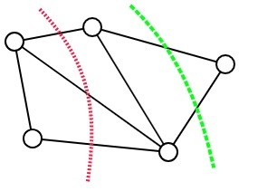

如下图所示，是一个有向带权图，共有4个顶点和5条边。每条边上的箭头代表了边的方向，每条边上的数字代表了边的权重。

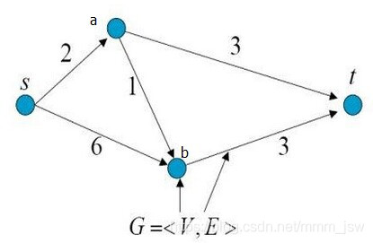

现在要求剪短图中的某几条边，使得不存在从s到t的路径，并且保证所减的边的权重和最小。相信大家能很快想到解答：剪掉边”s -> a”和边”b -> t”。图中已经不存在从源点到终点的路径，所割掉的边的权重值之和为5，是所有的切割方式中权重值最小的，像这样的切割方法我们将其称之为最小割。

数学上cut这个术语，就表示这两部分的差距：

$$ cut(A,B)=\sum\limits_{u\in A,v\in B}w(u,v) $$

Graph cuts的目的在于找到图的 Min-cut，Cut将 $V'$ 分割为两个部分（ $s,t$ 在两边，称为 s-t cut），去掉这些边将使得图中的任意一个节点只与源点 $s$ 或终点 $t$ 相连通，而 Min-cut 是所有s-t cut中边的能量值总和最小的一个；Min-cut 存在需要满足以下条件：

- A source node and a sink node
- Directed edge $\vec{<i,j>}$ from node $i$to $j$
- Each Directed edge $\vec{<i,j>}$ has non-negative capacity $c(i,j)$
- $c(i,j)=0$ for non-exists edges

!!! note "最小割和最大流"

    ##### 最大流

    如图所示，假如顶点 $s$ 源源不断有水流出，边的权重代表该边允许通过的最大水流量，顶点 $t$ 流入的水流量最大是多少？

    

    我们可以从顶点s到顶点t的3条路径着手分析，从源点s到终点t共有3条路径：
    s -> a -> t：流量被边”s -> a”限制，最大流量为2
    s -> b -> t：流量被边”b -> t”限制，最大流量为3
    s -> a -> b-> t：边”s -> a”的流量已经被其他路径占满，没有流量
    所以，顶点t能够流入的最大水流量为：2 + 3 = 5。
    这就是最大流问题。所以，图的最大流为：2 + 3 = 5。

    ##### 最小割和最大流的关系

    !!! note "最大流和最小割的关系是什么？"
        1. 最大流不可能大于最小割，因为最大流所有的水流都一定经过最小割那些割边，流过的水流怎么可能比水管容量还大呢？
        2. 最大流不可能小于最小割，如果小，那么说明水管容量没有物尽其用，可以继续加大水流。
        由此可见，最大流和最小割的其实都是在求解同一个问题。

然后我们再定义Flow，Flow是一个函数，对于每条边 $\vec{<i,j>}$ ，有 $f(i,j)=x,x\in\mathbb{R}$ ，那它显然就满足两个条件：

- capacity constraint：（容量约束）： $f(i,j)<c(i,j)$
- mass balance constraint：（除源点 s 和终点 t 外，流进去的等于流出去的）： $\sum\limits_{<i,j>\in E}f(i,j)-\sum\limits_{<k,i>\in E}f(k,i)= \begin{cases} 0&i\in V-\{s,t\}\\ |f|&i=s\\ -|f|&i=t \end{cases}$

现在，我们对于任意的一刀下来的s-t cut，就可以定义它的 capacity 和 flow （主要下面的边限制，必须是从S区域跨到T区域的边）——这里定义的就是净流量：

$$
\begin{cases}
cap([S,T])=&\sum\limits_{<\vec{i,j}>\in E,i\in S,j\in T}cap(i,j)\\\\f([S,T])=&\sum\limits_{<\vec{i,j}>\in E,i\in S,j\in T}f(i,j)-\sum\limits_{<\vec{j,i}>\in E,i\in S,j\in T}f(j,i)
\end{cases}
$$

基础部分就完啦，接下来可以去了解很多具体的算法[最大流 - OI Wiki]([oi-wiki.org](https://oi-wiki.org/graph/flow/max-flow/#ford-fulkerson-%E5%A2%9E%E5%B9%BF%E8%B7%AF%E7%AE%97%E6%B3%95))。不过在这里不是重点，上面我们只是能解决一个二分的问题，下面我们就对它进一步扩展，给出更general的一个形式：

#### 像素标记问题 | Pixel labeling problem

[论文](https://ieeexplore.ieee.org/stamp/stamp.jsp?tp=&arnumber=969114)

此部分老师截图疑似来源：[https://www.cs.ucf.edu/courses/cap6411/cap6411/spring2006/Lecture11.pdf](https://www.cs.ucf.edu/courses/cap6411/cap6411/spring2006/Lecture11.pdf)（需科技）

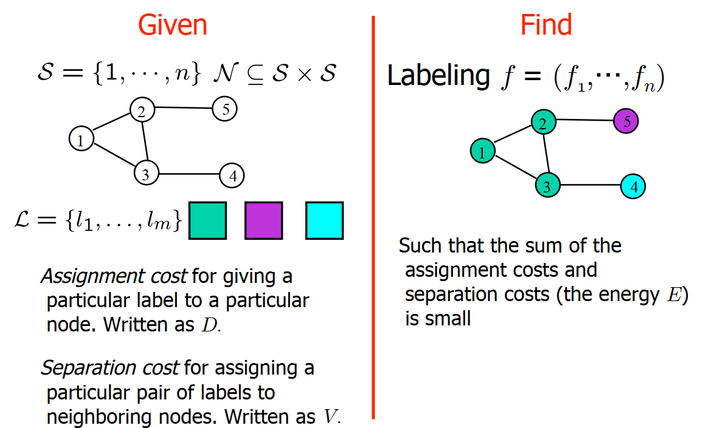

给定一个图（包括一系列点 $S=\{1,...,n\}$ 和相应的连接关系 $N\subset S\times S$ ）和一系列标签 $L=\{l_1,...,l_m\}$ ，以及下面两个cost

- Assignment cost 将一个label赋给一个点的cost，记作$D$
- Separation cost 将一对label赋给一对点的cost，记作$V$

这里的Assignment cost对应数据本身，Separation cost是希望分割尽可能平滑（V怎么定义要根据具体的问题，比如label相同是0，label不同...(这篇论文[What Energy Functions Can Be Minimized via Graph Cuts?](https://ieeexplore.ieee.org/stamp/stamp.jsp?tp=&arnumber=1262177)似乎讲的就是这个)）

最终每个点上都有一个labeling的结果，我们希望最小化这个cost

$$  
E(f)=\sum\limits_{p\in P}D_p(f_p)+\sum\limits_{p,q\in N}V_{p,q}(f_p,f_q)
$$

这里 $P$ 就是全体像素，$N$ 是全体像素对。$D_p(f_p)$是图像的数据项，$\sum\limits_{p,q\in N}V_{p,q}(f_p,f_q)$ 是平滑项

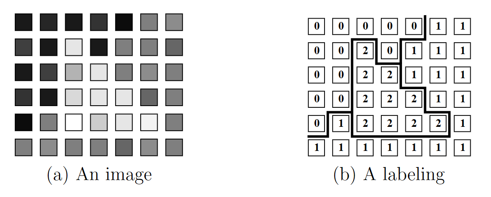

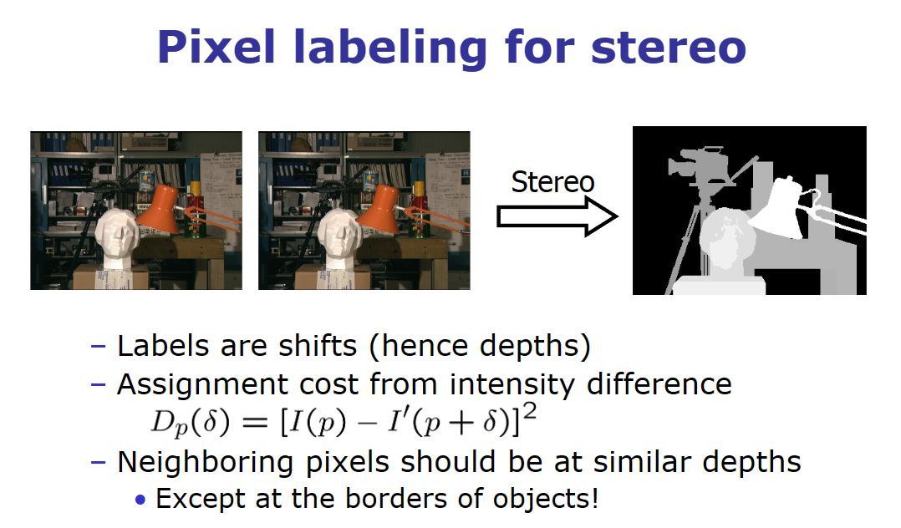

#### 图割的意义

图割算法提供了以下几个方面的功能：

1. 对于不太复杂的情况，可以提供全局最小值的多项式算法，用于找到全局最优解。
2. 对于特别复杂（NP难）的情况，提供了近似算法，用于找到接近全局最优解的解决方案。
3. 对于许多选择的情况，可以找到“强”局部最小值，同时具有非常强大的实验结果支持

### 多标签图割 | Multi-Label Graph-Cuts

多标签图割（Multi-label Graph Cut）是图割算法的一个扩展，它应对的就是我们刚刚说的像素标记问题问题，即不只是将像素分为前景和背景两类，而是可以分成多个类别。

在多标签图割中，每个节点（通常对应图像中的一个像素）可以被分配到不同的标签（而非仅仅是源点或汇点），标签之间可能存在有序关系，每个标签有自己的数据成本，并存在标签之间的光滑性成本等例如颜色连续性的限制。

$\alpha-\beta$ Swap以及 $\alpha$ - expansion都是一种求解多标签图割问题的方法。

$\alpha-\beta$ Swap 这个要求满足半度量（Semi-metric）：$V(\alpha,\beta)=V(\beta,\alpha)\geq0$，并且满足对称性和非负性，即$V(\alpha,\beta)=0\Leftrightarrow \alpha=\beta$。

$\alpha$ - expansion 这个在前面的基础上增加了三角不等式的要求：$V(\alpha,\beta)\leq V(\alpha,\gamma)+V(\gamma,\beta)$。

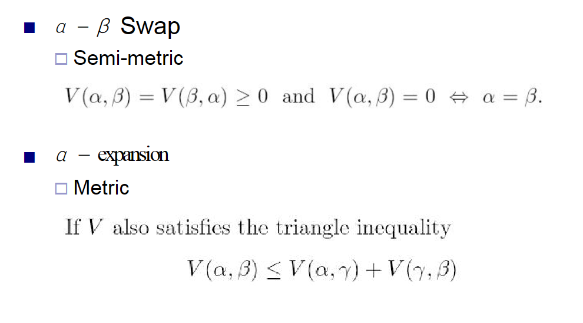

!!! note "a-β Swap"

    这种方法主要是用来解决当能量函数上存在多个最小值时的局部最小值问题。在每个迭代过程中，该算法首选选定两个标签a和β，然后考虑所有的像素i，尝试将i的标签从a换到β，或者从β换到a，然后找出所有使能量值E减少的标签变化，应用图割算法找出最小割，最后将所有在最小割中从a变为β的像素标签进行更新。这个过程会重复交换所有可能的标签对，直到能量不再减小。

    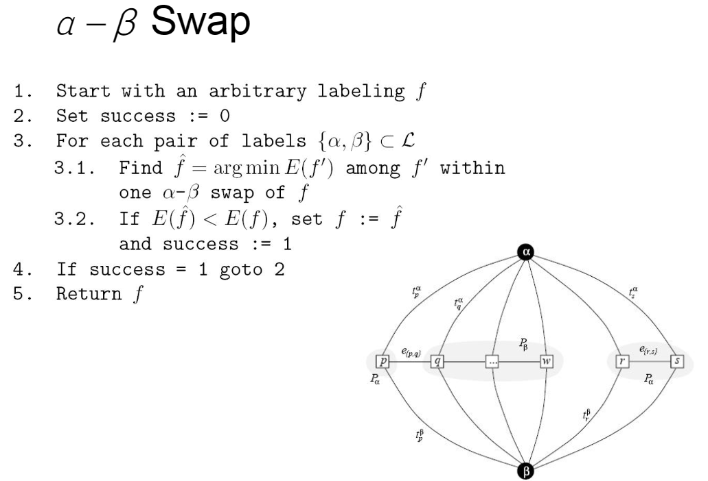

!!! note "a-expansion: "

    这种方法对于每次迭代，只考虑将像素的标签从其当前标签变为另一个特定的标签a。这种方法对于每个像素i都尝试将其标签换到a，然后找出所有使得能量函数值E减少的标签变化，并应用图割算法找出最小割。最后，将所有在最小割中的像素标签更新到a。这个过程会对所有可能的标签重复进行直到能量不再减小。

    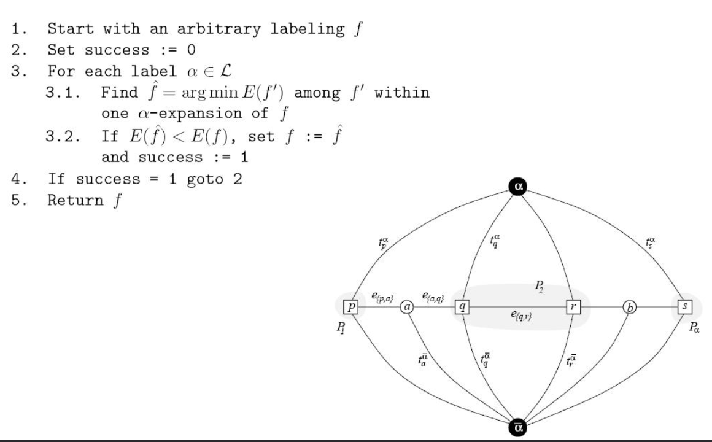

和之前一样的，这里的cost function也是定义成一个数据项（data penalty）和一个平滑项（interaction penalty）

#### Data Penalty

在被brush的地方，相当于我们已经给了某些像素一个label，所以对于指定的label cost就为0，否则就设很大

$$
C_d(p,L(p))= \begin{cases} 0&L(p)=u\\ large\ penalty&otherwise \end{cases}
$$

这一项相当于写入用户的输入信息，下面剩下的大块区域，我们通过优化来完成

#### Interaction Penalty

$$
C_i(p,q,L(p),L(q))= \begin{cases} X&\mathrm{if\ matching\ colors} \\ Y&\mathrm{if\ matching\ gradients} \\ X+Y&\mathrm{if\ matching\ colors\&gradients} \\ X/Z&\mathrm{if\ matching\ colors\&edges} \end{cases}
$$

其中，

$$
\begin{aligned}
X=&||S_{L(p)}(p)-S_{L(q)}(p)||+||S_{L(p)}(q)-S_{L(q)}(q)||\\
Y=&||\nabla S_{L(p)}(p)-\nabla S_{L(q)}(p)||+||\nabla S_{L(p)}(q)-\nabla S_{L(q)}(q)||\\
Z=&E_{L(q)}(p,q)+E_{L(q)}(p,q)
\end{aligned}
$$

X就是p label成L(p)和L(q)的color difference加上q label成L(p)和L(q)的color difference的和（就是输入图像有很多张， $S_{L(p)}$ 就确定了用那张图像）；Y就是用来梯度的信息，Z还考虑了边缘，就是用Sobel算子如果中间有边缘的话Z就可以小一些

现在目标函数定义好了，我们就可以用Graph-Cut的方法去解

$$
C(L)=\sum_pC_d(p,L(p))+\sum_{p,q}C_i(p,q,L(p),L(q))
$$

#### Gradient-domain fusion

现在我们第一步做好了，得到一个函数$f$对于每个像素点都有一个label（从对应图像去拿像素值），然后我们继续做梯度域的融合（和泊松融合相似）来消除缝隙（seam），在边界上要求保梯度，但是颜色尽可能相同

$$
\begin{cases}
v_{x+1,y}-v_{x,y}=&\nabla I_x(x,y)\\
v_{x,y+1}-v_{x,y}=&\nabla I_y(x,y)
\end{cases}
$$

然后会剩下右下的一圈的边界条件，这里就是constrain，因为用到的都是一个值所以只要用增加一个维度就可以了，把它设置成一个合理的值（比如某个像素点的灰度值），这样重新解算出来的就seamless了

#### 应用

##### 扩展景深


##### Relighting


##### Stroboscopic visualization of movement


##### Selective composites


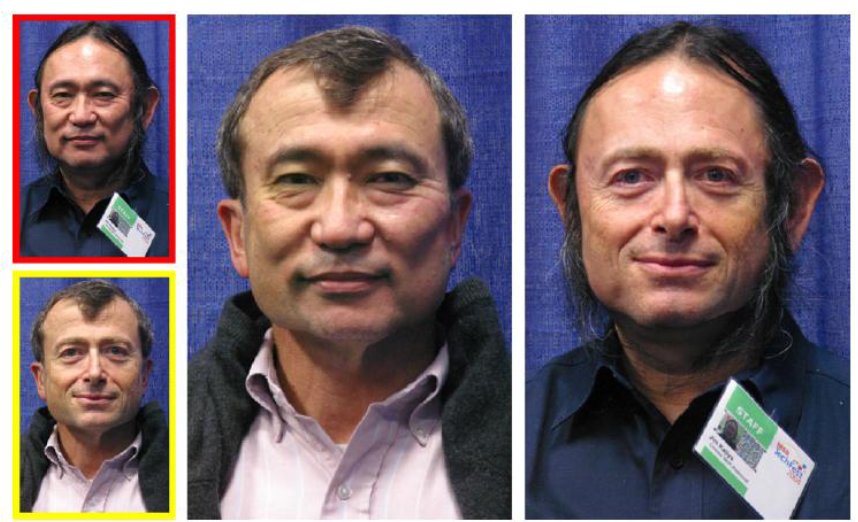

##### Time-lapse mosaics


##### Clean-plate production

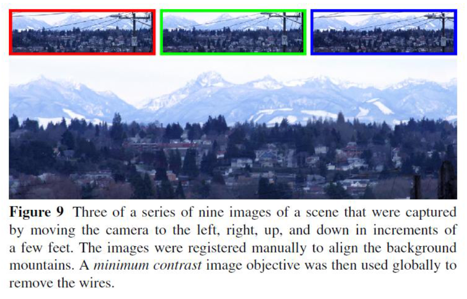

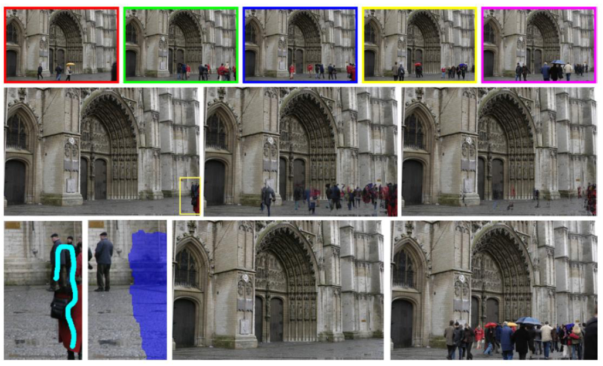