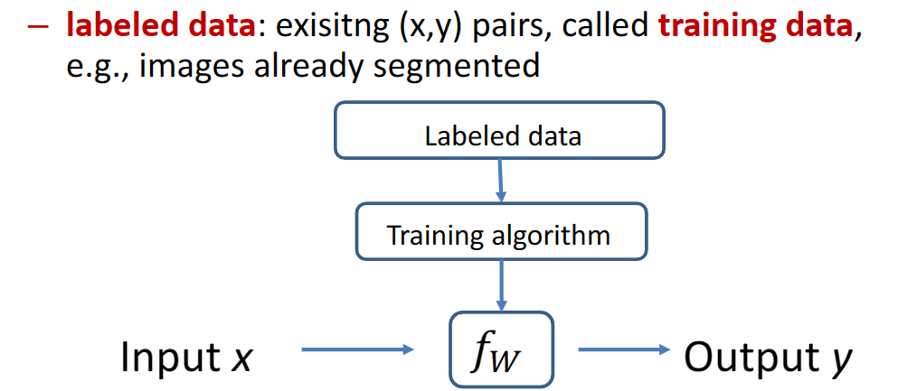
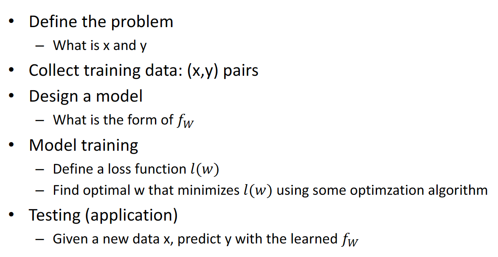
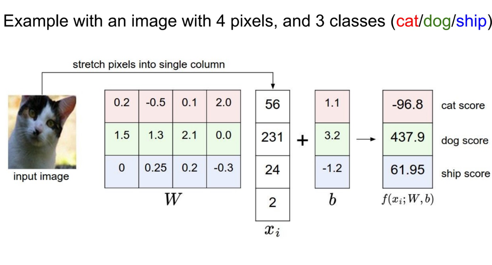
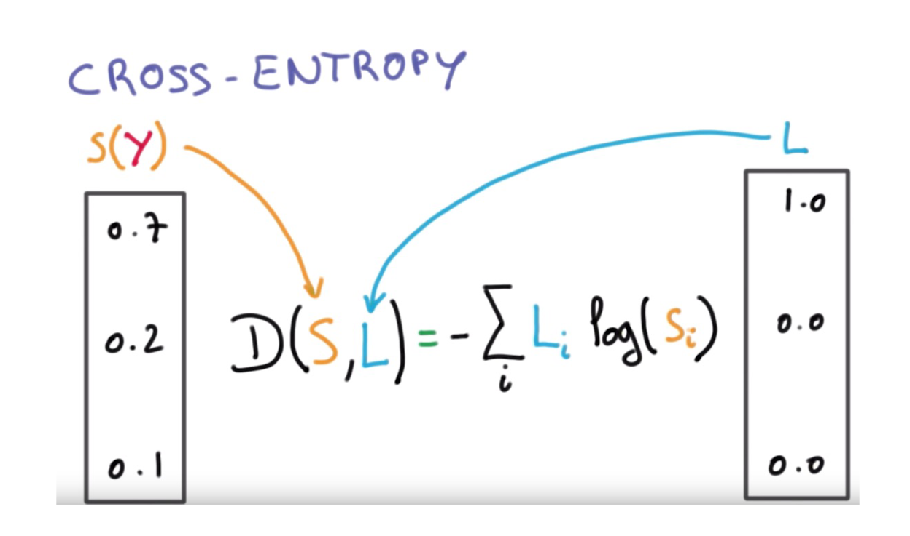
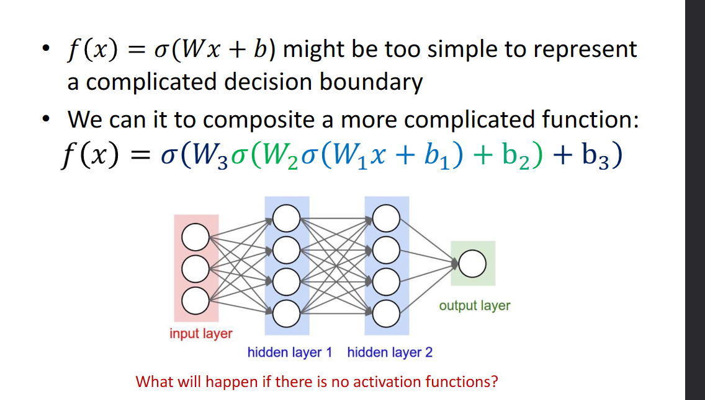

# Lec06 深度学习

!!! note ""
    周晓巍老师过来上的第一门课

!!! note "课程大纲"
    - Machine learning
    - Linear classifier
    - Neural networks
    - Convolutional neural networks
    - Training neural networks
    - Network architectures

## Machine learning

传统编程 | Traditional programming

机器学习 | Machine learning

## Important concepts

### 模型 | Model

用于描述输入x和输出y之间关系的数学模型。

```mermaid
graph LR
    A[输入x] --> B[模型]
    B --> C[输出y]
```

问题分类：

- 回归（Regression）：输出 $y$ 是连续的。
- 分类（Classification）：输出 $y$ 是离散的。

### 监督学习 | Supervised learning

从有标签的数据中学习模型。

- **Training**: given labeled data, find $f_W$ (**model fitting**)
- **Testing**: given $f_W$ and a new $x$, find $y$ (also called **inference**)

## 总流程 | General pipeline

## Image classification

An Image classifier is hard to define

- Unlike e.g. sorting a list of numbers
- No obvious way to hard-code the algorithm for recognizing a cat or other classes

分类是基于数据驱动的方法。

1. **收集数据集**：首先，你需要一个包含图像和对应标签的数据集。图像是我们的输入，标签描述了我们想从图像中获取的信息。例如，在一个狗的品种分类任务中，图像将是狗的图像，标签将是狗的品种。
2. **使用机器学习训练分类器**：这个步骤涉及到选择一个机器学习模型（例如：决策树、神经网络或支持向量机等）并使用我们的数据集来训练它。模型将学习识别输入图像的特性，并学习如何将它们与特定的标签相关联。
3. **在新图像上评估分类器**：在这个阶段，我们在训练完模型后，使用一些模型未见过的图像（测试集）来评估模型的性能。这通常涉及到计算一些评价指标，如精度（accuracy）、召回率（recall）或F1值等。

矩阵内积什么时候最大？很像的时候，所以这个就是找和每一列最相近的，输出为分类结果。

为什么不能用最小二乘：因为最小二乘是用来求解连续值的，而分类问题是离散值。这可能导致penalty太大，导致过拟合。

所以我们将其转化为一个最大似然估计问题，即找到一个最大的概率，使得这个概率最大。

怎么优化？梯度下降。

没有 $\sigma$的话，就是线性分类器。