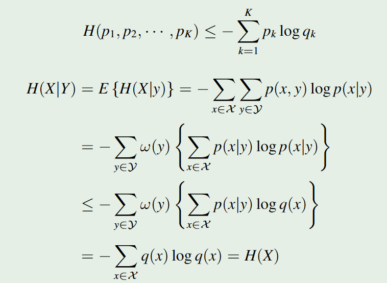
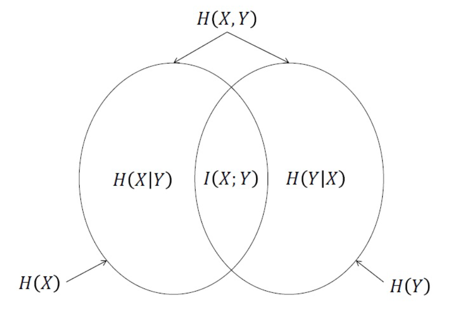
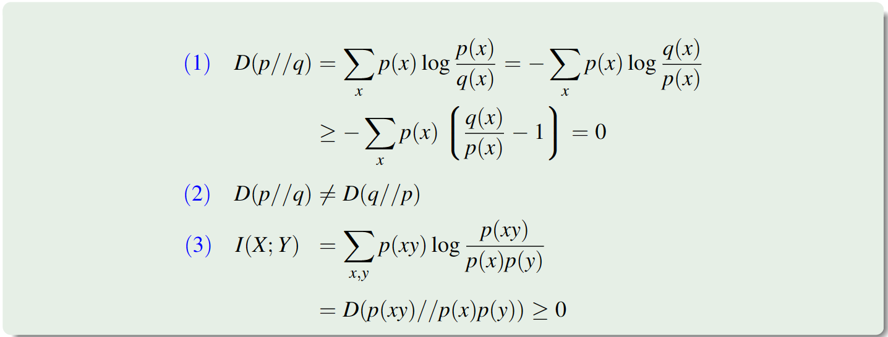
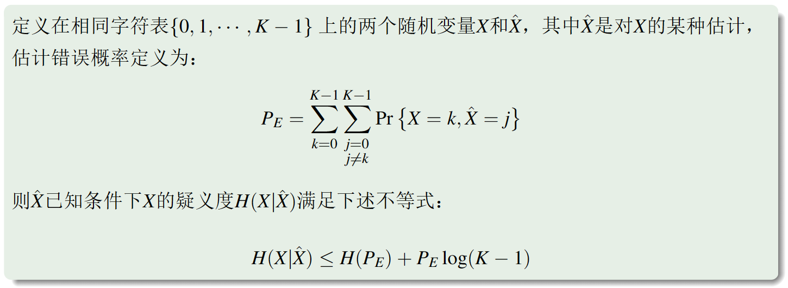
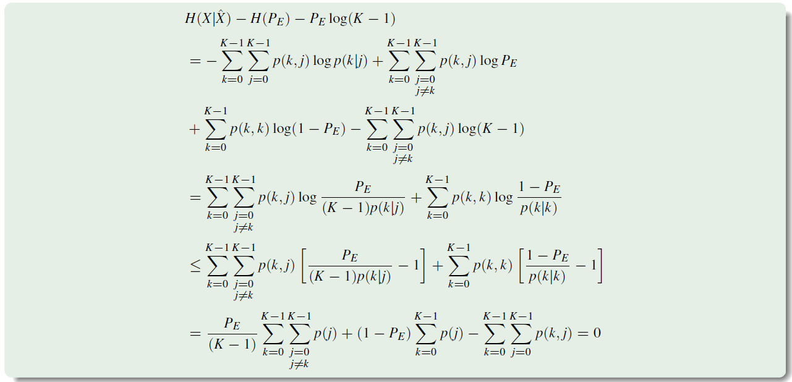
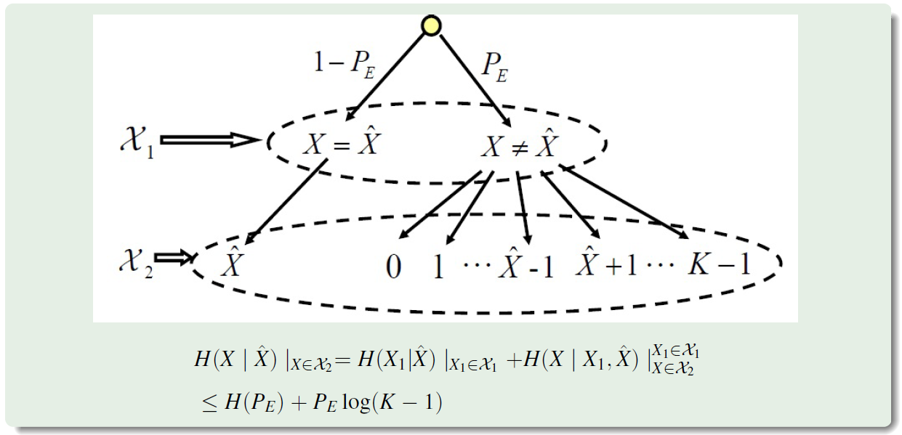
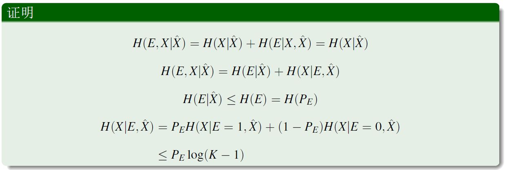
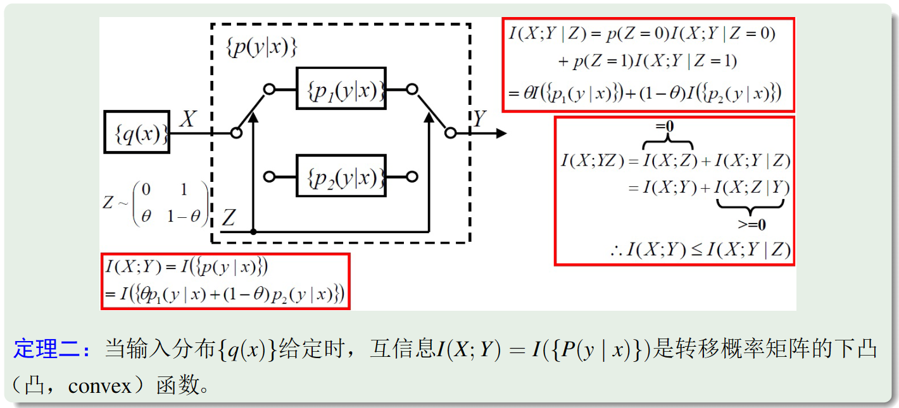

# 第一讲：随机变量的熵和互信息

!!! note ""

    - 掌握随机事件的自信息，互信息的概念及物理意义
    - 了解条件事件的互信息与联合事件的互信息
    - 掌握随机变量的熵的概念以及物理意义
    - 了解随机变量的条件熵和联合熵及其性质
    - 掌握随机变量互信息定义以及互信息的性质

## 概率论基础

!!! note "随机变量的概率空间"

    随机变量的概率空间可以表示为 $\{X,\mathcal{X},q(X)\}$，其中 $X$ 为随机变量，$\mathcal{X} = \{x_k;k=1,2,\cdots,K\}$ 为 $X$ 的取值空间，$q(x)$ 为事件 $\{X=x\}$ 的概率。显然我们有：

    $$
    q(x)>0,\quad \sum_{x\in\mathcal{X}}q(x)=1
    $$

!!! note "联合变量对 $(X,Y)$"

    二维随机变量 $\{X,Y\}$ 的联合概率空间可以表示为 $\{(X,Y),\mathcal{X}\times\mathcal{Y},p(x,y)\}$，其中 $p(x,y)$ 为事件 $\{X=x,Y=y\}$ 的概率。我们有：

    $$
    \begin{aligned}
    &p(x,y)=P\{X=x,Y=y\},\mathcal{X}=\{x_k;k=1,2,\cdots,K\},\mathcal{Y}=\{y_j;j=1,2,\cdots,J\}\\
    &\sum_k p(x_k,y_j)=\omega(y_j),\quad \sum_j p(x_k,y_j)=q(x_k)
    \end{aligned}
    $$

!!! note "条件概率"

    $$p(x|y)=\frac{p(x,y)}{\omega(y)},\quad p(y|x)=\frac{p(x,y)}{q(x)}$$

## 自信息

!!! note ""
    自信息：事件发生后提供的信息量。

**信息量**是信息论的重要概念，事件的**信息量**基于该事件发生的**概率**：

$$I(x_k)=-\log_aq(x_k)$$

!!! note ""

    当 $a=2$ 时，信息量的单位是比特（bit）；当 $a=e$ 时，信息量的单位是纳特（nat）。

定义为概率的负对数的优点：

- 符合**概率越小，信息量越大**的要求
- 对数函数是比较简单的函数，**容易进行数学处理**，
- **对数函数的可加性**符合生活中关于**信息可叠加性**的经验

!!! note "事件自信息的本质"

    1. 事件发生后对外界(观察者)所提供的信息量。
    2. 事件发生前外界(观察者)为确证该事件的发生所需要的信息量，也是外界为确证该事件所需要付出的代价。
    3. 事件的自信息并不代表事件的不确定性，事件本身没有不确定性可言，它要么是观察的假设和前提，要么是观察的结果。

概率越小的事件，其自信息越大，概率为1的事件，其自信息为0。

### 条件自信息

对于二维随机变量 $\{(X,Y),\mathcal{X}\times\mathcal{Y},p(x,y)\}$，事件 $Y=y_j$ 发生后，事件 $X=x_k$ 的条件自信息为：

$$I(x_k|y_j)=-\log p(x_k|y_j)$$

!!! note "事件条件自信息的本质"

    1. 事件 $Y=y_j$ 发生后，事件 $X=x_k$ 再发生需要新的信息量。
    2. 事件 $Y=y_j$ 发生后，事件 $X=x_k$ 再发生提供给观察者的信息量。

### 联合自信息

对于二维随机变量 $\{(X,Y),\mathcal{X}\times\mathcal{Y},p(x,y)\}$，事件 $(X,Y)=(x_k,y_j)$ 的联合自信息为：

$$I(x_k,y_j)=-\log p(x_k,y_j)$$

## 互信息

!!! note ""
    互信息：相互之间提供的信息量。

**互信息**是衡量两个随机变量之间的相关性的重要指标，定义为：

$$I(x_k;y_j)=I(x_k)-I(x_k|y_j)=\log\frac{p(x_k,y_j)}{q(x_k)\omega(y_j)}$$

显然可以看出，互信息有对称性 $I(x_k;y_j)=I(y_j;x_k)$

!!! note "互信息的本质"

    1. 事件 $Y=y_j$ 发生后对事件 $X=x_k$ 不确定性的减少量。
        $I(x_k)$ 表示事件 $X=x_k$ 发生前的不确定性，$I(x_k|y_j)$ 表示事件 $Y=y_j$ 发生后事件 $X=x_k$ 的不确定性。
        
        比如说 $I(x_k)=2$，$I(x_k|y_j)=1$，那么 $I(x_k,y_j)=1$，表示事件 $Y=y_j$ 发生后事件 $X=x_k$ 的不确定性减少了1。

        比如说 $I(x_k)=2$，$I(x_k|y_j)=3$，那么 $I(x_k,y_j)=-1$，表示事件 $Y=y_j$ 发生后事件 $X=x_k$ 的不确定性增加了1。

### 条件互信息

在给定事件 $Z=z$ 的条件下，事件 $X=x$ 和事件 $Y=y$ 的条件互信息为：

$$I((x;y)|z)=I(x|z)-I(x|(y,z))=\log \frac{p(x|(y,z))}{q(x|z)}=\log\frac{p(x,y|z)}{q(x|z)\omega(y|z)}$$

!!! note ""
    这里的 $I(x;y|z)$ 表示 $I(x;y)$ 在给定 $Z=z$ 的条件下的值。

    直接从原先的推导结果出发，因为$I(x;y)=\log\frac{p(x,y)}{q(x)\omega(y)}$，所以：

    $$
    I(x;y|z)=\log\frac{p(x,y|z)}{q(x|z)\omega(y|z)}
    $$

表示在给定事件 $Z=z$ 的条件下，事件 $X=x$ 和事件 $Y=y$ 相互之间提供的信息量。

### 联合互信息

联合事件 $\{Y=y,Z=z\}$ 与事件 $\{X=x\}$ 之间的互信息为:

$$I(x;(y,z))=\log\frac{p(x|y,z)}{q(x)}=\log\frac{p(x,y,z)}{q(x)\omega(y,z)}$$

表示事件 $Y=y$ 和事件 $Z=z$ 联合发生后对事件 $X=x$ "不确定性的减少量 / 提供的信息量"。

#### 链式法则

$$I(x;(y,z))=I(x;y)+I(x;z|y)$$

事件 $Y=y$ 和事件 $Z=z$ 联合发生后对事件 $X=x$ 的信息量等于事件 $Y=y$ 发生后对事件 $X=x$ 的信息量加上事件 $Z=z$ 发生后对事件 $X=x$ 的信息量。

## 熵

!!! note ""
    熵：随机变量的不确定性。

**熵**是衡量随机变量不确定性的重要指标，定义为随机变量各个事件的平均自信息：

$$H(X)=E[I(X)]=\sum_{x\in\mathcal{X}}q(x)I(x)=-\sum_{x\in\mathcal{X}}q(x)\log q(x)$$

!!! note "**熵**与**自信息**的区别"

     - **自信息**是对单个事件的信息量的度量，是对某个事件发生后提供的信息量的度量。
     - **熵**是对随机变量的不确定性的度量，是对随机变量各个事件的平均信息量的度量。

!!! note "例子"
    二元随机变量 $X$ 的概率分布 $q(x_1)=p,q(x_2)=1-p$，则 $X$ 的熵为：

    $$
    H(X)=-p\log p-(1-p)\log(1-p)
    $$

    当 $p=0.5$ 时，$H(X)=1$，表示 $X$ 的不确定性最大；当 $p=0$ 或 $p=1$ 时，$H(X)=0$，表示 $X$ 的不确定性最小。

### 条件熵

#### 给定事件

在给定事件 $Y=y$ 的条件下，事件 $X$ 的条件熵为：

$$H(X|Y=y)=-\sum_{x\in\mathcal{X}}p(x|y)\log p(x|y)$$

$H(X|y)$ 不一定比 $H(X)$ 小，可能随着 $y$ 的引入，系统更加混乱。

#### 随机变量

在随机变量 $Y$ 的条件下，随机变量 $X$ 的条件熵为 $H(X|y)$ 对 $y$ 的平均：

$$
    \begin{aligned}
    H(X,Y)&=E[H(X|y)]\\
    &=-\sum_{y\in\mathcal{Y}}\omega(y)\sum_{x\in\mathcal{X}}p(x|y)\log p(x|y)\\
    &=-\sum_{y\in\mathcal{Y}}\sum_{x\in\mathcal{X}}p(x,y)\log p(x|y)
    \end{aligned}
$$

当 $X$ 和 $Y$ 统计独立时，$H(X|Y)=H(X)$。

### 联合熵

对于二维随机变量 $\{(X,Y),\mathcal{X}\times\mathcal{Y},p(x,y)\}$，事件 $(X,Y)$ 的联合熵为：

$$H(X,Y)=-\sum_{x\in\mathcal{X}}\sum_{y\in\mathcal{Y}}p(x,y)\log p(x,y)$$

表示随机变量 $X$ 和 $Y$ 联合发生后的不确定性。

#### 链式法则

$$H(X,Y)=H(X)+H(Y|X)=H(Y)+H(X|Y)$$

随机变量 $X$ 和 $Y$ 联合发生后的不确定性等于随机变量 $X$ 的不确定性加上在给定 $X$ 的条件下随机变量 $Y$ 的不确定性。

当 $X$ 和 $Y$ 统计独立时，$H(X,Y)=H(X)+H(Y)$。

三元：

$$H(X,Y,Z)=H(X)+H(Y|X)+H(Z|X,Y)$$

### 熵的性质

对于随机变量 $X$ ，如果

$$\mathbb{X}=\begin{pmatrix}x_1&x_2&\cdots&x_K\\p_1&p_2&\cdots&p_K\end{pmatrix}$$

则有：

$$H(X)\triangleq H_K({p_1,p_2,\cdots,p_K})\triangleq H_K(P)=-\sum_{k=1}^Kp_k\log p_k$$

1. $H_K(P)$ 对概率矢量 $P$ 的分量是**对称的**，即 $H_K(P)$ 对 $p_1,p_2,\cdots,p_K$ 的排列是不变的——$p_1,p_2,\cdots,p_K$ 的排列不同，$H_K(P)$ 的值不变。
2. **非负性**：$H(X)\geq 0$
3. **确定性**：$H(X)=0$ 当且仅当 $X$ 是**确定性**的随机变量，即 $X$ 的取值只有一个。
4. **可扩展性**：$\lim_{\epsilon\to 0}H_{K+1}(P_1,P_2,\cdots,P_K-\epsilon,\epsilon)=H_K(P_1,P_2,\cdots,P_K)$ —— 维度扩展！
5. **可加性**：$H(X_2)=H(X_1)+H(X_2|X_1)$
   

    熵的可加性一般表达式：

    $$
    \begin{aligned}
    &H_M(p_1q_{11},p_1q_{21},\cdots,p_1q_{m1},p_2q_{12},\cdots,p_2q_{m2},\cdots,p_nq_{mn})\\
    =&H_N(p_1,p_2,\cdots,p_n)+\sum_{i=1}^n p_iH_M(q_1,q_2,\cdots,q_m)
    \end{aligned}
    $$

    对变量 $X$ 可以进行多步分层的观察，每一步都可从上一步的观察结果中得到更为细致的结果，变量 $X$ 在最后的观察结果集合中的不确定性等于第一次观察结果的不确定性，加上其后每次观察结果在前一次观察结果已知的前提下的条件不确定性。

6. **极值性**：$H(X)\leq \log K$，当且仅当 $X$ 是**均匀分布**时取等号。
7. **条件熵小于等于熵**：$H(X|Y)\leq H(X)$——增加条件，减少不确定性。当且仅当 $X$ 和 $Y$ 独立时取等号
    
8. **凸性**：$H(X)$是严格上凸函数， $H(\lambda \vec{P_1}+(1-\lambda)\vec{P_2})\geq \lambda H(\vec{P_1})+(1-\lambda)H(\vec{P_2}),\quad 0\leq \lambda\leq 1$

    !!! note "取极大值的充要条件"
        首先我们有

        

        !!! note "怎么理解？"
            注意到，此时每个分量为非负。我们要找到极值，就是让这个函数在邻域内的值都比它小。
            
            如果 $\alpha_k$ 大于零，那么这个偏导数一定要为零，否则必定在这个方向上有增大的空间。

            如果 $\alpha_k$ 等于零，那么这个偏导数需要小于或等于零。如果大于零，必定在这个方向上有增大的空间。

        把这个移作概率空间。除了要求非负，还要求和为1。所以我们用拉式乘子法，构造函数：

        $$
        L(P,\lambda)=H(P)+\lambda(1-\sum_{k=1}^Kp_k)
        $$

        求偏导，有：

        $$
        \begin{cases}
        \frac{\partial L}{\partial p_k}=\frac{\partial f(P)}{\partial p_k}-\lambda=0\\
        \frac{\partial L}{\partial \lambda}=1-\sum\limits_{k=1}^Kp_k=0
        \end{cases}
        $$

        根据非负性，我们有：

        $$
        \begin{cases}
        \frac{\partial f(P)}{\partial p_k}=\lambda\qquad p_k > 0\\
        \frac{\partial f(P)}{\partial p_k}\leq \lambda\qquad p_k = 0
        \end{cases}
        $$

### 其他熵（仅做了解）

#### 加权熵

香农熵仅考虑事件发生的客观规律，无法描述主观意义上对事件判断的差别。为了解决这个问题，引入了加权熵的概念。

$$
\begin{aligned}
\mathbf{X}&=\begin{pmatrix}x_1&x_2&\cdots&x_K\\w_1&w_2&\cdots&w_K\\p_1&p_2&\cdots&p_K\end{pmatrix}\\
H_w(X)&=-\sum_{k=1}^Kw_kp_k\log p_k
\end{aligned}
$$

就相当于给每个事件赋予了一个权重。

#### R$\acute{e}$nyi熵

$$
H_{\alpha}(X)=\frac{1}{1-\alpha}\log\sum_{k=1}^Kp_k^{\alpha}
$$

当 $\alpha\to 1$ 时，$H_{\alpha}(X)\to H(X)$。

当 $\alpha = 0$ 时，$H_{\alpha}(X)=\log K$。

## 平均互信息

在概率空间 $\{(X,Y),\mathcal{X}\times\mathcal{Y},p(x,y)\}$ 中，事件 $(X,Y)$ 的平均互信息（简称互信息）为随机变量 $I(x;y)$ 的数学期望：

$$I(X;Y)=E[I(x;y)]=\sum_{x\in\mathcal{X}}\sum_{y\in\mathcal{Y}}p(x,y)\log\frac{p(x,y)}{q(x)\omega(y)}$$

### 性质

1. $I(X;Y)=I(Y;X)$
2. $I(X;Y)\geq 0$，当且仅当 $X$ 和 $Y$ 独立时取等号
3. $I(X;Y)=H(X)-H(X|Y)=H(Y)-H(Y|X)=H(X)+H(Y)-H(X,Y)$
   
4. $I(X;Y)\leq \min\{H(X),H(Y)\}$

## 条件互信息

在概率空间 $\{(X,Y,Z),\mathcal{X}\times\mathcal{Y}\times\mathcal{Z},p(x,y,z)\}$ 中，事件 $(X,Y)$ 在给定事件 $Z$ 的条件下的条件互信息为：

$$I(X;Y|Z)=E[I(x;y|z)]=\sum_{x\in\mathcal{X}}\sum_{y\in\mathcal{Y}}\sum_{z\in\mathcal{Z}}p(x,y,z)\log\frac{p(x,y|z)}{q(x|z)\omega(y|z)}$$

## 联合互信息

在概率空间 $\{(X,Y,Z),\mathcal{X}\times\mathcal{Y}\times\mathcal{Z},p(x,y,z)\}$ 中，事件 $X$ 和事件 $(Y,Z)$ 的联合互信息为：

$$I(X;(Y,Z))=E[I(x;(y,z))]=\sum_{x\in\mathcal{X}}\sum_{y\in\mathcal{Y}}\sum_{z\in\mathcal{Z}}p(x,y,z)\log\frac{p(x|y,z)}{q(x)}=I(X;Z)+I(X;Y|Z)$$

## 相对熵 | 鉴别熵

互信息和相对熵的关系↑

### 相对熵的应用

## 关于疑义度的Fano不等式

这里 $Pr$ 就是 $P$

表示上界，不确定性最多这么多

!!! note ""

    $E$ 表示不等的情况，即 $E =
    \left \{
        \begin{array}{c}
        0,X = \hat{X}\\
        1,X \ne \hat{X}
        \end{array}
    \right.$，$P_E$ 为出错的概率。

### 证明

1. 法一
    

2. 法二
    

3. 法三
   

   第一行：因为 $E$ 是由 $X,\hat{X}$ 确定的，所以 $H(E|X,\hat{X})$为0

    前两行是由于 $H(X,Y)=H(X)+H(Y|X)=H(Y)+H(X|Y)$

    显然 $H(E)=H(P_E)$，显然吗？

    $$
    \begin{aligned}
    H(E)&=E_{\text{期望}}[I(E)]\\&=\sum_{e\in E}q(e)I(e)\\&=-\sum_{e\in E}q(e)\log q(e)\\&=-q(0)\log q(0)-q(1)\log q(1)
    \\&=-(\sum\limits_{k=0}^{K-1}p(k,k))\log(1-P_E)-(\sum\limits_{k=0}^{K-1}\sum\limits_{j=0, j\neq k}^{K-1}p(k,j))\log(P_E)\\
    &=-(1-P_E)\log(1-P_E)-P_E\log(P_E)
    \\&=H(P_E)
    \end{aligned}
    $$

    最后一步是为什么？这是定义...

    

### 物理意义

$K=2$，表示两个事件，一个是正确，一个是错误。如果$P_E=1$，那么$H_2(P_E)=0$，也表示是完全确定，没有不确定性。

## 马尔科夫链

!!! warning ""
    人生是马尔科夫的

2. 给定现在的状态，未来的状态与过去的状态无关。

!!! note "2的推导"

    $$
    \begin{aligned}
    I(X;Z|Y)&=\sum_{x\in\mathcal{X}}\sum_{z\in\mathcal{Z}}\sum_{y\in\mathcal{Y}}p(x,y,z)\log\frac{p(x|y,z)}{q(x|y)}\\&=\sum_{x\in\mathcal{X}}\sum_{z\in\mathcal{Z}}\sum_{y\in\mathcal{Y}}p(x,y,z)\log\frac{p(x,z|y)}{q(x|y)w(z|y)}\\&=0
    \end{aligned}
    $$

!!! warning ""
    PPT第三条这里打错了，我已修改。
3. 如果 $X,Y,Z$ 构成马尔科夫链，那么 $Z,Y,X$ 也构成马尔科夫链。

### 数据处理定理

!!! note ""
    随机变量的互信息有非负性。

### 四变量马尔科夫链

## 互信息的凸性

