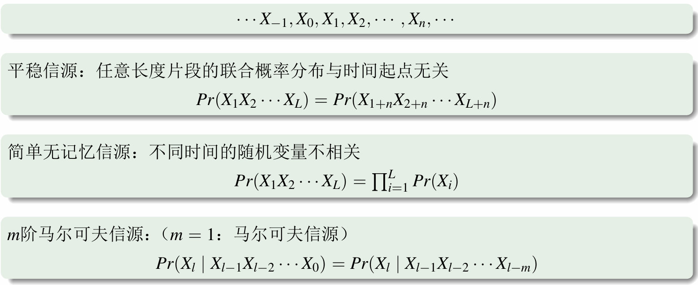
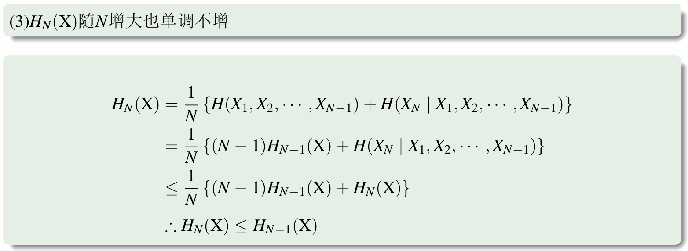
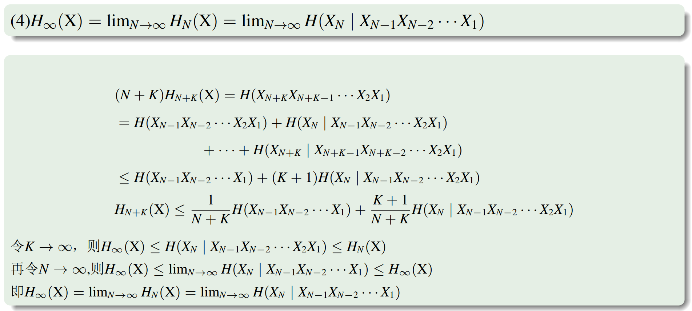
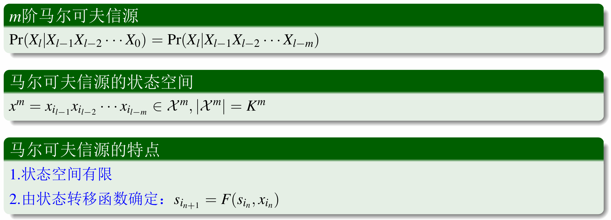
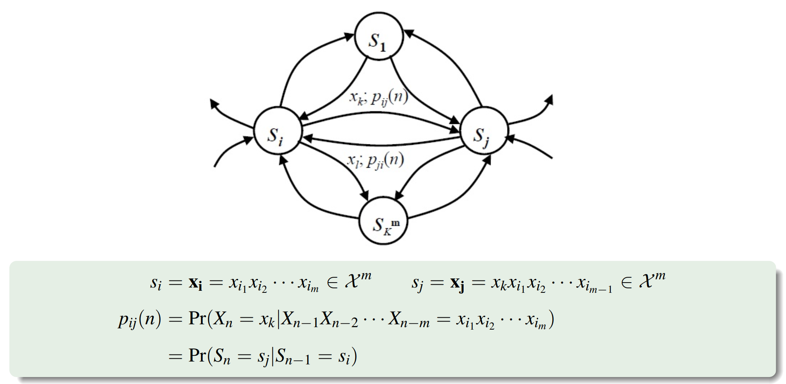

# 第三讲：平稳离散信源的熵

!!! note ""

    - 了解平稳离散信源的概念
    - 掌握平稳离散信源熵的定义
    - 了解马尔可夫信源的概念
    - 掌握马尔可夫信源熵的计算方法

## 平稳随机过程

### 平稳信源

!!! note ""
    $m$ 阶马尔科夫信源是一种有限记忆的信源，其记忆能力为$m$。

#### 平稳信源的熵

##### 平稳信源的熵的性质

!!! note '证明'

    
    
    
    

### 熵速率

!!! note ""
    对无记忆离散源，若 $X$ 在取值范围 $\mathcal{X}=\set{x_1,x_2,\cdots,x_K}$ 上等概分布，则 $H(X)=\log K\triangleq H_0$。

## 马尔可夫信源

!!! note ""
    对于 $m$ 阶马尔科夫信源，$x_{i_{n}}$是$n$时刻信源输出符号，$s_{i_{n}}$是$n$时刻信源状态。每一个状态$s_{i}$对应一个长度为 $m$ 的符号序列。

!!! note ""

    $p_{ij}(n)$ 是 $n$ 时刻状态 $s_{i}$ 转移到 $s_{j}$ 的概率。

