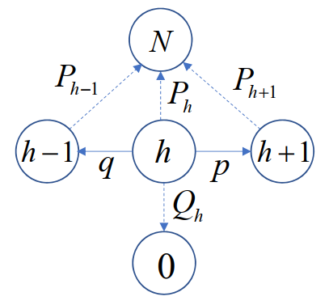

# Model 08 赌徒破产问题与Pascal问题

!!! question "问题背景"

    - 赌徒破产问题：

        一个赌徒在初始时拥有 $h$ 个单位财富。在每局赌博中以概率 $p$ 赢一个单位财富，以概率 $q=1-p$ 输一个单位财富。各局赌博结果独立。当赌徒的财富达到 $N$ 个单位或 $0$ 个单位（破产）时停止赌博。求赌徒破产的概率。
    - Pascal问题：
        
        A,B两人玩一种游戏，初始时两人各有12分。一次掷三枚骰子，若点数恰为11则A胜B负，点数恰为14则B胜A负，其他点数不分胜负。对出现胜负的一次投掷，胜一方增1分，负一方减1分。分数先为0分的一方失败。求双方获胜的概率之比

## 随机过程

### 随机过程

随机过程是描述随机现象随时间推移而演化的一类数学模型。

• 一族随机变量$\{X(t),t\in T\}$ ，其中 $t$ 是参数，$T$ 为参数集。
• $T$ 为整数集的随机过程称为随机序列。

### Markov 过程

Markov 过程意味着：在已知目前的状态（现在）的条件下，它未来的演变（将来）不依赖于它以往的演变（过去）

对随机序列 $\{X_n,n=0,1,2\cdots\}$（$X_n$为有限个或可数个），$P(X_{n+1}=i_{n+1})$只与 $X_n$ 有关， 而与 $X_{n-1},X_{n-2},\cdots$ 无关，则称 $\{X_n,n=0,1,2\cdots\}$ 为 Markov 链。用数学语言描述为：

$$P(X_{n+1}=i_{n+1}|X_n=i_n,X_{n-1}=i_{n-1},\cdots,X_0=i_0)=P(X_{n+1}=i_{n+1}|X_n=i_n)$$

## 递推关系

已知$A_0$，$A_n$及以下相邻两项之间的递推关系，求$A_n$的通项公式。

$$\begin{cases}A_0, A_N已知\\A_h-A_{h-1}=r(A_{h-1}-A_{h-2}), 1\leq h\leq N-1\end{cases}$$

很简单的高中数列题，我们有：

$$
\begin{aligned}
A_0-A_1 &= r^0(A_0-A_1)\\
A_1-A_2 &= r^1(A_0-A_1)\\
A_2-A_3 &= r^2(A_0-A_1)\\
\cdots\\
A_h-A_{h+1} &= r^{h}(A_0-A_1)\\
\cdots\\
A_{N-1}-A_{N} &= r^{N-1}(A_0-A_1)\\
\end{aligned}
$$

当$r\neq 1$时，将上述等式相加，得到：

$$A_0-A_N=(1+r+r^2+\cdots+r^{N-1})(A_0-A_1)=\frac{1-r^N}{1-r}(A_0-A_1)$$

将$A_h$开始的式子相加，得到：

$$A_h-A_N=(r^h+r^{h+1}+\cdots+r^{N-1})(A_0-A_1)=\frac{r^h-r^N}{1-r}(A_0-A_1)$$

所以：

$$\frac{A_h-A_N}{A_0-A_N}=\frac{r^h-r^N}{1-r^N}$$

因此我们可以得到：

$$A_h=A_N+\frac{A_0-A_N}{1-r^N}(r^h-r^N)=\frac{r^h-r^N}{1-r^N}A_0+\frac{1-r^h}{1-r^N}A_N$$

当$r=1$时，将上述等式相加，得到：

$$A_0-A_N=N(A_0-A_1)$$

将$A_h$开始的式子相加，得到：

$$A_h-A_N=(N-h)(A_0-A_1)$$

所以：

$$\frac{A_h-A_N}{A_0-A_N}=\frac{N-h}{N}$$

因此我们可以得到：

$$A_h=A_N+\frac{A_0-A_N}{N}(N-h)=\frac{N-h}{N}A_0+\frac{h}{N}A_N$$

综上所述，我们可以得到：

$$A_h=\begin{cases}\frac{r^h-r^N}{1-r^N}A_0+\frac{1-r^h}{1-r^N}A_N, r\neq 1\\ \frac{N-h}{N}A_0+\frac{h}{N}A_N, r=1\end{cases}$$

## 赌徒破产问题

!!! question ""
    一个赌徒在初始时拥有 $h$ 个单位财富。在每局赌博中以概率 $p$ 赢一个单位财富，以概率 $q=1-p$ 输一个单位财富。各局赌博结果独立。当赌徒的财富达到 $N$ 个单位或 $0$ 个单位（破产）时停止赌博。求赌徒破产的概率。

记 $P_h$ 和 $Q_h$ 分别为赌徒初始财富为 $h$ 个单位时，财富最终达到 $N$ 个单位的和 $0$ 个单位的概率，显然有初始条件 $P_N=1$ ，$P_0=0$ ，$Q_N=0$ ，$Q_0=1$ 。

### 求 $P_h$

对每一个 $P_h$ ，可以由如下Markov链得到：

{width=30%}

!!! note ""
    以概率 $p$ 赢一个单位财富，以概率 $q=1-p$ 输一个单位财富

$$P_h=pP_{h+1}+qP_{h-1}, 1\leq h\leq N-1$$

我们把这个式子转换为我们刚刚递推公式的形式：

$$
\begin{cases}
P_0 = 0, P_N = 1\\
P_h - P_{h+1}= \frac{q}{p}(P_{h-1}-P_h), 1\leq h\leq N-1
\end{cases}
$$

!!! note ""
    $$A_h=\begin{cases}\frac{r^h-r^N}{1-r^N}A_0+\frac{1-r^h}{1-r^N}A_N, r\neq 1\\ \frac{N-h}{N}A_0+\frac{h}{N}A_N, r=1\end{cases}$$

    其中 $r= \frac{q}{p}$，$A_0=0$，$A_N=1$，$A_h=P_h$

所以：

$$P_h=\begin{cases}\frac{1-(\frac{q}{p})^h}{1-(\frac{q}{p})^N}, &q\neq p \\ \frac{h}{N}, &q=p\end{cases}$$

### 求 $Q_h$

设想赌徒与另一位在初始时拥有 $N-h$ 个单位财富的虚拟赌徒赌博。在每局赌博中虚拟赌徒以概率 $q$ 赢一个单位财富，以概率 $p$ 输一个单位财富。赌徒破产时，虚拟赌徒财富达到 $N$ 个单位。

所以真实赌徒从$h$输到破产 就相当于 虚拟赌徒 从$N-h$ 的赚到 $N$个单位，即$Q_h = P_{N-h}'$ 

因为$P'_h=\begin{cases}\frac{1-(\frac{p}{q})^h}{1-(\frac{p}{q})^N}, &p\neq q \\ \frac{h}{N}, &p=q\end{cases}$，（和 $P_h$ 的输赢概率对调）

所以

$$ Q_h =P_{N-h}'= \begin{cases}\frac{1-(\frac{p}{q})^{N-h} }{1-(\frac{p}{q})^N}=\frac{(\frac{q}{p})^N-(\frac{q}{p})^h}{(\frac{q}{p})^N-1}, &p\neq q \\ \frac{N-h}{N}, &p=q\end{cases}$$

## Pascal问题

!!! question ""
    A,B两人玩一种游戏，初始时两人各有12分。一次掷三枚骰子，若点数恰为11则A胜B负，点数恰为14则B胜A负，其他点数不分胜负。对出现胜负的一次投掷，胜一方增1分，负一方减1分。分数先为0分的一方失败。求双方获胜的概率之比

掷三枚骰子，点数恰为 $j$ 的概率如何计算？我们采用多项式的方法。

$$\begin{aligned}
&(x+x^2+x^3+x^4+x^5+x^6)(x+x^2+x^3+x^4+x^5+x^6)(x+x^2+x^3+x^4+x^5+x^6)\\
=&x^{18}+3x^{17}+6x^{16}+10x^{15}+15x^{14}+21x^{13}+25x^{12}+27x^{11}\\&+27x^{10}+25x^9+21x^8+15x^7+10x^6+6x^5+3x^4+x^3
\end{aligned}$$

总可能性为 $6^3=216$ ，所以点数恰为 $j$ 的概率为 $\frac{a_j}{216}$ ，其中 $a_j$ 为上式中 $x^j$ 的系数。

一次投掷，A胜的概率为 $p=\frac{a_{11}}{216}=\frac{27}{216}$ ，B胜的概率为 $q=\frac{a_{14}}{216}=\frac{15}{216}$ ，不分胜负的概率为 $1-p-q=\frac{1-a_{11}-a_{14}}{216}=\frac{174}{216}$ 。

我们从获胜的角度来看，就是判断从12分到24分的概率。我们可以用Markov链来解决这个问题。

记$P_h$为A从$h$分到$24$分的概率，$Q_h$为B从$h$分到$24$分的概率，显然有初始条件$P_{24}=1$，$P_{0}=0$，$Q_{24}=1$，$Q_{0}=0$。

根据Markov链，我们可以得到如下递推关系：

$$\begin{cases}P_h&=pP_{h+1}+qP_{h-1}+(1-p-q)P_h, &1\leq h\leq 23\\Q_h&=qQ_{h+1}+pQ_{h-1}+(1-p-q)Q_h, &1\leq h\leq 23\end{cases}$$

即

$$\begin{cases}P_h-P_{h+1}&=\frac{q}{p}(P_{h-1}-P_{h}), &1\leq h\leq 23\\Q_h-Q_{h+1}&=\frac{p}{q}(Q_{h-1}-Q_{h}), &1\leq h\leq 23\end{cases}$$

!!! note ""
    $$
    \begin{aligned}
    &\begin{cases}A_0, A_N已知\\A_h-A_{h-1}=r(A_{h-1}-A_{h-2}), 1\leq h\leq N-1\end{cases}\\
    \Rightarrow&
    A_h=\begin{cases}\frac{r^h-r^N}{1-r^N}A_0+\frac{1-r^h}{1-r^N}A_N, r\neq 1\\ \frac{N-h}{N}A_0+\frac{h}{N}A_N, r=1\end{cases}
    \end{aligned}
    $$

所以

$$P_h = \frac{1-(\frac{q}{p})^h}{1-(\frac{q}{p})^{24}},\;\;Q_h = \frac{1-(\frac{p}{q})^h}{1-(\frac{p}{q})^{24}}$$

代入 $h=12$ ，得到

$$P_{12}=\frac{1-(\frac{q}{p})^{12}}{1-(\frac{q}{p})^{24}}=\frac{1-(\frac{15}{27})^{12}}{1-(\frac{15}{27})^{24}}=\frac{1-\frac{5^{12}}{3^{24}}}{1-\frac{5^{24}}{3^{48}}}=\frac{3^{48}-3^{24} 5^{12}}{3^{48}-5^{24}}$$

$$Q_{12}=
\frac{1-(\frac{p}{q})^{12}}{1-(\frac{p}{q})^{24}}
=\frac{1-(\frac{27}{15})^{12}}{1-(\frac{27}{15})^{24}}
=\frac{1-\frac{3^{24}}{5^{12}}}{1-\frac{3^{48}}{5^{24}}}
=\frac{5^{24}-3^{24} 5^{12}}{5^{24}-3^{48}}$$

所以

$$\frac{P_{12}}{Q_{12}}=\frac{3^{48}-3^{24} 5^{12}}{3^{24}5^{12}-5^{24}}=\frac{3^{24}}{5^{12}}=\frac{282429536481}{244140625}$$

显然，A获胜的概率要远大于B获胜的概率。