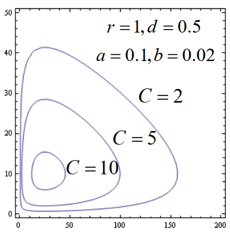
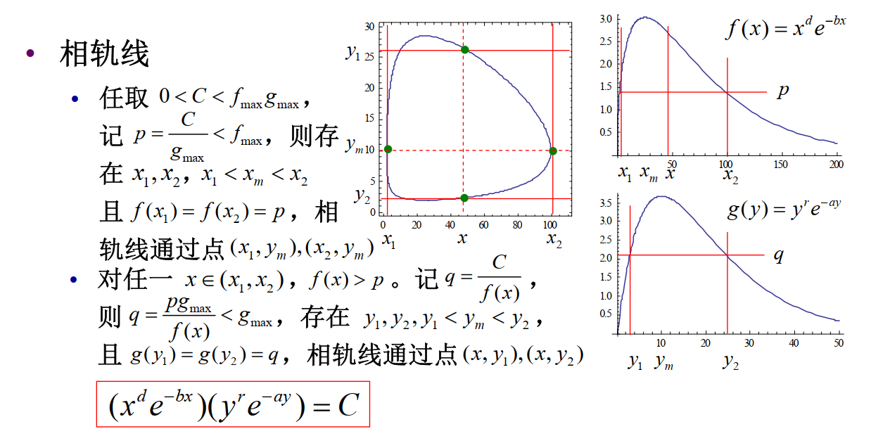
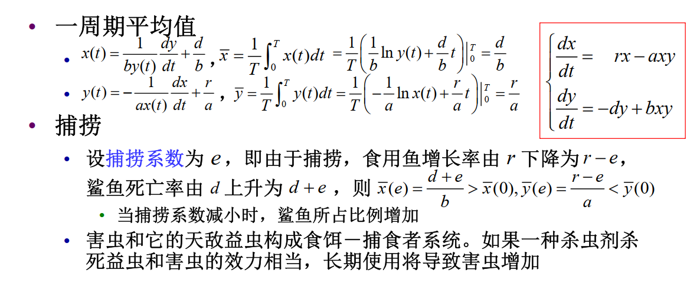

# Model 17 种间关系

!!! question "问题背景"

    我们知道，生物种群之间存在着相互作用关系，比如食饵与捕食者之间的关系，竞争关系等等。那么，两个种群之间的相互作用关系该如何描述？

## Lotka-Volterra 模型

记 $x(t),y(t)$ 分别为 $t$ 时刻食用鱼 (食饵) 和鲨鱼（捕食者）的种群数量。

假设海洋资源丰富，且：

- 食用鱼独立生存时以常数增长率增长；
- 而由于鲨鱼存在，使得食用鱼增长率减少，减少的程度与鲨鱼数量呈正比；
- 鲨鱼缺乏食用鱼时死亡率为常数；
- 食用鱼的存在使鲨鱼死亡率降低，降低的程度与食饵数量呈正比

我们可以列出如下的微分方程：

$$
\begin{cases}
\frac{\mathrm{d}x}{\mathrm{d}t} = (r - ay) x \\
\frac{\mathrm{d}y}{\mathrm{d}t} = (- d +bx)y 
\end{cases}
$$

!!! note ""
    其中，$r,a,d,b$ 为正常数，分别表示食用鱼的原生增长率、鲨鱼捕食食用鱼的能力、鲨鱼死亡率、食用鱼对鲨鱼死亡的抑制能力。

所以，我们可以得到：

$$
\frac{\mathrm{d}y}{\mathrm{d}x} = \frac{(- d +bx)y}{(r - ay) x}
$$

这是一个分式微分方程，我们可以通过分离变量的方法求解：

$$
\begin{aligned}
\frac{\mathrm{d}y}{\mathrm{d}x} &= \frac{(- d +bx)y}{(r - ay) x} \\
\frac{r - ay}{y} \mathrm{d}y &= \frac{- d +bx}{x} \mathrm{d}x \\
\int (\frac{r}{y} - a) \mathrm{d}y &= \int (\frac{- d}{x} + b) \mathrm{d}x \\
r \ln y - ay &= - d \ln x + bx + c \\
(x^d e^{-bx}) (y^r e^{-ay}) &= C 
\end{aligned}
$$

!!! note ""

    - 若 $x(0)=x_0,y(0)=y_0$， 则 $C=(x_0^de^{-bx_0})(y_0^re^{-ay_0})$  

    - 令$f(x)=x^de^{-bx}$，$f(x)$ 在 $x_m=\frac db$ 处取得极大值$f_\mathrm{max}$；令$g(y)=y^re^{-ay}$，$g(y)$ 在$y_m=\frac ra$ 处取得极大值 $g_\mathrm{max}$

        - $f(x)$ 和 $g(y)$ 都是单峰函数，图像如下：

            {width=50%}

    - $0\leq C=f(x)g(y)\leq f_{\max}g_{\max}$，若$C=f_{\max}g_{\max}$，则 $x=x_m,y=y_m$， 相轨线退化为点 $(x_m,y_m)$

给定一些参数，我们可以画出相轨线：

{width=50%}

这是 $C<f_{\max}g_{\max}$ 的情况。

!!! question "为什么相轨线是一个圈？"

    

我们可以通过分析相轨线来分析种群的数量变化：

!!! note ""

    这里的害虫相当于食用鱼，而害虫的天敌相当于鲨鱼。

## 一般双种群模型

一般双种群模型的微分方程为：

$$
\begin{cases}\frac{dx}{dt}=x(a_{10}+a_{11}x+a_{12}y)\\\frac{dy}{dt}=y(a_{20}+a_{21}x+a_{22}y)&\end{cases}
$$

- 记种群 $X,Y$ 的增长率为 $a_{10},a_{20}$

    - $a_{10}>0$ 表示 $X$ 可依靠系统外食物为生 
    - $a_{20}<0$ 表示 $Y$ 必须依赖 $X$ 为食才能生存
- 记种群 $X,Y$ 的密度制约项为 $a_{11},a_{22}$
    - $a_{11}=0$ 表示$X$是非密度制约的
    - $a_{11}<0$ 表示 $X$是密度制约的
- 种间关系
    - 利用 (Exploitation) : $a_{12}<0,a_{21}>0$
        - $X$为食饵，$Y$为捕食者，$X$为寄主，$Y$ 为寄生物
    - 种间竞争 (Interspecific competition) : $a_{12}<0,a_{21}<0$ 
    - 共生 (Mutualism) : $a_{12}>0,a_{21}>0$