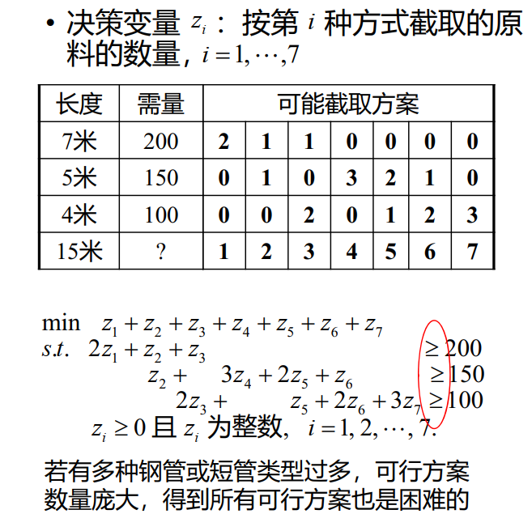

# Model 18 数学规划

!!! warning ""
    TODO

## 运筹学

运筹学的主要分支：

- 数学规划（Mathematical Programming）
    - 线性规划（Linear Programming）
    - 非线性规划（Nonlinear Programming）
    - 整数规划（Integer Programming）
    - 多目标规划（Multiobjective Programming）
- 组合优化（Combinatorial Optimization）
- 随机运筹
    - 排队论（Queuing Theory）
    - 库存论（Inventory theory）
    - 可靠性理论（Reliability Theory）
- 博弈论（Game Theory）与决策理论（Decision Theory）

## 数学规划

- 若干个变量在满足一些等式或不等式限制条件下，使目标函数取得最大值或最小值
- 研究问题的数学性质，构造求解问题的方法，实现求解问题的算法，以及将算法应用于实际问题

{width=50%}

!!! note "数学规划分类"

    !!! note "按函数性质"

        - 线性规划（linear programming）
            - 目标函数为线性函数，约束条件为线性等式或不等式
        - 非线性规划（nonlinear programming）
            - 目标函数为非线性函数，或至少有一个约束条件为非线性等式或不等式
                - 二次规划（Quadratic Programming, QP）：目标函数为二次函数，约束条件为线性等式或不等式
                - 带二次约束的二次规划（Quadratically Constrained Quadratic Program， QCQP）：目标函数为二次函数，约束条件为线性或二次等式或不等式
                - 线性分式规划（linear fractional programming）：目标函数为两个线性函数的商，约束条件为线性等式或不等式

    !!! note "按变量性质"
        整数规划（integer programming）：至少有一个决策变量限定取整数值
        - 整数决策变量意义
            - 用于表示只能取离散值的对象的数量
            - 用于表示约束条件之间的逻辑关系或复杂的函数形式
            - 用于表示非数值的优化或可行性问题
        - 特殊整数规划
            - 部分决策变量取整数值的数学规划特称为混合整数规划（Mixed Integer Programming, MIP）
            - 0-1规划：决策变量仅取值0或1的数学规划

    !!! note "按约束条件"
        - 无约束优化
        - 约束优化

## 食谱问题

也就是说，我们要找到在约束条件下的 $\vec{x}$，使得到 $\min\sum\limits_{i=1}^n c_{i}x_{i}$。（大概是多元线性规划？）

例如：

$$\begin{array}{rl}\min&60x_1+30x_2+20x_3\\s.t.&120x_1+180x_2+160x_3\geq50\\&300x_1+90x_2+30x_3\geq90\\&x_1,x_2,x_3\geq0\end{array}$$

## 运输问题

## 数独

!!! note ""
    $\sum\limits_{k=1}^9kx_{ijk}$ 的值为在这个格子里填的数字。

{width=60%}

## 下料问题

!!! question "问题背景"
    现有 $W$ 米长的钢管若干。生产某产品需长为 $w_i$ 米的短管 $b_i$ 根，$i=1,2,\cdots,n$。如何截取能使材料最省？

我们构造数学规划模型：

决策变量：$x_{ji}$ 表示第 $j$ 根钢管截取第 $i$ 种短管的数量，$i=1,2,\cdots,k$，$j=1,2,\cdots,n$。（$n=\sum\limits_{i=1}^k b_{i}$）

约束条件：

1. 每根钢管截取的短管总长度不超过钢管长度 $W$，即 $\sum\limits_{i=1}^n w_ix_{ji}\leq W$，$j=1,2,\cdots,n$
2. 每种短管截取的数量不低于需求量，即 $\sum\limits_{j=1}^n x_{ji}\geq b_i$，$i=1,2,\cdots,k$

我们的目标是使得截取的钢管最少，即 $\min n$。但这个 $n$ 是出现在求和号上的，在线代的数学规划中我们往往不会直接去求解这个 $n$，而是将其转化。

我们构造一个 0-1变量 $y_j$，表示第 $j$ 根钢管是否被截取，即 $y_j=1$ 表示第 $j$ 根钢管被截取，$y_j=0$ 表示第 $j$ 根钢管未被截取，$j=1,2,\cdots,n$。

所以我们的目标函数可以写成 $\min\sum\limits_{j=1}^n y_j$。

但现在有一个问题：$y_j$ 与 $x_{ji}$ 之间的关系是什么呢？

$$\exists i,x_{ji}>0\rightarrow y_j=1 \Rightarrow \sum\limits_{i=1}^k x_{ji}> 0 \rightarrow y_j=1$$

约束条件1可以写成 $\sum\limits_{i=1}^k w_ix_{ji}\leq Wy_j$，$j=1,2,\cdots,n$。

所以我们有：

$$\begin{array}{rl}\min&\sum\limits_{j=1}^n y_j\\s.t.&\sum\limits_{i=1}^k w_ix_{ji}\leq Wy_j\\&\sum\limits_{j=1}^n x_{ji}\geq b_i\\&x_{ji}\geq0,y_j\in\{0,1\}\end{array}$$

当 $y_j=1\rightarrow \exist i,x_{ji}> 0$。给定目标下，最优解自动满足。

### 另一种决策变量

同样，这个解法可以用于解决装箱问题。

### 装箱问题

两个问题实际上是同一个问题，只是描述的方式不同。

装箱问题指的是给定一系列大小已知的物品和若干个容量相同的箱子，如何将物品放入箱子中，使所用箱子数尽可能少。
