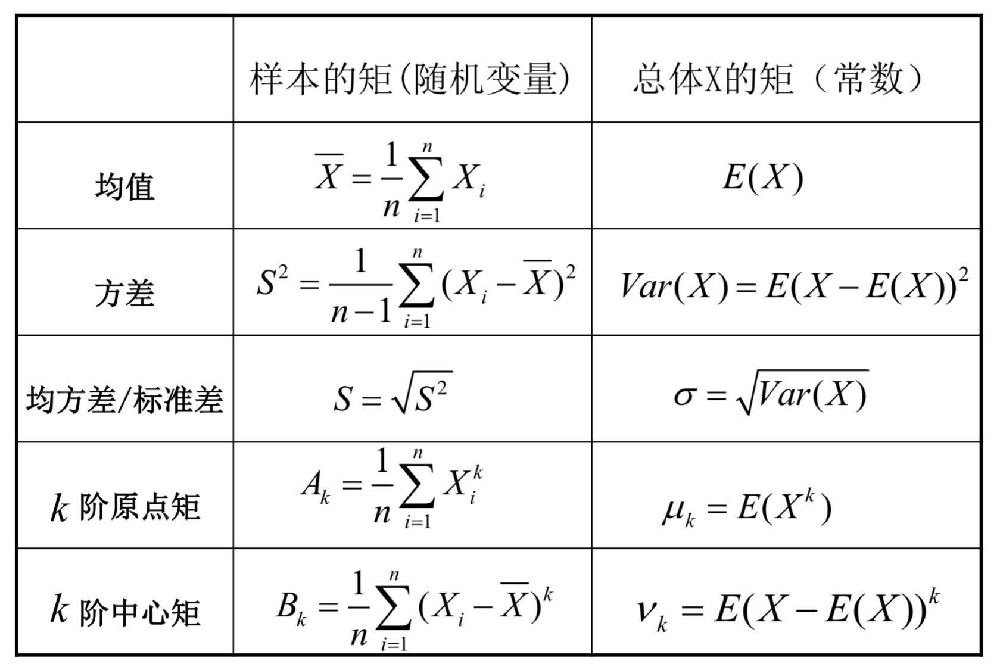
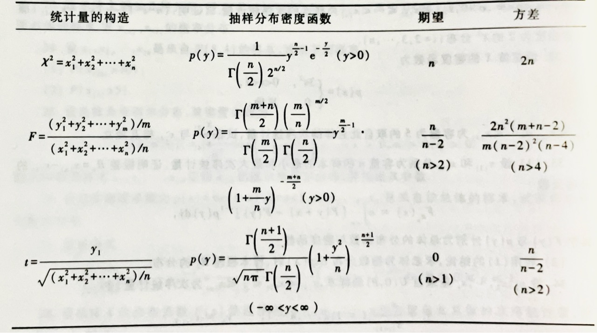
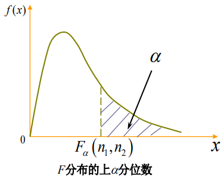

# [6.x] 统计量与抽样分布

## 基本概念

- 总体与个体：一个统计问题总有它明确的研究对象，研究对象的全体称为**总体（母体）**，总体中的每个成员称为**个体**；
- 总体容量：总体中包含的个体数；
    - 有限总体是容量有限的总体；
    - 无限总体是容量无限的总体，通常将容量非常大的总体也按无限总体处理；
- 随机样本：为推测总体的分布及其各种特征，按一定规则从总体中抽取若干个体进行观察试验，以获得关于总体的信息，这一过程称为抽样，所抽取的部分个体称为**样本**，通常记为 $X=(X_1,X_2,...,X_n)$；
- 样本容量：样本中所包含的个体数目 $n$；
    - 注意，每一个样本 $X_i$ 都是随机变量，维数与总体一致；
- 简单随机样本：满足**代表性**和**独立性**的样本称为**简单随机样本(Simple Random Sample)**，获得简单随机样本的抽样方法称为简单随机抽样；
    - 代表性：$X_1,X_2,...,X_n$ 中的每一个与所考察的总体 $X$ 都有相同的分布；
    - 独立性：$X_1,X_2,...,X_n$ 是相互独立的随机变量；

后面提到的所有样本，指的都是简单随机样本。

- 若总体有分布函数 $F(x)$，则样本具有联合分布函数 $F_n(x_1,x_2,...,x_n)=\prod_{i=1}^{n}F(x_i)$；
- 若总体为连续型（或离散型）随机变量，其概率密度函数（或分布律）为 $f(x)$，则样本具有联合密度函数（或联合分布律） $f_n(x_1,x_2,...,x_n)=\prod_{i=1}^{n}f(x_i)$

## 统计量

设 $(X_1,X_2,...,X_n)$ 是来自总体 $X$ 的一个样本，$g(X_1,X_2,...,X_n)$ 是 $X_1,X_2,...,X_n$ 的函数，若 $g$ 中**不含任何未知参数**，则称 $g(X_1,X_2,...,X_n)$ 为一**统计量**。换言之，统计量是样本的不含任何未知参数的函数。

- 统计量仍然为随机变量；
- 统计量的分布（称为抽样分布）一般与总体分布有关，**可以依赖未知参数**；
- 当样本的观察值确定时，统计量的值也就随之确定了；

### 样本均值

$$
\overline{X}=\frac{1}{n}\sum_{i=1}^{n}X_i
$$

样本均值反映了总体的期望（均值）。

样本均值的性质：

- $E(\overline{X})=\mu$，$Var(\overline{X})=\sigma^2/n$
- $\sum_{i=1}^{n}(X_i-\overline{X})=0$；
- 数据观测值与样本均值的偏差平方和最小，即在形如 $\sum(X_i-c)^2$ 的函数中，$\sum(X_i-\overline{X})^2$最小；
- 若总体服从 $N(\mu,\sigma^2)$，则 $\overline{X}$ 的**精确分布**为 $N(\mu,\sigma^2/n)$； 
- 若总体分布未知或不是正态分布，则当 $n$ 较大时，$\overline{X}$ **近似服从** $N(\mu,\sigma^2/n)$；

### 样本方差

$$
S^2=\frac{1}{n-1}\sum_{i=1}^{n}(X_i-\overline{X})^2
$$

样本方差反映了总体的方差，常作为总体方差 $\sigma^2$ 的无偏估计。

样本方差的性质：

- $E(S^2)=\sigma^2$；
- $\sum(X_i-\overline{X})^2=\sum X_i^2-\frac{1}{n}(\sum X_i)^2=\sum X_i^2-n\overline{X}^2$；

此外，$S=\sqrt{S^2}=\sqrt{\frac{1}{n-1}\sum_{i=1}^{n}(X_i-\overline{X})^2}$ 称为样本标准差。

### 样本 k 阶矩

样本 $k$ 阶（原点）矩，常作为总体 $j=k$ 阶原点矩 $\mu_k$ 的估计：

$$
A_k=\frac{1}{n}\sum_{i=1}^{n}X_i^k,\;\;k=1,2,...
$$

样本 $k$ 阶中心距，常作为总体 $j=k$ 阶中心矩 $\nu_k$ 的估计，$B_2$ 可作为总体方差 $\sigma^2$ 的有偏估计：

$$
B_k=\frac{1}{n}\sum_{i=1}^{n}(X_i-\overline{X})^k,\;\;k=2,3,...
$$

样本 $k$ 阶矩的性质：

- 假设 $X_1,X_2,...,X_n$ 是 $X$ 中抽取的样本，$\mu_k=E(X^k)$ 存在，由辛钦大数定律可知： 
  $A_k=\frac{1}{n}\sum_{i=1}^{n}X_i^k\xrightarrow{P}\mu_k,\;\;k=1,2,...$

---

样本与总体的各阶矩对比表：

## 三大抽样分布

统计量的分布称为**抽样分布(Sampling Distribution)**。

### &#x03c7;² 分布 / 卡方分布

设 $X_1,X_2,...,X_n$ 为独立同分布，服从 $N(0,1)$。则称 $\chi_{n}^{2}=\sum_{i=1}^{n}X_i^2$ 服从自由度为 $n$ 的 $\chi^2$ 分布，记 $\chi_{n}^{2}\sim \chi^2(n)$。

$\chi^2$ 分布的密度函数（不要求）：

$$
f_{\chi^2}(x)=
\left\{
\begin{aligned}
&\frac{1}{2^\frac{n}{2}\Gamma(\frac{n}{2})}x^{\frac{n}{2}-1}e^{-\frac{x}{2}},&x>0,
\\
&0,&\text{else},
\end{aligned}
\right.
$$

$\chi^2$ 分布有如下性质：

- 设 $X \sim \chi^2(n)$，则有 $E(X)=n$，$Var(X)=2n$；
- 设 $Y_1 \sim \chi^2(m)$，$Y_2\sim\chi^2(n)$，且两者互相独立，则 $Y_1+Y_2\sim \chi^2(m+n)$；
    - 这一性质被称为 $\chi^2$ 分布的可加性，可以推广到有限个相加的情形；
- $\chi^2$ 分布的上 $\alpha$ 分位数： 
  对于给定的正数 $\alpha,\;0<\alpha<1$，称满足条件 $P\{\chi^2>\chi^2_\alpha(n)\}=\int^{+\infty}_{\chi^2_\alpha(n)}f_{\chi^2}(x)\mathrm{d}x=\alpha$ 的点 $\chi^2_{\alpha}(n)$ 为 $\chi^2(n)$ 分布的上 $\alpha$ 分位数；

### t 分布 / 学生氏分布

设 $X\sim N(0,1)$，$Y\sim \chi^2(n)$，且 $X,Y$ 相互独立，则称随机变量 $T=\frac{X}{\sqrt{Y/n}}$ 服从自由度为 $n$ 的 $t$ 分布，记做 $T\sim t(n)$。

$t$ 分布的密度函数（不要求）：

$$
f_t(x)=\frac{\Gamma[(n+1)/2]}{\sqrt{\pi n}\Gamma(\frac{n}{2})}(1+\frac{x^2}{n})^{-\frac{n+1}{2}},\;\;-\infty<x<+\infty
$$

其中 $\Gamma(\alpha)=\int_0^{+\infty}t^{\alpha-1}e^{-t}\mathrm{d}t$，$\Gamma(\alpha+1)=\alpha\Gamma(\alpha)=\alpha!(if\;\alpha\in\Z)$，$\Gamma(0.5)=\sqrt{\pi}$。

$t$ 分布有如下性质：

- 设 $T\sim t(n)$，则当 $n\geq 2$ 时，有 $E(T)=0$；当 $n\geq 3$ 时，有 $Var(T)=\frac{n}{n-2}$；
- 当 $n$ 足够大时，$t$ 分布近似于标准正态分布 $N(0,1)$；
- 设 $T\sim t(n)$，$N\sim N(0,1)$，则对任意的 $n\geq 1$，都存在 $a_0>0$，使得 $P(|T|\geq a_0)\geq P(|N|\geq a_0)$；
- $t_{1-\alpha}(n)=-t_{\alpha}(n)$；

### F 分布

设 $U\sim\chi^2(n_1)$，$V\sim \chi^2(n_2)$，且 $U,V$ 相互独立，则称随机变量 $F=\frac{U/n_1}{V/n_2}$ 服从自由度为 $(n_1,n_2)$ 的 $F$ 分布，记 $F\sim F(n_1,n_2)$。

$F$ 分布的密度函数（不要求）：

$$
f_F(x)=\frac{
\Gamma(\frac{n_1+n_2}{2})(\frac{n_1}{n_2})^{n_1/2}x^{(n_1/2)-1}
}{
\Gamma(\frac{n_1}{2})\Gamma(\frac{n_2}{2})[1+(n_1x/2)]^{(n_1+n_2)/2}
},\;\;x>0
$$

$F$ 分布有如下性质：

- 设 $F\sim F(n_1,n_2)$，则 $F^{-1}\sim F(n_2,n_1)$；
- 设 $X\sim t(n)$，则 $X^2\sim F(1,n)$；
- $F_{1-\alpha}(n_1,n_2)=\frac{1}{F_{\alpha}(n_2,n_1)}$；

## 正态总体下的抽样分布

设 $X_1,X_2,...,X_n$ 是来自正态总体 $N(\mu,\sigma^2)$ 的样本，$\overline{X}$ 是样本均值，$S^2$ 是样本方差，则有：

1. $\overline{X}\sim N(\mu,\frac{\sigma^2}{n})$；
2. $\frac{(n-1)S^2}{\sigma^2}\sim \chi^2(n-1)$；
3. $\overline{X}$ 与 $S^2$ 相互独立；
4. $\frac{\overline{X} - \mu}{S/\sqrt{n}}\sim t(n-1)$；
   - 这里注意区别一下：$\frac{\overline{X} - \mu}{\sigma/\sqrt{n}}\sim N(0,1)$；

设 $X_1,X_2,...,X_n$ 和 $Y_1,Y_2,...,Y_n$ 是分别来自正态总体 $N(\mu_1,\sigma_1^2)$ 和 $N(\mu_2,\sigma_2^2)$，并且它们相互独立，$\overline{X},\overline{Y}$ 是样本均值，$S_1^2,S_2^2$ 是样本方差，则有：

1. $\frac{S_1^2/\sigma_1^2}{S_2^2/\sigma^2_2}\sim F(n_1-1,n_2-1)$；
2. $\frac{(\overline{X}-\overline{Y})-(\mu_{1}-\mu_{2})}{\sqrt{\frac{\sigma_{1}^{2}}{n_1}+\frac{\sigma_{2}^{2}}{n_2}}} \sim N(0,1)$；
3. 当 $\sigma_1^2=\sigma_2^2=\sigma^2$ 时： 
   $\frac{(\overline X - \overline Y) - (\mu_1-\mu_2)}{S_\omega\sqrt{\frac{1}{n_1}+\frac{1}{n_2}}}\sim t(n_1+n_2-2)$，其中 $S^2_\omega=\frac{(n_1-1)S_1^2+(n_2-1)S^2_2}{n_1+n_2-2}$；